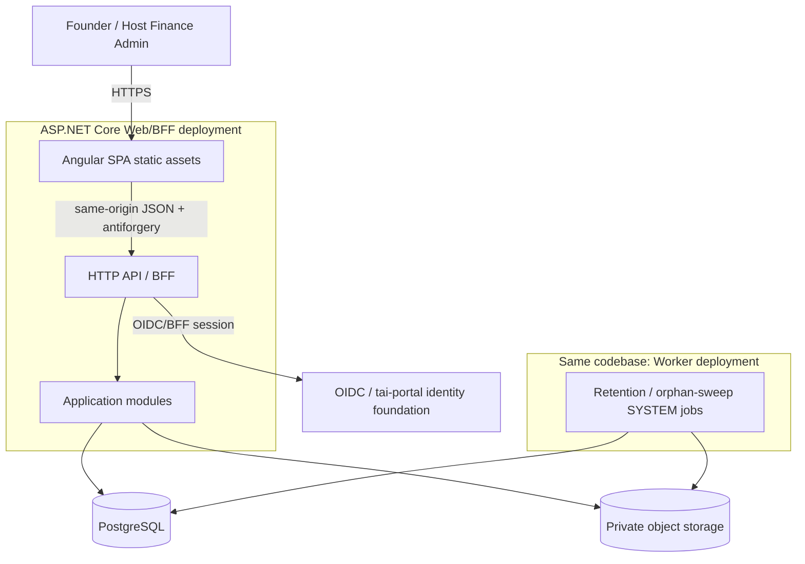
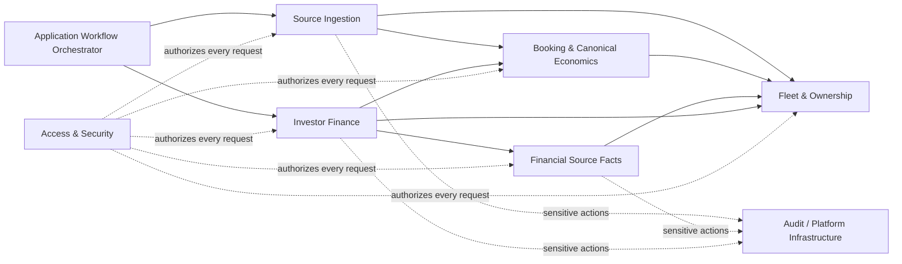
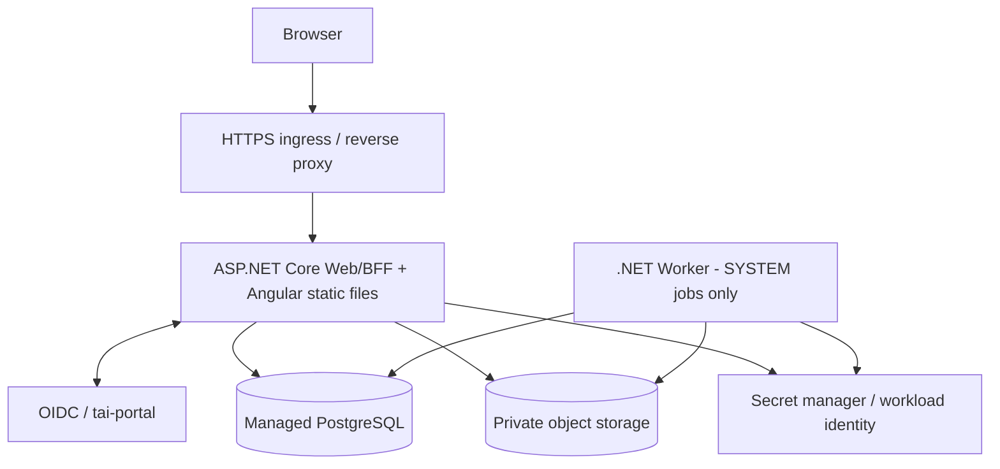

# MVP Vertical-Slice Architecture

**Project:** Rental Asset & Travel Platform / Fleet Management Project  
**Artifact:** `mvp-architecture.md`  
**Canonical path:** `/Projects/Fleet-Management/shared/canonical/mvp-architecture.md`  
**Steward:** `02-system-architecture` — System Architecture  
**Status:** Chat 02 R3 `GREENLIGHT` retained; Revision 5 is a focused complete-MVP R1 remediation synchronization for source financial completeness and compound statement-issue authorization  
**Revision:** 5  
**Previous revision:** 4  
**Last changed by:** `02-system-architecture`  
**Last material synchronization:** 2026-09-25 — complete-MVP package R1 CRIT-01 / SIG-02 focused synchronization  
**Primary inputs:**
- `/Projects/Fleet-Management/shared/canonical/financial-platform-product-direction.md`
- `/Projects/Fleet-Management/shared/canonical/mvp-turo-import-spec.md`
- `/Projects/Fleet-Management/shared/canonical/mvp-investor-calculation-spec.md`
- `/Projects/Fleet-Management/shared/canonical/mvp-domain-model.md`
- `/Projects/Fleet-Management/shared/canonical/mvp-security-scope.md`

---

# 1. Purpose

This document defines one thin, production-quality vertical slice for the current MVP:

```text
upload Turo CSV
→ preview / validate import
→ explicitly resolve any unknown Vehicles
→ commit CURRENT source state
→ expose provider-neutral source financial-completeness proof for affected Vehicle/cutoff scopes
→ application workflow attempts separately authorized Finance Refresh
→ synchronously materialize any due monthly operating-cost occurrences
→ refresh deterministic reservation + operating-cost investor projections
→ require financially COMPLETE source proof for every applicable source scope
→ prove live currentness from source-proof lineage + the complete authoritative input fingerprint
→ inspect canonical reservations / trips / vehicle economics
→ configure investor ownership + management agreement
→ record manager-incurred operating costs / investor-specific adjustments
→ calculate statement draft through the same Finance Refresh pipeline
→ reconcile deterministic calculations
→ issue/finalize statement
→ record distribution payment
→ mark payment paid
```

The architecture intentionally does **not** add:

```text
marketplace API synchronization
direct booking
availability synchronization
maintenance management
pricing optimization
general accounting / chart of accounts
multi-channel distribution
investor portal
customer portal
AI/LLM execution
Redis
Kafka/service bus
microservices
```

The four canonical domain specifications remain authoritative for business, import, finance, persistence, and security semantics. This document only defines how to assemble those semantics into the smallest coherent application.

---

# 2. Implementation-readiness gates inherited from the source specifications

This architecture must not silently convert plan-addressed review findings into implementation clearance.

Before Codex begins production implementation:

1. Complete the narrow **Turo import R3 convergence gate** required by the updated `mvp-turo-import-spec.md` after the package-remediation completeness contract has been synchronized across Import/Domain/Finance/Architecture.
2. Preserve the completed Chat 02 R3 `GREENLIGHT`; Revision 5 is a focused package-remediation synchronization, not a reopening of the converged architecture.
3. Consume the current Security compound statement-issue contract and operating-cost/refresh authorization boundaries without reopening the role model.
4. Preserve Investor Finance R5 `GREENLIGHT_WITH_ACCEPTED_RISKS` and the updated canonical Investor Finance contract, including its real-PostgreSQL implementation verification.
5. If Turo import R3 materially changes a contract used here, apply only the necessary synchronization/delta verification.

These are review prerequisites, not implementation phases.

---

# 3. Architectural thesis

The MVP should be one modular monolith with one PostgreSQL database, one Angular application, one ASP.NET Core application/BFF, private object storage, and a very small worker runtime used only for retention/orphan cleanup jobs that cannot safely depend on an interactive HTTP request.

```text
Angular SPA
   ↓ same-origin HTTPS/session
ASP.NET Core modular monolith / BFF
   ↓
PostgreSQL
   ↓
private object storage

same codebase, separate worker process only for justified SYSTEM jobs
```

The architecture favors:

```text
canonical domain correctness
> financial determinism
> tenant/resource authorization
> transactional integrity
> auditability
> operational simplicity
> hypothetical scale
```

Finance Refresh is an explicit synchronous application command/orchestration, not a background projection service. A successful source/configuration mutation and a successful finance refresh are separate commit/results. Live financial `CURRENT` status is derived from complete deterministic input lineage rather than from a best-effort mutable stale flag.

---

# 4. System/container view



## Runtime units

### Web/BFF

Responsibilities:

- serve Angular production assets or expose them behind the same origin;
- terminate the authenticated application session;
- establish the server-side `ActorContext`;
- enforce anti-forgery for unsafe cookie-authenticated requests;
- expose all MVP APIs;
- execute import preview and import commit synchronously at the current expected scale;
- execute finance commands synchronously under the canonical transaction/lock rules;
- after a successful CURRENT import, coordinate a **separately authorized** Finance Refresh from the application/composition layer without making Source Ingestion depend on Investor Finance;
- return import outcome and finance-refresh outcome as distinct results so a refresh denial/failure never rewrites a valid import result.

### Worker

The worker is **not** part of the normal user command path in the first slice, but it is part of the Phase 1 production safety boundary because real source PII cannot be retained without an operable purge path.

Justified SYSTEM workloads:

- source-PII retention/key-destruction workflow;
- object-storage orphan sweeper after failed DB/object-storage coordination;
- constrained security-audit retention purge when due.

#### RLS-safe SYSTEM scheduling without cross-Tenant discovery

Do **not** add a cross-Tenant database dispatcher role/function in the MVP. Scheduled SYSTEM maintenance is registered per Tenant by deployment/provisioning automation, so every invocation already arrives with a server-controlled Tenant + capability envelope and can enter the ordinary RLS-constrained path directly.

For each Tenant and named SYSTEM capability, the deployment scheduler invokes the worker with an opaque server-controlled envelope:

```text
tenant_id
requested_capability
schedule_version / invocation_id
```

Worker execution then follows the canonical SYSTEM authorization contract:

```text
identify service principal
→ validate the worker is allowed the requested capability
→ BEGIN using app_runtime
→ SET LOCAL app.tenant_id from the server-controlled scheduled invocation
→ re-resolve the due target work inside that Tenant
→ execute idempotently
→ audit service principal + Tenant + capability
→ COMMIT/ROLLBACK
```

The schedule/invocation envelope is not business-data authority. Tampered Tenant/capability values fail closed during tenant-scoped revalidation, pooled connections never retain Tenant context, and the worker cannot enumerate arbitrary cross-Tenant business data.

This deliberately trades a small amount of deployment configuration for avoiding a new pre-Tenant/cross-Tenant PostgreSQL exception that would otherwise require its own canonical security/domain contract.

If evidence upload is later enabled, the same worker deployment can also perform quarantine cleanup; evidence scanning itself remains fail-closed and can be synchronous or delegated to a bounded scanner service.

No message broker is required for the first slice.

The worker **must not** materialize recurring operating costs, refresh investor economics, or mark projections stale. Phase-A recurring materialization occurs only synchronously inside an explicitly authorized Finance/Statement Refresh. There is no autonomous finance scheduler, SYSTEM finance materializer, broker, or finance outbox.

---

# 5. Minimum backend modules

The codebase should have **six business modules plus one platform/security layer**. They are code/persistence ownership boundaries inside one modular monolith, not network services.



`ORCH` is an application/composition concern, not a new bounded context or persistence owner. Its key Phase-A use is `CURRENT import committed → independently authorize/attempt Finance Refresh`.

## 5.1 Access & Security

Owns application security behavior, not investor/business semantics.

Owns or wraps:

- platform-global `User` mapping;
- `Membership` + `MembershipRole`;
- authenticated Membership bootstrap;
- server-side `ActorContext`;
- named permission evaluation;
- SourceConnection/resource authorization policies;
- finance/resource authorization policies;
- MFA/step-up checks supplied by the authentication/session layer;
- DB tenant-context setup;
- audit-event writing policy.

Dependencies:

- may query authoritative relationships through narrow module query contracts;
- business modules do not depend on identity-provider internals.

## 5.2 Fleet & Ownership

Owns:

- `Organization` business relationships used by this slice, including required `financial_timezone`;
- `Party`;
- `Vehicle`;
- `OwnershipInterest`.

Minimal responsibilities:

- explicit Vehicle creation/approval by VIN;
- list/view managed Vehicles;
- create investor Party;
- create effective-dated 100% OwnershipInterest;
- reject overlapping/invalid ownership;
- provide Organization financial-timezone state to deterministic financial commands.

It does **not** own calculations, operating-cost facts, or statement rules.

## 5.3 Booking & Canonical Economics

Owns provider-neutral operational/economic truth needed downstream:

- `Listing` / canonical channel-facing association used by the Turo import;
- `Reservation`;
- optional 1:1 `Trip`;
- `ReservationEconomicSnapshot`;
- `ReservationEconomicComponent`.

Responsibilities:

- maintain canonical Reservation/Trip state from accepted source observations;
- project provider source components into canonical economic codes under a versioned mapping policy;
- expose finance-safe, provider-neutral snapshots;
- never expose Turo component names as finance rules.

This module does **not** know investor management terms or operating-cost chargeability.

## 5.4 Source Ingestion

Owns the complete Turo CSV/source boundary:

- `Channel` reference used by source processing;
- `SourceConnection`;
- `SourceArtifact`;
- `ImportBatch`;
- `RawImportRecord`;
- `ImportIssue`;
- `ExternalListingBinding` / source-side binding coordination;
- `ExternalReservationBinding`;
- `SourceObservation`;
- `SourceEarningComponent`;
- deterministic Turo CSV profile/parser/normalizer/reconciler.

Responsibilities:

- resolve an approved `SourcePIIRetentionPolicy` before production receipt and fail closed when none applies;
- preserve exact artifact bytes/raw rows under retention-governed envelope encryption with persisted policy/key lineage;
- make purge/key-destruction eligibility durable at first receipt rather than retrofitting it later;
- parse/validate/normalize without LLMs;
- compare semantic fingerprints;
- enforce processing identity/idempotency;
- quarantine row-local failures;
- serialize CURRENT apply by `Tenant + SourceConnection`;
- call Fleet and Booking application contracts to resolve/update canonical state;
- reconcile the batch before commit succeeds;
- expose the provider-neutral `SourceFinancialCompletenessProofV1(Tenant, SourceConnection, Vehicle, CutoffAt)` contract from import-owned source/provenance state, including effective CURRENT snapshot/processing lineage, deterministic blocker/disposition sets, `COMPLETE | INCOMPLETE | UNKNOWN`, and a stable proof hash.

`ReconciledWithQuarantine` remains a valid import/apply outcome. It is **not** a Finance completeness verdict: one Vehicle may be provably complete while another is blocked by an in-scope or unknown financially relevant quarantine/disappearance/regression/reconciliation issue.

**Source Ingestion must not own, call, or directly depend on Financial Source Facts or Investor Finance.** A CURRENT import returns committed canonical/source results plus the affected Vehicle scope. The application/composition layer may then invoke Investor Finance as a second, independently authorized step. Finance consumes the proof contract; it never reconstructs completeness by counting accepted rows or inspecting Turo parser/raw-row types.

## 5.5 Financial Source Facts

Owns the factual manager-incurred Vehicle cost boundary introduced by the Financial Platform Product Direction:

- `OperatingCostFact`;
- `RecurringExpenseRule`;
- `RecurringExpenseRuleVersion`;
- `RecurringExpenseOccurrence`.

Responsibilities:

- author each real manager-incurred/advanced operating cost exactly once as a canonical source fact;
- correct facts by immutable reversal/replacement lineage rather than destructive edits;
- keep cost category separate from investor chargeability, accounting treatment, tax treatment, and payment proof;
- maintain simple Phase-A MONTHLY recurring rule/version configuration;
- deterministically enumerate/materialize due occurrences **only when invoked by an authorized Finance/Statement Refresh**;
- route recurring materialization through the same canonical OperatingCostFact creation path used for manual facts;
- enforce one occurrence → at most one ORIGINAL recurring OperatingCostFact.

It does **not** create investor ledger effects or independently decide whether an owner bears the cost. It has no autonomous scheduler.

## 5.6 Investor Finance

Owns:

- `ManagementAgreementVersion` + reservation-component and operating-cost projection treatment;
- `OperatingCostInvestorProjection`;
- `InvestorEconomicsProjectionSnapshot`;
- `InvestorReimbursement`;
- investor-specific `EconomicAdjustment`;
- `ReservationInvestorCalculation`;
- `ReservationInvestorCalculationCurrent`;
- `CrossOwnershipCorrection`;
- `EconomicLedgerEntry` investor subledger;
- `InvestorStatement` + `InvestorStatementEntry`;
- `DistributionPayment`.

Responsibilities:

- consume canonical reservation economics and canonical operating-cost facts only;
- resolve ownership/agreement/effective policy deterministically;
- calculate provisional/earned reservation economics;
- project each OperatingCostFact under exact management-agreement/policy inputs, including explicit zero investor effect when manager-borne;
- ensure one source cost cannot create duplicate investor economic effects;
- synchronously request due recurrence materialization from Financial Source Facts during authorized Finance/Statement Refresh;
- obtain `SourceFinancialCompletenessProofV1` for every applicable external source scope for the Vehicle/cutoff and require `COMPLETE` before publishing/advancing successful-current finance state;
- persist exact matching `InvestorEconomicsProjectionSourceProof[]` provenance for the source proofs consumed;
- maintain reservation and operating-cost current projection lineage;
- compute/store `InvestorEconomicsProjectionSnapshot` with a versioned complete authoritative input fingerprint and projection-result hash that includes exact source-proof/effective ImportBatch/ProcessingIdentity lineage;
- report live economics as CURRENT only when every fresh applicable source proof is `COMPLETE`, persisted source-proof provenance matches exactly, the stored fingerprint exactly matches freshly derived authoritative inputs, and all other required due occurrences/inputs are present and valid;
- create/reconcile statement drafts only from complete current finance state;
- issue immutable statement membership;
- record settlement separately from earned economics.

`EconomicAdjustment` remains investor-specific; ordinary manager-incurred operating costs are **not** authored as `EconomicAdjustment(VEHICLE_EXPENSE)`. Any non-zero `VEHICLE_EXPENSE`-classified investor ledger effect is sourced from `OperatingCostInvestorProjection`.

It does **not** parse CSV or depend on Turo field names.

## 5.7 Audit / Platform Infrastructure

This is a platform infrastructure boundary rather than a business bounded context.

Owns:

- append-only security/business audit persistence;
- `audit_writer` path for post-rollback DENIED/FAILED records;
- correlation/trace ID plumbing;
- clock abstraction;
- transaction/advisory-lock helpers;
- object-storage abstraction;
- system-job host for retention/orphan/audit maintenance only.

It must remain free of business rules such as statement arithmetic or recurring-cost materialization.

# 6. Dependency direction

Allowed application dependencies:

```text
Source Ingestion
  → Fleet & Ownership
  → Booking & Canonical Economics

Booking & Canonical Economics
  → Fleet & Ownership

Financial Source Facts
  → Fleet & Ownership

Investor Finance
  → Fleet & Ownership
  → Booking & Canonical Economics
  → Financial Source Facts

All business modules
  → narrow shared platform primitives
  → Access authorization at the application boundary
```

The application/composition layer may orchestrate multiple module commands sequentially without creating a domain dependency. The key Phase-A workflow is:

```text
CommitCurrentImport
  → Source Ingestion commits and returns ImportCommitResult + affected Vehicle scope
  → transaction ends
  → application orchestrator independently authorizes Finance Refresh
  → Investor Finance refreshes affected Vehicle scope in a separate transaction
```

Important constraints:

- Source Ingestion never calls Investor Finance and never owns finance authorization.
- Import success is not contingent on Finance Refresh success.
- A source/cost/rule/agreement mutation may commit before a later refresh attempt; live currentness then derives fail-closed from the complete authoritative input fingerprint.
- Investor Finance may invoke the Financial Source Facts materialization contract during refresh because Finance owns when recurrence becomes economically required, while Financial Source Facts owns how one occurrence becomes one canonical cost fact.
- No broker/outbox/domain-event hop is required for this synchronous application orchestration.
- No module directly queries another module's tables from normal application code.
- Cross-schema FKs/constraints in the single relational model remain permitted where the canonical domain model requires them.

This preserves the existing dependency direction: source processing flows toward canonical booking state; investor finance consumes canonical state and source facts; no financial interpretation flows backward into Source Ingestion.

# 7. Persistence boundary

## 7.1 One PostgreSQL database

Use one database because the MVP requires strong transactions across source state, canonical state, current calculation lineage, ledger facts, and statement close operations.

Use schemas as durable ownership boundaries:

```text
identity.*
core.*
fleet.*
ownership.*
booking.*
ingestion.*
finance.*
audit.*
```

Do not create one database per module.

## 7.2 EF Core / migration boundary

Use one **physical relational model/migration assembly** for the MVP because the canonical model deliberately relies on cross-schema composite FKs and transactionally consistent constraints.

Code modules must still own their entity configuration/repositories internally.

Recommended shape:

```text
Platform.Persistence
  PlatformDbContext
  module-owned IEntityTypeConfiguration<T> registrations
  migration assembly
  tenant transaction helper
  advisory-lock helpers
```

Rules:

- no public "generic repository" shared by all modules;
- no module receives arbitrary access to every `DbSet`;
- application handlers use module-owned repositories/query services;
- cross-module reads occur through explicit application/query contracts;
- direct cross-schema SQL is allowed only in reviewed persistence constraints/migrations or explicitly owned reporting queries.

This is intentionally simpler than multiple EF `DbContext`s sharing a database while still preserving schema/module ownership.

---

# 8. Minimum Angular application

Use Angular standalone routes/components and typed feature services. Do not introduce NgRx solely for this slice; server state is authoritative and feature-local signals/forms are sufficient.

Use a generated or strongly typed client from the ASP.NET OpenAPI contract so request/response drift is caught by the build.

## Business screens

### Screen 1 — Import Workspace

Route:

```text
/imports
/imports/:batchId
```

Capabilities:

- choose/create the one Turo `SourceConnection` for the current Organization;
- upload CSV;
- choose `CURRENT` or `HISTORICAL_BACKFILL` when needed;
- for CURRENT, show explicit current-snapshot assertion and step-up requirement;
- show deterministic preview counts:
  - physical
  - parsed
  - `NEW`
  - `UNCHANGED`
  - `REVISED`
  - `QUARANTINED`
  - `REJECTED`;
- show batch/row issues using redacted diagnostics;
- surface unknown VINs;
- allow explicit operator action to create/approve a canonical Vehicle for an unknown VIN;
- rerun/revalidate preview after that resolution;
- commit an eligible batch;
- show final reconciliation and `Reconciled` / `ReconciledWithQuarantine` result.

No raw PII is displayed by default.

### Screen 2 — Trips / Reservations

Route:

```text
/trips
/trips/:reservationId
```

Master/detail behavior is preferred over separate pages.

Show:

- Vehicle;
- external reservation reference;
- scheduled start/end;
- canonical/source status;
- trip odometers/distance when present;
- canonical gross economics summary;
- current source revision/provenance summary;
- warning badges for non-blocking source issues.

Do not expose encrypted raw rows or guest/source PII unless the caller separately has the sensitive-data permission and explicitly enters that diagnostic flow.

### Screen 3 — Vehicle & Investor Setup

Route:

```text
/vehicles
/vehicles/:vehicleId/economics
```

Capabilities:

- view/create Vehicle;
- create/select investor Party;
- create effective-dated 100% `OwnershipInterest`;
- create `ManagementAgreementVersion`;
- configure explicit component treatment;
- configure the current Aaron agreement values where applicable:
  - management fee rate;
  - delivery charge/location rule;
  - cleaning charge rule;
- display calculation-readiness failures such as missing/overlapping ownership or agreement treatment.

### Screen 4 — Adjustments & Statement Workbench

Route:

```text
/vehicles/:vehicleId/statements
/statements/:statementId
```

One workbench can contain tabs/sections for:

- manual manager-incurred operating cost entry/correction;
- simple monthly recurring-cost rule create/edit/disable with prospective versions;
- operating-cost source-fact history and investor projection explanation;
- reservation repair charge / fixed delivery-cleaning override / investor reimbursement workflow where contractually distinct from factual operating costs;
- explicit Finance Refresh with CURRENT / STALE / BLOCKED / UNKNOWN state, cutoff, and reason;
- statement period selection;
- calculate/recalculate draft through the same Finance/Statement Refresh pipeline;
- per-reservation and per-operating-cost reconciliation;
- ledger candidate membership;
- debit carry-forward;
- issue/finalize statement;
- settlement/payment status;
- record a `PENDING` payment;
- mark a payment `PAID`.

A separate payment screen is unnecessary for MVP.

## Application shell, not counted as a business screen

- login/session state;
- active Organization context;
- permissions for UX enablement only;
- step-up/MFA redirect/prompt;
- global error/correlation-ID display.

Backend authorization remains authoritative.

---

# 9. Application command/query model

Commands are server-authoritative and transaction-scoped. IDs supplied by the client are selectors, never authority.

## 9.1 Access/session

Queries:

```text
GetSessionContext
GetAvailableOrganizationContexts
```

Commands:

```text
SelectOrganizationContext
Request/CompleteStepUp   // authentication integration, not domain state
```

## 9.2 Source Ingestion

Commands:

```text
CreateSourceConnection
UploadTuroCsv
ProcessImportPreview
CreateVehicleFromImportCandidate
ReprocessImportPreview
CommitCurrentImport
CommitHistoricalBackfill
RetryFailedImportProcessing
```

Queries:

```text
GetImportBatch
ListImportBatches
GetImportPreview
ListImportIssues
GetImportReconciliation
GetSourceFinancialCompletenessProofV1   // internal/provider-neutral query contract used by Finance
```

`CreateVehicleFromImportCandidate` is an explicit user command; import itself never auto-creates a Vehicle.

## 9.3 Booking / canonical inspection

Queries:

```text
ListReservations
GetReservationDetail
GetReservationEconomicSnapshot
```

No direct mutation UI for Reservation/Trip is required in this slice.

## 9.4 Fleet & Ownership

Commands:

```text
CreateVehicle
CreateInvestorParty
CreateOwnershipInterest
EndOwnershipInterest
CreateManagementAgreementVersion   // command implemented in Finance but presented from vehicle setup
```

Queries:

```text
ListVehicles
GetVehicleEconomicsSetup
ListInvestorParties
GetOwnershipTimeline
GetManagementAgreementTimeline
```

## 9.5 Financial Source Facts

Commands:

```text
CreateOperatingCost
CorrectOperatingCost              // immutable reversal/replacement lineage
CreateRecurringExpenseRule
CreateRecurringExpenseRuleVersion // prospective edit/re-enable/disable semantics
DisableRecurringExpenseRule       // implemented through prospective version/retirement rules
```

Queries:

```text
ListOperatingCosts
GetOperatingCostDetail
ListRecurringExpenseRules
GetRecurringExpenseRuleTimeline
```

A recurring rule never posts directly to the investor subledger. Missing due occurrences are materialized only inside authorized Finance/Statement Refresh and create exactly one canonical `OperatingCostFact(source_kind = RECURRING_RULE)` per occurrence.

## 9.6 Investor Finance

Commands:

```text
RefreshInvestorEconomics          // authoritative Finance Refresh(scope, cutoff)
CreateEconomicAdjustment          // investor-specific only; no ordinary VEHICLE_EXPENSE source fact
ReverseEconomicAdjustment
CreateInvestorReimbursement
ApproveInvestorReimbursement
RejectInvestorReimbursement
CalculateStatementDraft           // invokes Statement Refresh first
RecalculateStatementDraft         // invokes Statement Refresh first
IssueInvestorStatement
CreateDistributionPayment
MarkDistributionPaymentPaid
MarkDistributionPaymentFailed
VoidPendingDistributionPayment
ReversePaidDistributionPayment     // supported by domain, UI may remain secondary
```

Queries:

```text
GetCurrentInvestorEconomics
GetInvestorEconomicsCurrentness
GetStatementDraft
GetStatementReconciliation
GetStatementDetail
ListStatementsForVehicle
GetDistributionPayments
GetReservationInvestorCalculationDetail
GetOperatingCostInvestorProjectionDetail
```

`RefreshInvestorEconomics` owns the deterministic refresh boundary:

```text
Vehicle lock
→ resolve Organization financial timezone
→ materialize due recurring occurrences through Financial Source Facts
→ project all effective OperatingCostFact lineages under agreement policy
→ refresh reservation calculations/current lineage
→ compute complete authoritative input fingerprint
→ create/reuse InvestorEconomicsProjectionSnapshot
```

Cross-ownership correction commands remain part of the Finance contract but need not be a primary happy-path screen:

```text
GetRequiredCrossOwnershipCorrection
ApproveCrossOwnershipCorrection
ApplyCrossOwnershipCorrection
```

They must exist before a post-issue owner-change edge case can be safely processed.

## 9.7 Authoritative command-security matrix

This table is the single Chat 02 implementation reference for permission/step-up behavior. It does not replace the canonical security specification; it projects that contract onto this slice. Frontend visibility is advisory. Every protected mutation reauthorizes current Membership/permission/resource relationships inside its authoritative transaction/lock.

| Command / surface | Base permission | Required stored relationship checks | Recent step-up | Authoritative in-transaction reauth | Direct-ID behavior |
|---|---|---|---|---|---|
| Create/change/disable SourceConnection | `source.connection.manage` | Actor Membership → target Organization; same Tenant | No separate recent-step-up requirement; privileged session MFA still required | Yes | outside scope `404`; in-scope missing permission `403` |
| Upload/process import preview | `source.import.execute` | Membership → SourceConnection.Organization; active same-Tenant SourceConnection | No separate recent step-up | Yes before protected persistence/processing | same rule |
| Commit CURRENT import | `source.import.execute` + `source.current.apply` | Membership → SourceConnection.Organization; SourceConnection still active/current under lock | **Yes** | **Yes**, under Tenant + SourceConnection lock | same rule |
| Commit HISTORICAL_BACKFILL | `source.import.execute` | Membership → SourceConnection.Organization; active same-Tenant SourceConnection; persisted batch mode is historical | No separate recent step-up | **Yes**, under SourceConnection/binding serialization; must not regress provider-current state | same rule |
| Raw source download/read | `source.raw.read` + `source.pii.read` when readable payload contains source PII | authorized ImportBatch → SourceConnection → Organization relation to artifact | **Yes** | Read authorization re-resolved server-side before object read | same rule |
| Vehicle/Party/Ownership setup | `organization.admin` | target Vehicle/Party/Ownership belongs to actor Organization/Tenant | No separate recent-step-up | Yes for mutations | same rule |
| ManagementAgreementVersion mutation | `finance.adjustment.write` | managing Organization + target OwnershipInterest/Vehicle | **Yes** | **Yes**, with finance resource re-resolution | same rule |
| Create/correct OperatingCostFact | `finance.adjustment.write` | Membership → Organization + managed Vehicle + optional Reservation relation | **Yes** | **Yes** before source-fact mutation | same rule |
| Create/edit/disable RecurringExpenseRule/Version | `finance.adjustment.write` | Membership → Organization + managed Vehicle + rule/version relationship | **Yes** | **Yes** before configuration mutation | same rule |
| EconomicAdjustment / reimbursement mutation or approval | `finance.adjustment.write` | Organization + OwnershipInterest + Vehicle/Reservation as applicable | **Yes** | **Yes**, under canonical finance transaction/Vehicle lock when economics change | same rule |
| View existing calculation / statement reconciliation | `finance.read` | Organization + OwnershipInterest + Vehicle scope | No | read scope re-resolved; **must not mutate current calculation/ledger state** | same rule |
| Finance Refresh / calculate or recalculate statement draft | `finance.calculation.write`; **plus `finance.adjustment.write` when missing due recurring occurrences must be materialized** | Organization + OwnershipInterest + Vehicle + relevant Reservation/current-lineage + recurring-rule/cost relationships | **Yes** | **Yes**, under Vehicle lock; all required authority is rechecked before any occurrence/source-fact materialization | same rule |
| Issue statement | `finance.statement.issue` **AND** `finance.calculation.write`; additionally `finance.adjustment.write` only when the required Statement Refresh will materialize missing recurring costs | Organization + OwnershipInterest + Vehicle + statement lineage + all refresh/materialization resources actually required | **Yes** | **Yes**: under Vehicle lock, establish/revalidate every permission/resource predicate required by the actual issue path **before the first mutation**; issue authority never implies refresh/cost authority | same rule |
| Create/change/reverse DistributionPayment | `finance.payment.write` | Organization + statement + OwnershipInterest + Vehicle relationship | **Yes** | **Yes**, under protected finance transaction | same rule |
| Approve/apply/reject cross-owner correction | `finance.cross_owner_correct` | managing Organization + Vehicle + **every server-derived affected OwnershipInterest** | **Yes** | **Yes**, under Vehicle lock | same rule |
| Maintenance/break-glass | maintenance capability | explicitly scoped target operation | **Yes** | revalidate maintenance scope | separate maintenance path |

`source.import.execute` does **not** imply `source.connection.manage`, raw-source read, source-PII read, or finance access. A successful CURRENT import may therefore be followed by `FINANCE_REFRESH_NOT_ATTEMPTED_AUTH_REQUIRED`; that does not make the import fail. The follow-on Finance Refresh uses its own permission/step-up/resource checks.

`finance.statement.issue` likewise does **not** imply `finance.calculation.write` or `finance.adjustment.write`. Statement issue is a compound protected operation: refresh authority is always required, and cost-mutation authority is additionally required only when that refresh must materialize missing recurring costs. Authorization is based on the actual nested operations and is revalidated under the Vehicle lock before any authoritative mutation.

## 9.8 HTTP idempotency contract

Every mutation whose canonical domain contract requires idempotency exposes the requirement in OpenAPI and therefore in the generated Angular client.

```text
Header: Idempotency-Key
Allowed: [A-Za-z0-9._:-]{8,128}
Scope: Tenant + command kind + authoritative route resource + Idempotency-Key
Idempotency contract version: IDEMPOTENCY_V1
Request hash: SHA-256 of the versioned canonical validated command representation
```

`IDEMPOTENCY_V1` canonicalization is server-owned and stable: fixed field order per command version; UUID lowercase `D` form; ISO `YYYY-MM-DD` dates; UTC RFC3339 timestamps where applicable; invariant-culture decimal strings at the command's canonical scale; explicit null markers; and no dependence on JSON property/dictionary order. Persist `idempotency_contract_version` and hash algorithm with the request hash. Incompatible command semantics require a new contract version rather than silently changing replay identity.

### Authorization-aware replay ordering

An idempotency key is never a capability token and replay lookup never precedes authorization. For every retry:

1. authenticate and establish current ActorContext;
2. resolve the requested authoritative resource under current Tenant/Organization scope and preserve normal `401/403/404` anti-oracle behavior;
3. re-check the command's current permission/resource relationship and required recent step-up;
4. only then resolve the scoped idempotency record.

Behavior:

- first accepted request persists the versioned request hash with the resulting durable command/business record;
- same key + same contract version + same request identity returns the same logical result/resource **only to an actor currently authorized to receive that projection**, without re-executing a committed mutation;
- same key + different request identity returns `409 IDEMPOTENCY_KEY_REUSED` only after normal current authorization succeeds; unauthorized callers receive the normal `401/403/404` result and cannot learn whether the key exists;
- if the original mutation never durably committed, retry is a new execution and must satisfy all current authorization/step-up rules before mutation;
- revocation, Organization-scope loss, or resource-scope loss after a successful command prevents replay disclosure even though the committed mutation remains committed;
- keys attached to immutable durable records are retained with those records; transient command-dedupe records, if any, are retained for at least 90 days;
- clients generate a cryptographically strong UUID/opaque key when the user action begins and reuse it on retry after timeout/network ambiguity.

Required at minimum for CURRENT and HISTORICAL_BACKFILL import commit, OperatingCostFact create/correction, recurring-rule mutation/versioning, investor-specific adjustment/reversal, reimbursement approval that creates an adjustment, authoritative Finance/Statement Refresh, statement issue, payment mutations/reversal, and cross-owner correction approval/application. Recurring materialization additionally has structural idempotency through unique `(Tenant, RecurringExpenseRule, OccurrenceDate)` plus exactly one ORIGINAL OperatingCostFact per occurrence.

---

# 10. Important HTTP APIs

These are resource-oriented HTTP surfaces over application commands/queries; business semantics live in handlers/domain services.

## Session

```http
GET  /api/session
GET  /api/session/contexts
POST /api/session/context
```

## Sources/imports

```http
GET  /api/source-connections
POST /api/source-connections

POST /api/imports/turo                 multipart/form-data
GET  /api/imports/{batchId}
GET  /api/imports/{batchId}/issues
GET  /api/imports/{batchId}/reconciliation
POST /api/imports/{batchId}/reprocess
POST /api/imports/{batchId}/commit
```

`POST /api/source-connections` requires `source.connection.manage`; import execution alone is insufficient. `POST /api/imports/{batchId}/commit` requires `Idempotency-Key` and derives CURRENT vs HISTORICAL_BACKFILL from the persisted `ImportBatch.mode`. CURRENT additionally requires `source.current.apply` + recent MFA step-up; HISTORICAL_BACKFILL requires `source.import.execute` and the no-current-regression contract. All other mutation endpoints follow Sections 9.7–9.8.

## Vehicles/ownership

```http
GET  /api/vehicles
POST /api/vehicles
GET  /api/vehicles/{vehicleId}/economics-setup

POST /api/investor-parties
POST /api/vehicles/{vehicleId}/ownership-interests
POST /api/ownership-interests/{ownershipInterestId}/end
POST /api/ownership-interests/{ownershipInterestId}/management-agreements
```

## Operating costs / recurring rules

```http
GET  /api/vehicles/{vehicleId}/operating-costs
POST /api/vehicles/{vehicleId}/operating-costs
POST /api/operating-costs/{operatingCostId}/corrections

GET  /api/vehicles/{vehicleId}/recurring-expense-rules
POST /api/vehicles/{vehicleId}/recurring-expense-rules
POST /api/recurring-expense-rules/{ruleId}/versions
POST /api/recurring-expense-rules/{ruleId}/disable

POST /api/vehicles/{vehicleId}/finance-refresh
GET  /api/vehicles/{vehicleId}/investor-economics
```

Operating-cost/rule mutations use `finance.adjustment.write` + recent step-up. `finance-refresh` uses `finance.calculation.write` + recent step-up and must also prove current operating-cost mutation authority before creating any missing recurring occurrence/source fact.

## Reservations/trips

```http
GET /api/reservations?vehicleId=&status=&from=&to=&cursor=
GET /api/reservations/{reservationId}
GET /api/reservations/{reservationId}/economics
```

Use bounded pagination/cursoring even though the initial dataset is small.

## Adjustments/reimbursements

```http
POST /api/economic-adjustments
POST /api/economic-adjustments/{adjustmentId}/reversals

POST /api/investor-reimbursements
POST /api/investor-reimbursements/{id}/approve
POST /api/investor-reimbursements/{id}/reject
```

## Statements/payments

```http
POST /api/statements/drafts
POST /api/statements/{statementId}/recalculate
GET  /api/statements/{statementId}
GET  /api/statements/{statementId}/reconciliation
POST /api/statements/{statementId}/issue

POST /api/statements/{statementId}/payments
POST /api/distribution-payments/{paymentId}/mark-paid
POST /api/distribution-payments/{paymentId}/mark-failed
POST /api/distribution-payments/{paymentId}/void
POST /api/distribution-payments/{paymentId}/reverse
```

All mutation APIs use structured problem details and stable domain error codes. Endpoints covered by Section 9.8 declare the required `Idempotency-Key` header and replay/conflict responses in OpenAPI so generated Angular clients cannot silently omit retry semantics.

---

# 11. CURRENT import → authorized Finance Refresh sequence

```mermaid
sequenceDiagram
    actor User
    participant UI as Angular Import Workspace
    participant API as ASP.NET Core / Application Orchestrator
    participant Auth as Authorization
    participant Ingest as Source Ingestion
    participant DB as PostgreSQL
    participant Cost as Financial Source Facts
    participant Finance as Investor Finance

    User->>UI: Upload Turo CSV
    UI->>API: POST /api/imports/turo
    API->>Auth: Authorize source.import.execute
    API->>Ingest: Upload + preview
    Ingest->>DB: Artifact/raw rows/normalized candidates/issues
    Ingest-->>API: Preview
    API-->>UI: Preview + redacted issues

    User->>UI: Assert CURRENT + Commit
    UI->>API: POST /api/imports/{id}/commit
    API->>Auth: source.import.execute + source.current.apply + recent step-up
    API->>Ingest: CommitCurrentImport
    Ingest->>DB: BEGIN + tenant + SourceConnection lock
    Ingest->>DB: Source revisions + canonical Reservation/Trip/EconomicSnapshot + quarantine/reconciliation state
    Ingest->>DB: COMMIT
    Ingest-->>API: ImportCommitResult + affected Vehicle scope

    Note over Ingest,API: ReconciledWithQuarantine may be a successful import; financial completeness is scope-local and separate
    Note over API,Finance: Import success is now durable and independent of Finance Refresh

    API->>Auth: Independently authorize finance.calculation.write + recent step-up
    alt finance refresh not authorized
        Auth-->>API: Denied / step-up required
        API-->>UI: Import SUCCEEDED; Finance Refresh NOT ATTEMPTED
    else finance refresh authorized
        API->>Finance: RefreshInvestorEconomics(affected Vehicles, cutoff)
        Finance->>DB: BEGIN + tenant + Vehicle lock
        Finance->>Auth: Reauthorize current finance/resource scope
        loop each applicable SourceConnection
            Finance->>Ingest: SourceFinancialCompletenessProofV1(Vehicle, cutoff)
            Ingest-->>Finance: COMPLETE / INCOMPLETE / UNKNOWN + proof hash + effective processing lineage
        end
        alt any required proof absent/INCOMPLETE/UNKNOWN/mismatched
            Finance-->>API: BLOCKED / UNKNOWN source completeness; no successful-current publication
            API-->>UI: Import SUCCEEDED; Finance Refresh BLOCKED for affected Vehicle scope
        else every required proof COMPLETE
        Finance->>Cost: Materialize due recurring occurrences if any
        Cost->>Auth: Require current finance.adjustment.write before materialization
        Cost->>DB: Missing occurrences + exactly one recurring OperatingCostFact each
        Finance->>DB: Reservation + operating-cost projections/current lineage
        Finance->>DB: Complete input fingerprint + InvestorEconomicsProjectionSnapshot
        Finance->>DB: COMMIT
        Finance-->>API: FinanceRefreshResult
        API-->>UI: Import SUCCEEDED; Finance Refresh SUCCEEDED/CURRENT
        end
    end
```

If Finance Refresh is denied, fails, or receives an `INCOMPLETE`/`UNKNOWN` source proof after the import committed, Source Ingestion remains successful. A `ReconciledWithQuarantine` batch is not itself an error and does not globally block Finance: Import classifies unresolved blockers as `IN_SCOPE`, `OUT_OF_SCOPE`, or `UNKNOWN` for the requested Vehicle/cutoff. Only affected/unknown scopes fail closed.

A financially relevant quarantine, disappearance/regression review, unresolved financial reconciliation issue, or unknown scope relation changes the authoritative source proof/fingerprint inputs. The previous finance snapshot therefore does **not** remain authoritative CURRENT merely because no stale-marker update occurred. After deterministic resolution/reprocessing or an allowed reviewed disposition advances the source/proof lineage, a later authorized Finance Refresh may consume the new `COMPLETE` proof and publish CURRENT state.

HISTORICAL_BACKFILL retains its existing safe apply contract and does not imply provider-current advancement or automatic finance freshness.

# 12. Finance/Statement Refresh and close sequence

```mermaid
sequenceDiagram
    actor User
    participant UI as Statement Workbench
    participant API as ASP.NET Core
    participant Auth as Authorization
    participant Ingest as Source Ingestion completeness contract
    participant Finance as Investor Finance
    participant Cost as Financial Source Facts
    participant Book as Booking/Economics
    participant Own as Fleet/Ownership
    participant DB as PostgreSQL

    User->>UI: Refresh / calculate draft for period
    UI->>API: POST /api/statements/drafts or finance-refresh
    API->>Auth: finance.calculation.write + recent step-up
    API->>Finance: Finance/Statement Refresh(scope, cutoff)
    Finance->>DB: BEGIN + SET LOCAL tenant + Vehicle lock
    Finance->>DB: Reauthorize current Membership/resource scope
    loop each applicable SourceConnection
        Finance->>Ingest: SourceFinancialCompletenessProofV1(Vehicle, cutoff)
        Ingest-->>Finance: proof status/hash + effective snapshot/ImportBatch/ProcessingIdentity
    end
    Finance->>Finance: Require every applicable proof COMPLETE; freeze exact proof inputs for fingerprint/provenance
    Finance->>Own: Resolve Organization financial timezone / ownership / agreement
    Finance->>Cost: Enumerate due monthly occurrences through cutoff
    alt missing due occurrences exist
        Finance->>Auth: Require current finance.adjustment.write
        Cost->>DB: Idempotent occurrence + OperatingCostFact materialization
    end
    Finance->>Cost: Read complete effective OperatingCostFact lineages
    Finance->>Book: Read current canonical ReservationEconomicSnapshots/source lineage
    Finance->>Finance: Project cost treatment + refresh reservation calculations/ledger currentness
    Finance->>Finance: ComputeAuthoritativeInvestorInputFingerprintV1
    Finance->>DB: Persist/reuse InvestorEconomicsProjectionSnapshot
    Finance->>DB: Persist draft reconciliation/review fingerprint
    Finance->>DB: COMMIT
    API-->>UI: CURRENT draft or explicit BLOCKED/non-current reason

    User->>UI: Issue statement
    UI->>API: POST /api/statements/{id}/issue
    API->>Auth: Preflight issue + refresh authority for requested scope
    API->>Finance: IssueInvestorStatement
    Finance->>DB: BEGIN + SET LOCAL tenant + Vehicle lock
    Finance->>DB: Determine actual nested issue path before mutation
    Finance->>Auth: Revalidate finance.statement.issue + finance.calculation.write + recent step-up + current resource relationships
    opt missing due recurrence requires cost materialization
        Finance->>Auth: Also revalidate finance.adjustment.write + cost/rule/affected-resource relationships
    end
    Finance->>Finance: Only after all actual-path authorization succeeds, run/require Statement Refresh through cutoff
    Finance->>Finance: Require complete-input fingerprint CURRENT
    Finance->>Finance: Recompute exact StatementReviewFingerprintV1
    Finance->>DB: Freeze InvestorStatementEntry membership + totals + SUCCESS audit
    Finance->>DB: COMMIT
    API-->>UI: Immutable issued statement
```

Two fingerprints serve different purposes and must not be conflated:

- `CompleteInputFingerprint` proves that the live investor-economic projection was derived from the complete authoritative deterministic inputs through a cutoff, including exact Import-owned `SourceFinancialCompletenessProofV1` version/hash/effective processing lineage for every applicable external source scope.
- `StatementReviewFingerprintV1` proves that the exact candidate membership/totals being issued are identical to what the user reviewed.

Statement issue requires both.

## Review-staleness behavior — exact `StatementReviewFingerprintV1`

The DRAFT is a review artifact, not financial truth. At issue time the server always re-selects authoritative candidates under the Vehicle lock. There is **no materiality threshold**: the issue state must exactly match the last state the user reviewed.

Persist with the reviewed draft:

```text
statement_review_fingerprint_version = STATEMENT_REVIEW_FINGERPRINT_V1
statement_review_fingerprint_sha256
reviewed_at
reviewed_by
```

`StatementReviewFingerprintV1` is SHA-256 over an explicitly serialized UTF-8 canonical record containing:

```text
scope: tenant_id, organization_id, ownership_interest_id, vehicle_id
period_start, period_end, currency
recognition_policy_code + version
carry_forward_predecessor_statement_id? + opening_debit (exact 6 decimals)
candidate entries sorted by economic_ledger_entry_id:
  ledger_entry_id
  entry_type
  economic_date
  signed_amount formatted with exactly 6 decimal places
  reservation_id?
  reservation_calculation_id?
  cross_ownership_correction_id?
  required current calculation id / correction current-calculation id when applicable
derived reservation_earnings_total, vehicle_expense_total,
period_economic_total, investor_payable_total, closing_debit (all exact 6 decimals)
fingerprint algorithm/version
```

Canonical serialization uses fixed property order, UUID lowercase `D` form, dates `YYYY-MM-DD`, UTC timestamps when present, and invariant-culture decimal strings. Candidate arrays are sorted exactly as specified; implementation must not rely on ordinary JSON object/dictionary ordering.

At issue, while holding the Vehicle lock, recompute the canonical review record from authoritative state. **Any byte/canonical-field mismatch** returns `409 STATEMENT_REVIEW_STALE`; no statement membership is frozen. Examples that must fail stale even if headline totals match: different ledger membership, a six-decimal amount change, predecessor/debit-chain change, or current-lineage substitution.

This is an application-level safety control layered on top of the canonical issue algorithm; it does not change finance recognition rules.

---

# 13. Transactional boundaries

## 13.1 Artifact upload

Boundary:

```text
object write
→ DB transaction creates/reuses SourceArtifact + ImportBatch
```

Object storage and PostgreSQL cannot participate in one ACID transaction. Therefore:

- write to a server-generated private object key;
- calculate SHA-256 while streaming;
- persist DB metadata only after successful object write;
- if DB persistence fails, leave a tagged/unreferenced object eligible for the SYSTEM orphan sweeper;
- never adopt arbitrary existing objects based only on a client key.

## 13.2 Preview processing

Preview persists import provenance before canonical apply: raw records, redacted diagnostics, normalized candidate data/issues, and reconciliation counts. No Reservation/Trip/current source pointer or finance projection is advanced during preview.

## 13.3 Import commit: CURRENT and HISTORICAL_BACKFILL

Both modes use persisted immutable `ImportBatch.mode`, idempotency, Tenant/SourceConnection authorization, and binding serialization. The client cannot change mode at commit time.

### CURRENT

One Source-Ingestion-owned PostgreSQL transaction:

```text
BEGIN
SET LOCAL app.tenant_id
reauthorize Membership + SourceConnection + source.current.apply + recent step-up
acquire Tenant + SourceConnection advisory lock
re-read current bindings/observations
insert NEW/REVISED SourceObservations/components
link UNCHANGED records
apply canonical Reservation/Trip projection
create canonical ReservationEconomicSnapshot/components
advance current-source pointers
persist row outcomes
run structural + financial reconciliation
append SUCCESS audit
COMMIT
```

The import transaction contains **no Investor Finance mutation**. After commit, the application orchestrator may attempt Finance Refresh as a second command/transaction. Import and refresh outcomes are reported independently.

### HISTORICAL_BACKFILL

Historical apply preserves its reviewed contract: `source.import.execute`, SourceConnection/binding serialization, historical observation persistence, idempotency, and strict no-current-regression behavior. It never moves a newer provider-current pointer/canonical current projection backward.

## 13.4 Operating-cost / recurring-rule mutation

Manual manager-incurred costs and recurring-rule changes commit through the Financial Source Facts boundary under `finance.adjustment.write` + recent step-up + Organization/Vehicle relationship authorization.

`CreateOperatingCost` inserts one immutable ORIGINAL source fact. Correction inserts REVERSAL and optional REPLACEMENT facts atomically under canonical lineage constraints; the original is never edited. Recurring rule edits create prospective immutable RuleVersion rows and never rewrite already-materialized occurrences.

These source/configuration mutations do not smuggle Finance Refresh into their transaction. The application may attempt an independently authorized Finance Refresh after commit. If that refresh is denied/fails, the source/configuration mutation remains valid and prior live projection currentness fails automatically by complete-input fingerprint comparison.

## 13.5 Finance Refresh

One protected transaction per Vehicle/scope under `VehicleInvestorEconomicLock`:

```text
BEGIN
SET LOCAL app.tenant_id
acquire VehicleInvestorEconomicLock
reauthorize finance.calculation.write + current Organization/Vehicle/Ownership scope + recent step-up
for every applicable external SourceConnection:
    obtain SourceFinancialCompletenessProofV1(Tenant, SourceConnection, Vehicle, cutoff) from Source Ingestion
    require status = COMPLETE
    retain proof_version + proof_hash + effective provider snapshot / ImportBatch / ProcessingIdentity lineage
if any proof is absent, INCOMPLETE, UNKNOWN, or lineage cannot be established:
    fail closed for this Vehicle/cutoff before publishing/advancing successful-current finance state
resolve Organization.financial_timezone
re-read recurring rules/versions and complete authoritative finance inputs
if any due occurrence is missing:
    reauthorize finance.adjustment.write before any materialization
    enumerate due monthly occurrence dates through cutoff
    insert missing RecurringExpenseOccurrence idempotently
    insert exactly one OperatingCostFact(source_kind=RECURRING_RULE) per new occurrence
resolve OperatingCostFact correction lineages
resolve applicable ownership/agreement + operating-cost projection treatment
create/reuse current OperatingCostInvestorProjection + ledger target/deltas
refresh reservation calculations/current pointers/ledger target/deltas
compute versioned complete authoritative input fingerprint including exact source-proof lineage
require every deterministic input/occurrence complete and valid
create/reuse InvestorEconomicsProjectionSnapshot + exact InvestorEconomicsProjectionSourceProof[] + result hash
append SUCCESS audit
COMMIT
```

If any required authority disappears or step-up is stale when materialization is required, fail **before** creating occurrence/source-fact rows. No partial materialization is allowed. Retry is idempotent.

## 13.6 Currentness after independent mutations or failed refresh

The authoritative currentness predicate is derived:

```text
CURRENT
iff every applicable fresh SourceFinancialCompletenessProofV1 is COMPLETE
AND persisted InvestorEconomicsProjectionSourceProof[] exactly matches those proof hashes/effective processing lineages
AND stored CompleteInputFingerprint
   == ComputeAuthoritativeInvestorInputFingerprintV1(scope, cutoff)
AND every other required deterministic input and due occurrence is present, unambiguous, authorized, and valid
```

A provider-current pointer/proof/blocker/disposition/ProcessingIdentity change, source revision, OperatingCostFact correction, recurring RuleVersion change, ownership/agreement/policy change, or other included input can therefore make an existing projection non-current without any best-effort `is_stale = true` write. `ReconciledWithQuarantine` is evaluated through the scope-local proof, never as a global boolean. Failed/denied refresh never leaves the old projection authoritatively CURRENT. Mutable currentness flags may exist only as caches/hints.

## 13.7 Statement issue

One transaction under the Vehicle lock:

- determine the actual nested issue path before the first authoritative mutation;
- reauthorize `finance.statement.issue` **and** `finance.calculation.write`, recent step-up, and current Tenant/Organization/Vehicle/OwnershipInterest/statement relationships;
- if required Statement Refresh must materialize missing recurring costs, additionally reauthorize `finance.adjustment.write` and current cost/rule/affected-resource relationships **before any materialization**;
- on any authorization/resource failure, roll back with zero partial recurrence materialization, recalculation/current-lineage/projection/ledger advancement, draft totals/cutoff freeze, or issue mutation;
- run/require Statement Refresh through period/cutoff;
- require every applicable `SourceFinancialCompletenessProofV1 = COMPLETE` with exact matching projection source-proof provenance;
- require complete-input fingerprint CURRENT;
- validate predecessor chain/period non-overlap;
- set cutoff and select only current-lineage eligible reservation/operating-cost/correction entries;
- recompute exact `StatementReviewFingerprintV1`;
- if review fingerprint differs, return `STATEMENT_REVIEW_STALE`;
- compute totals/debit carry;
- insert exact statement-entry membership;
- transition DRAFT → ISSUED;
- append SUCCESS audit.

Issued membership/totals remain immutable.

## 13.8 Payment

Payment keeps the existing settlement boundary: create PENDING only against positive outstanding payable; PAID is terminal; reversal is a new record; payment changes settlement, not earned economics.

# 14. Background jobs

Do **not** put import parsing, CURRENT commit, statement calculation, statement issue, or payment marking behind a queue in the initial slice.

The current workload (hundreds to low thousands of rows) benefits more from immediate transactional feedback than asynchronous orchestration. SYSTEM maintenance jobs are invoked through per-Tenant deployment schedules as defined in Section 4; there is no cross-Tenant worker discovery role in the MVP. Worker execution remains tenant-scoped and RLS-constrained.

## 14.1 Source-PII retention purge

SYSTEM capability: `source_pii_retention_purge`.

- recurring per-Tenant deployment schedule exists before real/production source PII is accepted;
- inside the Tenant, find expired retained source payloads;
- destroy/disable readable artifact data-key material;
- delete retained raw object versions/bytes;
- make `RawImportRecord.raw_values_ciphertext` unreadable under the same governed key lifecycle;
- mark purge state/provenance;
- preserve only approved redacted/economic/hash provenance;
- retry idempotently;
- alert on failure.

## 14.2 Orphan object sweeper

SYSTEM capability: `object_orphan_sweep`.

- finds temporary/unreferenced objects older than a conservative grace period;
- after entering Tenant scope, verifies objects are not referenced in PostgreSQL before delete;
- deletes idempotently;
- reports backlog/failure.

## 14.3 Audit retention purge

SYSTEM capability: `security_audit_retention_purge`.

- uses only the constrained retention operation for records past the configured cutoff;
- ordinary `app_runtime`/`audit_writer` roles cannot update/delete audit history;
- reports retention backlog/failure.

Each per-Tenant deployment timer invokes only its configured Tenant/capability envelope; the worker then revalidates due work inside that Tenant. Do not add a cross-Tenant dispatcher, queue, or broker.

---

# 15. Failure and retry behavior

## HTTP commands

Every mutation that can duplicate financial/source effects uses an idempotency key where the canonical specs require one.

Retry classes:

```text
400/422 deterministic validation
  → do not retry automatically

401/403/404 authorization/scope failure
  → do not retry automatically

409 stale/currentness/concurrency conflict
  → refresh authoritative state and require user re-action where needed

5xx / transient PostgreSQL/object-storage failure
  → client may retry same idempotency key
```

## Import

- `ParseFailed` / `BatchQuarantined`: fix input/config then deterministic reprocess; canonical state unchanged;
- `ApplyFailed` / `ReconciliationFailed`: apply transaction rolled back; retry same ProcessingIdentity under the same SourceConnection lock;
- stale `Applying`: verify no successful committed result exists, then retry idempotently;
- `ReconciledWithQuarantine`: accepted rows are validly committed; quarantined rows remain visible and unresolved; this is **not** a global Finance failure/completeness boolean;
- Finance evaluates Import-owned `SourceFinancialCompletenessProofV1` per applicable SourceConnection + Vehicle + cutoff: `COMPLETE` may proceed, `INCOMPLETE` blocks known affected scope, and `UNKNOWN` fails closed when relevance/effective lineage cannot be proven;
- a blocker deterministically proven to affect only Vehicle B does not block Vehicle A; a financially relevant quarantine/disappearance/regression/reconciliation issue remains blocking until deterministic reprocessing or an allowed reviewed disposition advances authoritative source/proof lineage;
- after resolution, Finance does not mutate an old proof/snapshot into completeness: a later refresh consumes the newly derived proof/hash/ProcessingIdentity and may publish CURRENT when all inputs pass;
- **after a committed CURRENT import, Finance Refresh failure/denial does not roll back or relabel the import**; the orchestrator returns two distinct outcomes and currentness derives from source-proof/fingerprint mismatch.

## Financial source facts / Finance

- cost/rule authorization denial is terminal and creates zero source/configuration mutation;
- successful source/cost/rule/agreement mutation may commit even when later Finance Refresh fails;
- Finance Refresh authorization is independent; if due recurring materialization is required, missing/stale `finance.adjustment.write` authority causes the refresh transaction to fail before any occurrence/source-fact insert;
- duplicate refresh/materialization is idempotent by command identity, recurring occurrence uniqueness, source-fact uniqueness, and projection input fingerprint;
- deterministic input/policy ambiguity is not retried blindly and produces BLOCKED/non-current live state;
- lock/deadlock/transient DB failure may be retried only through an idempotent command boundary;
- statement stale-review conflict requires explicit user re-review, not automatic issue;
- payment retry with the same idempotency key must not double settle;
- no recovery path depends on a best-effort stale-marker write.

## Worker

- only transient infrastructure failures retry;
- SYSTEM jobs are idempotent;
- if a future USER_DELEGATED job is introduced, revoked/lost authorization is terminal and never automatically revived.

---

# 16. Object storage

## Mandatory MVP use: SourceArtifact

Store the exact uploaded Turo CSV in private object storage only after an approved finite source-PII retention policy has been resolved.

PostgreSQL stores:

```text
SourceArtifact ID
Tenant ID
SHA-256
size/content type
server-generated object key
retention_policy_code + version
retention_until
wrapped_artifact_data_key / key-wrapping reference
crypto_version
PII purge state/timestamps
created/received timestamps
```

Rules:

- no applicable approved `SourcePIIRetentionPolicy` in production → receipt fails closed before durable PII storage;
- no public URLs;
- application-mediated access only;
- server-generated opaque keys;
- exact artifact bytes are encrypted with a per-artifact data key before durable application-controlled storage;
- exact `RawImportRecord` source strings/cells are encrypted under the same governed key lifecycle or an explicitly derived child key; only redacted long-lived diagnostics remain readable after purge;
- the artifact data key is wrapped by a deployment KMS/key-wrapping provider (or equivalent) so readable key material can be destroyed/disabled independently of long-lived economic provenance;
- object-provider server-side encryption is defense in depth, not a substitute for the retention-governed application key lifecycle;
- audit raw downloads;
- purge destroys/disables readable key material and deletes retained object/versioned bytes idempotently;
- long-lived finance/import provenance must not require readable PII bytes after purge;
- no production phase may write retained PII first and add key lineage later.

## Optional later MVP use: EvidenceDocument

Evidence upload is **not required for the first happy-path vertical slice** because manual adjustments can exist without mandatory attachments under the current source contracts.

If/when evidence upload is enabled:

- private object storage only;
- PDF/JPEG/PNG allowlist;
- 20 MiB initial limit;
- magic-byte/type validation;
- malware scan fail-closed;
- no HTML/SVG/Office active content;
- attachment download with `nosniff`;
- quarantine/orphan cleanup.

Do not expose an evidence upload UI before these controls exist.

---

# 17. Authorization/security execution model

Web UI uses same-origin BFF/session authentication.

Ordinary request path:

```text
verified OIDC identity
→ narrow identity bootstrap
→ server ActorContext
→ permission + resource relationship policy
→ BEGIN
→ SET LOCAL app.tenant_id
→ authoritative mutation reauthorization when required
→ RLS-constrained DB access
```

Important rules:

- `TenantId` is never accepted from a normal client request as authority;
- direct object IDs do not establish scope;
- same-Tenant cross-Organization access remains prohibited;
- CURRENT apply requires `source.current.apply` and recent step-up;
- `Create/CorrectOperatingCost` and recurring-rule mutations use the existing high-risk finance mutation boundary (`finance.adjustment.write` + recent step-up + current Organization/Vehicle relationships), subject to the focused Security verification required by the Product Direction;
- authoritative Finance/Statement Refresh requires `finance.calculation.write`, recent step-up, and current resource relationships; `finance.read` is projection-only and non-mutating;
- if refresh must materialize missing recurring occurrences, current operating-cost mutation authority (`finance.adjustment.write`) is additionally revalidated under the Vehicle lock **before** any occurrence/source-fact insert;
- statement issue/payment/financial high-risk mutations require their named permission and current resource relationship;
- raw/source PII requires separate permissions;
- production privileged role templates require MFA-backed sessions;
- RLS remains enabled/forced in production rollback scenarios.

DB roles:

```text
schema_owner
app_runtime
identity_bootstrap
audit_writer
audit_retention
maintenance_admin
```

Normal web and worker execution uses no owner/BYPASSRLS role. SYSTEM maintenance is invoked per Tenant by deployment scheduling and enters the same `app_runtime` + transaction-local Tenant context as other Tenant business access.

---

# 18. Audit behavior

Operational logs and durable audit are separate.

## Commit-coupled SUCCESS

Sensitive successful commands write audit state in the same DB transaction as the business mutation:

```text
CURRENT import commit
Vehicle/ownership/agreement sensitive changes
OperatingCostFact create/correction
RecurringExpenseRule/version create/edit/disable
Finance/Statement Refresh when it materializes or changes authoritative projection lineage
investor-specific adjustment create/reversal
reimbursement approval
statement issue
payment status change
cross-owner correction
raw/evidence access where applicable
```

A rolled-back command cannot leave a false SUCCESS record.

## Rollback-safe DENIED / FAILED

If authorization/protected work fails inside the business transaction:

```text
ROLLBACK business transaction
→ append sanitized DENIED/FAILED through audit_writer
```

Audit rows are DB append-only for normal roles.

Never put raw CSV rows, guest names, full locations, evidence bytes, secrets, or access tokens into normal logs/audit text.

---

# 19. Observability

Use structured logging + OpenTelemetry traces/metrics from the start.

Every request/job carries:

```text
trace_id
correlation_id
actor kind/id when safe
tenant_id / organization_id after authorization
module
operation
result
duration
```

Never log raw source PII.

## Minimum metrics

### Import

- batch state/duration;
- physical/parsed/new/unchanged/revised/quarantined/rejected counts;
- blocking issue count;
- schema drift count;
- reconciliation failure count;
- oldest unreconciled batch;
- stale Applying age/count;
- quarantine backlog by SourceConnection;
- CURRENT assertion timestamp/actor identifier.

### Finance

- Finance Refresh count/duration/result;
- live currentness counts by CURRENT / STALE / BLOCKED / UNKNOWN and reason code;
- complete-input fingerprint match/mismatch count;
- due recurring occurrence count/materialized count/duplicate-idempotent no-op count;
- OperatingCostInvestorProjection create/reuse/correction-delta count;
- calculation duration/count by PROVISIONAL/EARNED/posting disposition;
- deterministic calculation failures by reason;
- post-import refresh attempted/succeeded/denied/failed counts kept separate from import success;
- statement draft/issue duration;
- stale-review conflicts;
- statement issue failures;
- payment failures/over-settlement rejects;
- cross-owner-correction-required count.

### Security/platform

- authorization denial count;
- RLS/bootstrap health check status;
- audit append failures;
- object-storage failures;
- source-PII purge failures;
- orphan backlog;
- SYSTEM dispatcher claim failures/backlog by capability;
- audit-retention purge failures.

## Operator-visible diagnostics

Every user-facing failure returns:

- stable error code;
- safe explanation;
- correlation ID;
- remediation hint when deterministic.

No routine diagnosis should require opening raw guest PII.

---

# 20. Deployment topology

## Production



Initial production sizing can be one Web replica and one low-resource Worker replica. The Web process may scale horizontally later because authoritative concurrency lives in PostgreSQL locks/constraints, not process memory.

Do not deploy Kubernetes, Redis, or a message broker solely for this slice.

## Local/CI

Use containerized dependencies:

- PostgreSQL;
- S3-compatible local object storage such as MinIO;
- test OIDC/session fixture or local tai-portal integration;
- optional malware scanner only when evidence uploads are implemented.

---

# 21. Migration strategy

## 21.1 Greenfield initial sequence

Follow the canonical security sequence rather than turning RLS on as an afterthought:

```text
1. Create schemas/tables with tenant_id + tenant-safe/composite FKs.
2. Create migration/runtime/bootstrap/audit roles with least privilege.
3. Implement transaction-scoped app.tenant_id access.
4. Implement transaction-scoped authenticated-user Membership bootstrap.
5. Run PostgreSQL integration tests for both role paths.
6. ENABLE + FORCE RLS on Tenant-owned tables.
7. Verify web/import/finance/worker paths using non-owner runtime credentials.
8. Treat any RLS health failure as deployment failure.
```

## 21.2 Migration ownership

Use one `Platform.Migrations` assembly because cross-schema FKs and security policies are part of the canonical persistence contract.

Each migration must still be reviewed by the owning module for affected tables.

## 21.3 Future schema evolution

Prefer expand/contract:

```text
add nullable/additive shape
→ deploy compatible code
→ deterministic backfill/reconciliation
→ add stronger constraint/index
→ remove obsolete shape only after compatibility window
```

For immutable financial/source history:

- do not rewrite old monetary/source rows to fit a new model;
- add versioned fields/rows/projections;
- preserve issued statement membership;
- use explicit correction/migration lineage.

## 21.4 Seed/bootstrap data

Reference data such as `Channel = TURO` may be seeded deterministically.

Tenant-specific production state must not be hard-coded in migrations. Provide an idempotent operator bootstrap command for:

- initial Tenant/Organization;
- founder Membership/role;
- initial Turo SourceConnection.

---

# 22. End-to-end testing strategy

Testing should follow the business flow, not module-by-module mocks.

## 22.1 Test layers

### Domain/unit

Use for:

- money parsing and decimal arithmetic;
- Turo normalization/fingerprint logic;
- component mapping;
- management fee/investor earnings;
- charge rules;
- effective-date resolution;
- statement/debit-carry arithmetic;
- payment outstanding balance rules;
- state transition guards.

### PostgreSQL integration

Use real PostgreSQL/Testcontainers for:

- RLS and `SET LOCAL` isolation;
- identity bootstrap role/policy;
- pooled-connection leakage tests;
- composite FK invariants;
- exclusion constraints;
- idempotency/unique indexes;
- advisory locks;
- import rollback/current-pointer atomicity;
- statement/recalculation races;
- payment over-settlement concurrency;
- audit append-only roles.

Do not replace these with an in-memory EF provider.

### Object-storage integration

Use local S3-compatible storage for:

- streaming upload + hash;
- private key generation;
- DB failure → orphan behavior;
- authorized download;
- purge/sweep idempotency.

### API integration

Use ASP.NET `WebApplicationFactory` or equivalent against real PostgreSQL for:

- permission/resource authorization;
- direct-ID negative cases;
- authorization-aware idempotency replay, including revocation/cross-Organization scope loss;
- versioned request-canonicalization/idempotency hashes;
- problem-details/error codes;
- antiforgery/session behavior.

### Browser E2E

Use Playwright for the complete operator workflow.

## 22.2 Golden/reference fixtures

Do not copy real guest PII into an ordinary public/source-controlled test fixture.

Maintain two tiers:

1. **Repository fixtures:** synthetic/redacted rows that preserve every important state/economic edge.
2. **Secure acceptance fixtures:** the canonical Turo export and CRV workbook/reference values used in controlled local/private acceptance testing where permitted.

The secure acceptance suite must reproduce the exact canonical source/spec expectations, including fractional-cent finance cases.

## 22.3 Minimum E2E scenarios

### Happy path

```text
login
→ create/confirm SourceConnection
→ upload valid CURRENT CSV
→ preview reconciles
→ resolve/create unknown Vehicle if needed
→ commit
→ inspect imported Completed trip
→ create investor Party/OwnershipInterest/agreement
→ record one vehicle expense and one reservation adjustment
→ calculate statement draft
→ reconcile expected reservation/ledger values
→ issue statement
→ create payment
→ mark payment paid
→ statement derives SETTLED
```

### Import revision

```text
import reservation version A
→ import YTD version B with changed economics
→ same Reservation identity
→ new SourceObservation/current snapshot
→ no duplicate reservation/earnings
→ finance recalculation follows current lineage
```

### Quarantine / source financial completeness

```text
CURRENT export contains financially relevant invalid row for Vehicle A
→ row quarantined; valid rows commit
→ batch may be ReconciledWithQuarantine
→ Vehicle A SourceFinancialCompletenessProofV1 = INCOMPLETE or UNKNOWN
→ Finance Refresh cannot publish CURRENT; statement refresh/issue is blocked
→ deterministic reprocess/resolution or allowed reviewed disposition advances source/proof lineage
→ proof becomes COMPLETE when no blocker remains
→ authorized Finance Refresh may publish CURRENT
```

Also cover:

- a blocker deterministically bound only to Vehicle B is `OUT_OF_SCOPE` for Vehicle A, so Vehicle A may still become CURRENT when all other inputs pass;
- unresolved Vehicle/cutoff relevance is `UNKNOWN` and blocks the requested scope;
- reservation disappearance or financially relevant regression awaiting review remains in the proof and cannot silently disappear from Finance eligibility.

### Security

Cover the canonical negative suite, especially:

- cross-Tenant;
- same-Tenant cross-Organization;
- SourceConnection mismatch;
- revoked Membership;
- missing/stale step-up for CURRENT apply, `finance.calculation.write`, finance adjustment write, statement issue, payment write, cross-owner correction, and raw/source-PII read;
- a `finance.read`-only actor can view existing calculation/statement projections but cannot cause current-calculation/ledger/correction mutation;
- idempotency replay after revocation or same-Tenant cross-Organization scope loss is denied without re-execution or key-existence disclosure;
- `source.import.execute` without `source.connection.manage` cannot create/change SourceConnection;
- guessed statement/ownership/evidence ID;
- runtime role without Tenant context;
- bootstrap role leakage;
- false SUCCESS audit after rollback.

### Financial source facts / recurring refresh / complete-input currentness

- **one source cost → at most one investor economic effect:** one OperatingCostFact cannot be double-authored through EconomicAdjustment and cannot generate duplicate current VEHICLE_EXPENSE effects for the same owner/policy lineage;
- **agreement-specific treatment:** the same cost category/factual shape can yield zero investor effect under one ManagementAgreementVersion and a non-zero effect under another, without mutating the source fact;
- **no-import recurrence:** a due monthly recurring occurrence materializes during authorized Finance Refresh even when no Turo import occurred that month;
- **duplicate refresh/materialization:** concurrent/repeated refresh creates one occurrence + one recurring OperatingCostFact per rule/date and no duplicate projection/ledger effect;
- **Organization timezone / month end:** EffectiveFrom anchor day is evaluated in `Organization.financial_timezone`; missing day-of-month falls back to the local month's last calendar day; period start/end are local month boundaries;
- **prospective rule edits:** edit/disable/re-enable creates prospective versions and never rewrites already-materialized occurrence/source facts;
- **authorization atomicity:** denied/stale operating-cost mutation authority creates zero cost/rule mutation; refresh with missing/stale materialization authority creates zero partial recurring occurrence/source fact;
- **failed follow-on refresh:** committed source revision, cost correction, agreement change, or recurring-rule change followed by denied/crashed Finance Refresh leaves the mutation committed but the prior projection cannot read CURRENT;
- **complete fingerprint match:** same complete deterministic inputs/cutoff reproduce the same fingerprint/result hash and may reuse the current snapshot idempotently;
- **complete fingerprint mismatch:** any included source/cost/agreement/rule/ownership/adjustment/policy/engine input change or missing due occurrence makes prior snapshot non-current without a stale-marker write.

### Statement close/concurrency

Cover:

- statement-issue-only actor cannot invoke hidden Finance/Statement Refresh;
- issue + calculation authority without `finance.adjustment.write` fails atomically when a due recurrence must be materialized;
- the same actor is not denied adjustment authority when no cost materialization is required;
- permission/resource revocation racing issue is revalidated under the Vehicle lock before first mutation;
- all compound-authorization failures leave zero partial recurrence/currentness/draft/cutoff/issue mutation;
- applicable source completeness proof must be COMPLETE and exactly match projection provenance before issue;

- recalculation racing statement issue;
- current calculation supersession;
- contiguous predecessor/debit carry;
- same idempotency key double submit;
- exact `StatementReviewFingerprintV1`: same total/different membership, six-decimal value change, predecessor/carry change, or current-lineage change all cause `STATEMENT_REVIEW_STALE`;
- issued membership immutability.

### Payment

Cover:

- partial settlement;
- exact settlement with optional cent cash evidence;
- over-settlement rejection;
- PAID terminal behavior;
- full reversal as a new record.

---

# 23. Proposed solution layout

```text
src/
  Platform.Web/
    AngularApp/
    Endpoints/
    Session/

  Platform.Worker/

  Platform.Persistence/
    PlatformDbContext.cs
    Migrations/
    TenantTransactions/
    AdvisoryLocks/

  Modules/
    Access/
      Application/
      Infrastructure/

    FleetOwnership/
      Domain/
      Application/
      Infrastructure/

    BookingEconomics/
      Domain/
      Application/
      Infrastructure/

    SourceIngestion/
      Domain/
      Application/
      Infrastructure/
      Turo/

    FinancialSourceFacts/
      Domain/
      Application/
      Infrastructure/

    InvestorFinance/
      Domain/
      Application/
      Infrastructure/

    Audit/
      Application/
      Infrastructure/

tests/
  Domain.Tests/
  Postgres.IntegrationTests/
  Api.IntegrationTests/
  ObjectStorage.IntegrationTests/
  E2E.Playwright/
```

Module domain/application types should be `internal` where possible. Cross-module access is through deliberately small contracts.

---

# 24. ADR register

## ADR-MVP-ARCH-001 — One modular monolith

**Decision**  
Use one ASP.NET Core modular monolith for the MVP.

**Rationale**  
The same founder/team owns all modules, core flows require strong transactions, and deployment independence has no demonstrated value yet.

**Tradeoffs**  
Code boundaries require discipline because process/database proximity makes accidental coupling easy.

**What would cause us to revisit it**  
A module requires materially independent scaling/reliability/deployment ownership and the extraction benefit exceeds distributed-system cost.

---

## ADR-MVP-ARCH-002 — One PostgreSQL database with schema ownership

**Decision**  
Use one PostgreSQL database and canonical schemas rather than one database per bounded context.

**Rationale**  
The source contracts rely on composite FKs, RLS, atomic import application, finance lineage, and statement close serialization.

**Tradeoffs**  
Physical isolation between modules is weaker; SQL discipline and module APIs matter.

**What would cause us to revisit it**  
Selective service extraction becomes justified by real scale/team/reliability requirements.

---

## ADR-MVP-ARCH-003 — One physical EF relational model / migration assembly

**Decision**  
Use one relational model/migration assembly while keeping entity configuration/repositories module-owned.

**Rationale**  
It preserves the canonical cross-schema constraints and makes multi-module transactions straightforward without building a distributed unit-of-work abstraction.

**Tradeoffs**  
The persistence project sees the whole relational model and must not become a business-service dumping ground.

**What would cause us to revisit it**  
A module is extracted or cross-schema constraints are deliberately replaced by versioned service contracts.

---

## ADR-MVP-ARCH-004 — Same-origin Angular + ASP.NET BFF

**Decision**  
Use an HttpOnly Secure server session and same-origin Angular/API deployment for the web MVP.

**Rationale**  
It reuses the authentication foundation while keeping OAuth credentials out of browser JavaScript and simplifying CSP/CSRF/runtime authorization.

**Tradeoffs**  
Requires server-side session state and BFF integration.

**What would cause us to revisit it**  
Native/mobile/public API clients require direct OAuth access tokens.

---

## ADR-MVP-ARCH-005 — Synchronous import preview and commit with a measured operating envelope

**Decision**  
Run Turo CSV preview and CURRENT apply synchronously for MVP; no queue in the user workflow. Treat the canonical 25 MiB / 50,000-row values as parser/resource **hard safety ceilings**, not as a promise that every such file is supported synchronously.

Before production acceptance, run a production-like benchmark through object upload + hashing/encryption + raw persistence + parse/normalize/reconcile and separately through CURRENT apply. The configured public synchronous limit must be at or below the largest envelope that meets the documented request/transaction/memory budgets. Until that benchmark passes, use a conservative MVP operational cap of **5 MiB / 2,000 data rows**; lower it further if the benchmark requires. Raising the cap is an operational/config change only after the same performance gate passes.

Initial acceptance budgets to validate/tune against the deployment environment:

```text
preview HTTP duration       <= 30 s at supported maximum
CURRENT apply transaction   <= 15 s at supported maximum
peak Web-process memory     <= 512 MiB attributable to one import request
cancellation/timeout        leaves deterministic persisted pre-apply state or full apply rollback
```

**Rationale**  
The real reference file is 678 rows and expected MVP scale is hundreds to low thousands. Immediate feedback keeps the workflow simpler while the explicit gate prevents parser attack ceilings from becoming an accidental web-performance SLA.

**Tradeoffs**  
The supported maximum is intentionally lower than parser safety ceilings until measured. Large future files may require an async delegated workflow.

**What would cause us to revisit it**  
Measured/real workloads exceed the safe synchronous envelope. A future async design must use `USER_DELEGATED` authorization and preserve the same idempotency, CURRENT assertion, lock, and reconciliation semantics.

---

## ADR-MVP-ARCH-006 — No event broker/outbox in the first slice

**Decision**  
Use direct in-process application orchestration and PostgreSQL transactions; do not add Kafka/RabbitMQ/outbox solely for internal module communication. In particular, `CURRENT import committed → separately authorized Finance Refresh` is a synchronous application/composition workflow with distinct transaction/results, not an event-bus workflow.

**Rationale**  
There is no required external side effect in the authoritative workflow and adding a broker would create operational complexity without solving a current failure mode.

**Tradeoffs**  
Modules share transaction timing and cannot scale/deploy independently.

**What would cause us to revisit it**  
Critical external integrations/notifications are introduced and must be reliably emitted after commit, or a module is extracted.

---

## ADR-MVP-ARCH-007 — Object storage only for immutable/source/evidence bytes

**Decision**  
Use private object storage for `SourceArtifact` bytes and later `EvidenceDocument` bytes; keep structured business state in PostgreSQL.

**Rationale**  
This matches retention/security requirements and avoids storing large/active file content inside relational rows.

**Tradeoffs**  
Object + database writes require orphan/recovery handling because they are not one ACID transaction.

**What would cause us to revisit it**  
Not the principle; only provider/implementation choice or evidence rendering architecture.

---

## ADR-MVP-ARCH-008 — Vehicle-scoped finance serialization

**Decision**  
All Finance Refresh, recurring-occurrence materialization performed by refresh, reservation/current-calculation, operating-cost projection/ledger, statement, and cross-owner operations that can affect investor economics share the canonical Vehicle advisory lock.

**Rationale**  
Ownership can change across calculation versions; a Vehicle lock preserves correctness through owner transitions and statement close races.

**Tradeoffs**  
One Vehicle's finance writes serialize.

**What would cause us to revisit it**  
Measured contention at much larger scale and an alternative concurrency protocol can preserve every current-lineage/close invariant.

---

## ADR-MVP-ARCH-009 — Statement issue requires exact reviewed-state equality

**Decision**  
Issue always re-selects authoritative rows under the Vehicle lock and recomputes `StatementReviewFingerprintV1`. **Any mismatch** from the last reviewed canonical state fails with `STATEMENT_REVIEW_STALE`; there is no financial materiality threshold.

**Rationale**  
Same totals can hide different membership/lineage, and six-decimal changes are economically real under the finance contract. Exact equality ensures the obligation issued is the obligation reviewed.

**Tradeoffs**  
A user may need to recalculate/review again after any candidate membership, amount, lineage, predecessor, or debit-carry change.

**What would cause us to revisit it**  
A future explicit auto-close workflow intentionally permits unattended issue under a separately approved policy; issued-statement immutability and deterministic candidate selection still remain.

---

## ADR-MVP-ARCH-010 — Background runtime only for per-Tenant SYSTEM maintenance jobs

**Decision**  
Deploy the worker from Phase 1 for retention/orphan/audit-retention jobs only. Discoverability is supplied by per-Tenant deployment schedules; no cross-Tenant PostgreSQL dispatcher role/function exists in the MVP. Each invocation enters tenant-scoped `app_runtime`, re-resolves due work, validates the named SYSTEM capability, and executes idempotently.

**Rationale**  
Those jobs must run independently of browser requests, while per-Tenant scheduling preserves the canonical rule that ordinary workers do not need a new pre-Tenant/cross-Tenant database exception.

**Tradeoffs**  
Two process types are deployed from one codebase and deployment/provisioning automation maintains one small schedule registration per Tenant/capability.

**What would cause us to revisit it**  
Tenant count makes per-Tenant scheduler registration operationally material, or long-running imports/exports/reliable post-commit external side effects justify a dedicated globally-dispatched job substrate. Any such dispatcher must first be added to the canonical security/domain contracts.

---


## ADR-MVP-ARCH-011 — CURRENT import and Finance Refresh are application-orchestrated but independently authoritative

**Decision**  
After a successful CURRENT import commits, the application/composition layer may immediately attempt Finance Refresh for affected Vehicles. Source Ingestion never calls Investor Finance. Import and refresh use separate authorization, transactions, idempotency, audit results, and user-visible outcomes.

**Rationale**  
A source manager may be authorized to advance Turo current state without finance-mutation authority, and finance failure must not corrupt or roll back valid source history.

**Tradeoffs**  
The UI/application must represent partial workflow success explicitly.

**What would cause us to revisit it**  
A future reliable asynchronous post-commit workflow becomes necessary because finance refresh exceeds the safe synchronous envelope; that would require preserving the same separate authority/results and adding a reviewed delivery mechanism.

---

## ADR-MVP-ARCH-012 — Monthly recurring costs materialize only inside authorized Finance/Statement Refresh

**Decision**  
Phase-A recurring rules are configuration. Missing due monthly occurrences materialize synchronously during Finance/Statement Refresh through the canonical Financial Source Facts command path, before finance candidate selection. There is no autonomous finance scheduler, SYSTEM materializer, broker, or recurring-rule direct ledger post.

**Rationale**  
This guarantees deterministic completeness at the moment financial truth is requested, works in months with no Turo import, and avoids a second scheduling subsystem.

**Tradeoffs**  
A refresh may perform several idempotent source-fact inserts before projection/calculation work and therefore requires both calculation authority and operating-cost mutation authority when materialization is needed.

**What would cause us to revisit it**  
A real operational requirement for autonomous billing/AP scheduling, daily/annual/custom recurrence, or materially larger recurrence volume.

---

## ADR-MVP-ARCH-013 — Live investor-economic currentness derives from complete authoritative input fingerprint

**Decision**  
`InvestorEconomicsProjectionSnapshot.CompleteInputFingerprint` is the authoritative currentness proof. CURRENT is true only when it exactly matches a freshly derived versioned fingerprint over all deterministic inputs through cutoff and every required due recurrence/input is complete and valid. Mutable stale flags are non-authoritative hints only.

**Rationale**  
Source revisions and cost/agreement/rule changes can commit before a refresh attempt fails. Derived currentness fails closed without requiring a second best-effort invalidation write.

**Tradeoffs**  
Read/refresh paths must support deterministic versioned input canonicalization and fingerprint comparison.

**What would cause us to revisit it**  
Only implementation optimization of how fingerprint inputs are indexed/cached; authoritative semantics remain derived from complete lineage.

---

## ADR-MVP-ARCH-014 — Manager-incurred operating cost is authored once as source fact, then projected by agreement policy

**Decision**  
Manual/recurring manager-incurred Vehicle costs use `OperatingCostFact` as the single canonical factual path. Investor Finance deterministically creates `OperatingCostInvestorProjection`; a cost category does not itself imply investor chargeability. Ordinary operating costs are not duplicated as `EconomicAdjustment(VEHICLE_EXPENSE)`.

**Rationale**  
The same factual cost may have different investor treatment under different agreement versions, and future Books/Tax projections need the same upstream factual history without consuming the investor subledger as accounting truth.

**Tradeoffs**  
The MVP carries an explicit source-fact/projection seam rather than a single generic expense row.

**What would cause us to revisit it**  
Never collapse factual cost and investor treatment; only richer future source-fact/payment/evidence semantics may extend the boundary.

---

## ADR-MVP-ARCH-015 — Import apply success and source financial completeness are separate contracts

**Decision**  
Keep `ReconciledWithQuarantine` as a valid import/apply outcome. Investor Finance consumes Import's provider-neutral `SourceFinancialCompletenessProofV1` per applicable SourceConnection + Vehicle + cutoff, requires `COMPLETE`, persists exact proof provenance, and includes that lineage in complete-input currentness. `INCOMPLETE` or `UNKNOWN` blocks only the affected/unknown scope.

**Rationale**  
Row-local quarantine should not throw away valid source mutations, but a fingerprint over only accepted rows cannot prove payout completeness. Scope-local proof preserves ingestion availability without allowing incomplete financial state to appear CURRENT.

**Tradeoffs**  
Import must retain deterministic blocker/disposition provenance and Finance reads an additional cross-module query contract before successful-current publication.

**What would cause us to revisit it**  
A future provider exposes an authoritative transaction-level completeness/watermark contract; the proof implementation may simplify, but import success and financial completeness remain separate.

---

## ADR-MVP-ARCH-016 — Statement issue uses compound authorization for its actual nested mutations

**Decision**  
`IssueInvestorStatement` requires `finance.statement.issue + finance.calculation.write`, recent step-up, and current resource relationships. If the required Statement Refresh will materialize missing recurring costs, it additionally requires `finance.adjustment.write`. All actual-path permissions/resources are established/revalidated under the Vehicle lock before the first authoritative mutation.

**Rationale**  
Issue authority must not become an implicit privilege-escalation route into Finance Refresh or canonical OperatingCostFact creation.

**Tradeoffs**  
The authorization preflight/transaction must determine whether recurrence materialization is actually required before mutating state.

**What would cause us to revisit it**  
A future workflow separates pre-refreshed close preparation from issue into independently approved immutable commands; no future design may make issue permission silently imply unrelated finance mutation authority.

---

# 25. R1 panel-review resolution record

R1 decision: `REVISE_PLAN` with 0 Critical, 5 Significant, and 3 Minor findings. Revision 2 preserves the architecture direction and closes the findings at plan level as follows:

| R1 finding | Revision 2 disposition | Verification target |
|---|---|---|
| SEC-001 / SIG-001 source-PII lifecycle sequenced too late | **Plan addressed:** retention policy, envelope-key lineage, raw-row encryption, and deployable purge capability are Phase 1 prerequisites for real PII | fail-closed no-policy; ciphertext-at-rest; purge/key destruction; PII non-recoverability |
| SEC-002 / SIG-002 auth/step-up propagation | **Plan addressed:** Section 9.6 is the authoritative command-security matrix and is referenced by phases/OpenAPI tests | negative permission + stale-step-up tests for every exposed high-risk command |
| SEC-003 / SIG-003 worker discovery under RLS | **Plan addressed:** constrained opaque SYSTEM dispatcher + tenant-scoped `app_runtime` execution | dispatcher cannot read business data; tampered tenant/capability fails; pool isolation |
| SIG-004 statement review staleness | **Plan addressed:** exact versioned `StatementReviewFingerprintV1`; no materiality threshold | same-total/different-membership and six-decimal/lineage/carry mismatch tests |
| SIG-005 sync import envelope | **Plan addressed:** parser ceilings separated from supported synchronous cap; production-like benchmark/budgets gate any supported max | benchmark at configured max; timeout/cancel/transaction budget checks |
| MIN-001 pre-apply batch states | **Plan addressed:** canonical pre-apply state subset is explicit; no temporary preview state | transition/retry tests |
| MIN-002 concurrent artifact dedupe | **Plan addressed:** explicit real PostgreSQL/object-store race test | one SourceArtifact identity; independent ImportBatches; orphan cleanup |
| MIN-003 HTTP idempotency visibility | **Plan addressed:** Section 9.8 defines generated OpenAPI/header/replay contract | generated client + API replay/payload-mismatch tests |
| SEC-004 audit-retention job ownership | **Plan addressed:** named SYSTEM capability in worker from Phase 1 | cutoff-only purge; ordinary roles cannot delete audit history |

These are plan-level dispositions. Per the R1 report, run **R2 broad panel review** before Codex begins Phase 1 production implementation.


# 26. R2 panel-review resolution record

R2 decision: `REVISE_PLAN` with 0 Critical, 4 Significant, and 1 Minor finding. Revision 3 preserves all resolved R1 changes and addresses the R2 blockers as follows:

| R2 finding | Revision 3 disposition | Verification target |
|---|---|---|
| SEC-002 / SIG-R2-001 finance recalculation treated as read | **Plan addressed + security synchronized:** `finance.read` is non-mutating; `finance.calculation.write` is the canonical write permission for operations that can advance current calculation, create/supersede ledger output, or create correction-required state; recent step-up + in-transaction Vehicle-scoped reauthorization required | read-only actor cannot mutate economics; stale/no step-up denied; revocation race fails closed |
| SEC-003 / SIG-R2-002 dispatcher outside canonical security/domain | **Removed rather than canonized:** no cross-Tenant dispatcher exists in MVP; per-Tenant deployment schedules invoke tenant-scoped SYSTEM work directly | no worker cross-Tenant enumeration; wrong Tenant/capability fails closed; pool Tenant context does not leak |
| SIG-R2-003 HISTORICAL_BACKFILL incomplete | **Plan addressed:** historical apply is a real Phase 2 path with persisted batch mode, SourceConnection/binding serialization, idempotency, authorization, historical-observation persistence, and strict no-current-regression semantics | historical-after-current and CURRENT-vs-historical race/E2E tests |
| SEC-005 / SIG-R2-004 replay authorization | **Plan addressed:** authorization/resource resolution occurs before idempotency replay lookup/response; committed mutation is never re-executed; unauthorized replay preserves 401/403/404 anti-oracle behavior | revoked-after-success, cross-Org guessed key/resource, authorized replay tests |
| MIN-R2-001 idempotency request hash versioning | **Plan addressed:** `IDEMPOTENCY_V1` canonicalization/hash version is persisted with stable server-side encoding | compatible retry hash stability + explicit version-change tests |

Resolved R1 PII lifecycle, exact statement-review fingerprint, synchronous performance envelope, pre-apply state machine, concurrent artifact dedupe, and audit-retention fixes remain unchanged.

Per R2, the next Chat 02 review is a **narrow R3 convergence gate** over only these items and regressions introduced by their fixes.

---
# 27. Financial Platform Product Direction synchronization record

Revision 4 is a focused Section-18 synchronization from `/Projects/Fleet-Management/shared/canonical/financial-platform-product-direction.md` after Domain and Investor Finance canonical synchronization. Chat 02 R3 `GREENLIGHT` architecture decisions remain intact unless explicitly changed below.

| Product-direction delta | Architecture synchronization |
|---|---|
| CURRENT import → authorized Finance Refresh orchestration | Application/composition layer performs a second independently authorized/transactional refresh after import commit; Source Ingestion has no Investor Finance dependency |
| import and refresh success distinct | Separate result/audit/failure semantics; finance failure never rolls back valid import |
| recurring monthly costs | Financial Source Facts owns rule/version/occurrence/source-fact path; Finance Refresh synchronously materializes due occurrences before projection/candidate selection |
| no autonomous finance scheduler/broker/outbox | Worker remains maintenance-only; no finance SYSTEM materializer; no event broker/outbox for this workflow |
| fail-closed currentness | `InvestorEconomicsProjectionSnapshot` + complete authoritative input fingerprint is authoritative; stale flags are caches only |
| source/cost/agreement/rule changes can invalidate projections | Currentness comparison detects mismatch even if follow-on refresh fails and no invalidation write occurs |
| one source cost / agreement-specific treatment | `OperatingCostFact` authored once; `OperatingCostInvestorProjection` applies exact management agreement/policy, including zero effect |
| preserve security/concurrency | Existing `finance.adjustment.write`, `finance.calculation.write`, recent-step-up, resource authorization, RLS, idempotency and Vehicle lock boundaries are preserved/extended to the new commands |

This synchronization does **not** add Books V1, GL/tax, AP, bank feeds, OCR, receipt workflows, generalized scheduling, or autonomous finance processing.

---

# 28. Complete-MVP package R1 focused remediation synchronization

Revision 5 synchronizes the complete-MVP package R1 remediation after Import, Domain, Finance, and Security were updated. It preserves all unrelated Chat 02 R3 and Financial Platform Revision-4 decisions.

| Package R1 item | Architecture disposition |
|---|---|
| CRIT-01 incomplete accepted source subset may look CURRENT | Finance Refresh now requires Import-owned `SourceFinancialCompletenessProofV1 = COMPLETE` for every applicable source scope, persists exact matching source-proof provenance, and includes proof/effective processing lineage in `CompleteInputFingerprint` |
| `ReconciledWithQuarantine` semantics | remains a successful import state; Finance blocks only `INCOMPLETE`/`UNKNOWN` Vehicle+cutoff scopes, while deterministically unrelated Vehicle scopes may remain complete |
| quarantine/disappearance/regression resolution | authoritative blocker/disposition/proof lineage changes; old projections become non-current automatically and a later authorized refresh may become CURRENT only after proof becomes COMPLETE |
| SEC-001 / SIG-02 issue authority composition | statement issue now requires issue + refresh authority, and conditionally cost-mutation authority when recurrence materialization is actually needed; all actual-path checks occur before first mutation under Vehicle lock |
| SIG-03 persistence hardening | consumed from updated Domain contract; architecture preserves protected command/Vehicle lock and relies on mandatory PostgreSQL defense-in-depth for correction scope |
| legacy cutover / operational authority transfer | owned by `mvp-implementation-plan.md`; no generalized spreadsheet-import architecture is added |

No new project-level architecture conflict was introduced; no Chat 00 escalation is required by this focused synchronization.

---

# 29. Final architecture boundary

The MVP implementation should be considered correctly scoped when this single flow works safely end to end:

```text
private source artifact
→ deterministic source processing
→ canonical Reservation/Trip/economics + source-completeness provenance
→ scope-local SourceFinancialCompletenessProofV1
→ canonical manual/recurring OperatingCostFact source facts
→ explicit Vehicle/owner/agreement relationships
→ authorized Finance Refresh + due recurrence materialization
→ reservation + operating-cost investor projections
→ complete-input fingerprint proves live currentness
→ investor subledger
→ reviewed + immutable issued statement
→ explicit settlement/payment
```

Anything that does not materially help that flow, secure it, reconcile it, or make it auditable should be deferred.
