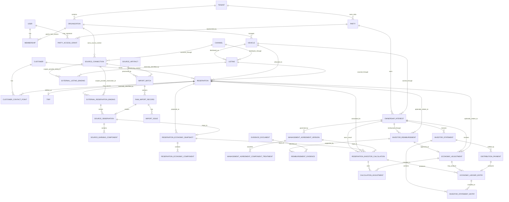

# MVP Canonical Domain Model & PostgreSQL Persistence

**Project:** Rental Asset & Travel Platform  
**Chat owner:** 03 — Domain Model & PostgreSQL  
**Steward:** `03-domain-model`  
**Artifact:** `mvp-domain-model.md`  
**Canonical path:** `/Projects/Fleet-Management/shared/canonical/mvp-domain-model.md`  
**Status:** Prior reviewed domain, finance, import, security, and Financial Platform decisions retained; focused synchronization for complete-MVP R1 `CRIT-01` and `SIG-03` / `SEC-002` adds source-financial-completeness provenance and strengthens OperatingCostFact correction integrity without redesigning unrelated domain semantics. Books V1 and Tax-Ready V1 remain deferred.  
**Revision:** 8  
**Previous revision:** 7  
**Primary inputs:** `panel-review-complete-mvp-package__2026-09-25__r1.md`, `mvp-turo-import-spec.md`, `mvp-investor-calculation-spec.md`, `financial-platform-product-direction.md`, `mvp-security-scope.md`, `trip_earnings_export_20260912.csv`, `Aaron 2026.xlsx`
**Last changed by:** `03-domain-model` — focused complete-MVP R1 CRIT-01 / SIG-03 / SEC-002 synchronization  
**Last material synchronization:** 2026-09-25 — Chat 06 source-financial-completeness contract + complete-MVP R1 OperatingCostFact correction-integrity findings  

---

## 1. Scope and evidence basis

This document defines the **minimum canonical domain and PostgreSQL persistence model** needed for the first working investor-management MVP:

```text
Turo CSV
→ immutable import artifact / raw source
→ normalized provider source revisions
→ canonical Vehicle / Listing / Reservation / Trip
→ canonical reservation-economic snapshot/components
→ versioned ownership + management rules
→ manual economic adjustments
→ deterministic reservation calculations
→ immutable investor-economic subledger
→ issued investor statement
→ distribution/payment settlement
```

The model is intentionally **not** a Turo-shaped schema and **not** a transcription of `Aaron 2026.xlsx`.

The concrete source evidence establishes several non-negotiable behaviors:

- the Turo export is a cumulative mutable YTD snapshot, not an additive transaction feed;
- the same external Reservation ID can change status, dates, odometers, earning components, and total earnings over time;
- the original artifact and every raw value remain recoverable during the finite approved source-PII retention horizon; after expiry, guest-identifying payloads become unreadable while hashes and economic/source provenance remain;
- VIN resolves the physical vehicle while the provider-side Vehicle ID maps to the provider listing/distribution binding;
- provider source earning components must remain distinct and reconcile to source-reported total earnings before canonical economic mapping;
- later null operational observations must not automatically erase previously accepted non-null operational facts;
- investor calculations require versioned management terms and exact source-revision provenance;
- historical issued/paid statements must remain reproducible even after later source revisions;
- reservation-level management calculations preserve fractional cents and must not round each line to cents;
- statement calculation state and payment/settlement state are different concepts.

The supplied concrete artifacts were re-checked:

```text
trip_earnings_export_20260912.csv
  rows: 678
  columns: 47
  unique Reservation IDs: 678
  distinct provider Vehicle ids: 16
  distinct VINs: 16
  SHA-256:
  186ab6189a4659129ff47b4c444049a3275c4fb15dd16c9271c29c604c813dde

Aaron 2026.xlsx
  sheets: CRV, Stelvio
  SHA-256:
  6b59e91c9db6ee72f578ab7a072f9ce8b2fba1035a04533366b2c74adf5901cc
```

---

# 2. MVP modeling decisions

## 2.1 Concepts retained

The MVP foundation needs the following semantic concepts:

1. `Tenant` — SaaS/security isolation boundary.
2. `Organization` — host/legal/operating/accounting entity inside a Tenant; owns a required financial timezone for Phase-A monthly finance semantics.
3. `User` / `Membership` — identity-side concepts owned by Chat 04; host access comes through Organization membership.
4. `Party` — economic/legal participant such as an investor person or organization.
5. `PartyAccessGrant` — identity-to-Party authorization relationship for investor access.
6. `Customer` — canonical renter identity when sufficiently verified; distinct from source guest snapshots.
7. `CustomerContactPoint` — source-aware Customer phone/email with permitted-use and retention provenance.
8. `EvidenceDocument` — private receipt/invoice/supporting-evidence metadata + object-storage reference.
9. `Vehicle` — canonical physical asset.
10. `OwnershipInterest` — effective-dated ownership/economic interest of a Party in a Vehicle.
11. `Channel` — canonical distribution channel such as Turo, Outdoorsy, Uber Marketplace, or Direct.
12. `SourceConnection` — tenant-owned external-source/account processing boundary within one Organization + Channel; provider identity and CURRENT-import serialization are scoped here.
13. `Listing` — one Vehicle offered through one Channel/account relationship.
14. `ExternalListingBinding` — provider-side listing/vehicle identifier mapped to canonical Listing.
15. `Reservation` — canonical commercial booking sourced through a Listing.
16. `Trip` — actual/operational fulfillment facts; optional 1:1 child of Reservation for MVP.
17. `SourceArtifact` — immutable artifact identity/hash/provenance with retention-limited encrypted source bytes when the artifact contains PII.
18. `ImportBatch` — one deterministic processing attempt/state machine and ProcessingIdentity carrier.
19. `RawImportRecord` — exact encrypted parsed source row during the retention horizon plus a long-lived PII-redacted row and row outcome.
20. `ImportIssue` — deterministic warning/error/quarantine evidence, including financially relevant source-omission provenance where applicable.
21. `SourceCurrentSnapshotPointer` — import-owned pointer to the effective successful CURRENT ImportBatch per SourceConnection; never inferred from timestamps.
22. `SourceFinancialCompletenessDisposition` — immutable finite reviewed/deterministic disposition for one financially relevant ImportIssue.
23. `SourceFinancialCompletenessProofV1` — derived provider-neutral Vehicle+cutoff completeness contract over authoritative import state; not a persisted aggregate.
24. `ExternalReservationBinding` — provider Reservation ID mapped to canonical Reservation.
25. `SourceObservation` — immutable normalized provider revision of one external reservation.
26. `SourceEarningComponent` — exact provider-specific earning component set for a SourceObservation.
27. `ReservationEconomicSnapshot` — provider-neutral economic projection for finance/investor calculations.
28. `ReservationEconomicComponent` — canonical component taxonomy used by finance.
29. `ManagementAgreementVersion` — immutable/effective-dated rules between managing Organization and OwnershipInterest.
30. `OperatingCostFact` — one canonical manager-incurred/advanced Vehicle operating-cost source fact; not an investor adjustment, GL posting, tax deduction, or payment proof.
31. `RecurringExpenseRule` / `RecurringExpenseRuleVersion` — stable recurring-cost configuration plus immutable prospective versions.
32. `RecurringExpenseOccurrence` — deterministic monthly occurrence/materialization identity.
33. `OperatingCostInvestorProjection` — deterministic agreement/policy-driven investor-economic projection from one OperatingCostFact.
34. `InvestorEconomicsProjectionSnapshot` — immutable live-view lineage envelope carrying the complete authoritative input fingerprint/cutoff semantics.
35. `InvestorReimbursement` — dashboard-visible reimbursement workflow with approval and evidence.
36. `EconomicAdjustment` — typed immutable **investor-specific** approved/manual calculation input; not the source of ordinary manager-incurred operating costs.
37. `ReservationInvestorCalculation` — immutable deterministic reservation calculation snapshot.
38. `ReservationInvestorCalculationCurrent` — one mutable current-calculation pointer per Reservation, including the currently resolved OwnershipInterest.
39. `CrossOwnershipCorrection` — Finance/Admin-approved post-issue reassignment workflow when current entitlement resolves to a different owner.
40. `EconomicLedgerEntry` — immutable investor-economic **subledger** line.
41. `InvestorStatement` — issued investor obligation/debit-carry snapshot with explicit ledger membership and predecessor chain.
42. `DistributionPayment` — settlement/payment record separate from earnings.

The MVP implementation may use only Turo initially, but these concepts make Turo an adapter rather than the domain model.

### Core relationship principle

```text
Organization manages Vehicle
Party owns OwnershipInterest in Vehicle
Vehicle is distributed through Listing(s)
Listing belongs to Channel
SourceConnection belongs to one Tenant + Organization + Channel and scopes external provider identity/import processing
Reservation books Vehicle through Listing
Trip fulfills Reservation
ManagementAgreement governs investor economics for OwnershipInterest
Organization records manager-incurred OperatingCostFact
RecurringExpenseRule → RecurringExpenseOccurrence → OperatingCostFact
OperatingCostFact → deterministic OperatingCostInvestorProjection → investor subledger when chargeable
User gains host access through Membership
User gains investor access through PartyAccessGrant → Party → OwnershipInterest
```

This same physical vehicle can therefore be:

```text
managed by: My Rental LLC
owned by: Aaron
listed on: Turo
listed on: Outdoorsy
listed on: Uber Marketplace
listed direct: platform channel
```

without any of those facts being collapsed together.

### Organization is required now

`Tenant` is not a tax/legal entity. `Organization` is required even if the first deployment has one LLC.

Financially meaningful records retain the applicable `organization_id` historically rather than deriving it from a Vehicle's current organization.

### Ownership is required now

Ownership is no longer speculative future capital-accounting scope because it directly drives:

- which vehicles appear on an investor dashboard;
- whose management agreement applies;
- whose statement/distribution is produced;
- relationship-based authorization.

The MVP uses `OwnershipInterest` as an economic/beneficial ownership relationship. It does **not** yet attempt to model title owner, lender/lienholder, fund units, waterfall classes, or every legal ownership form.

### Listing is required now

A Listing is a canonical distribution concept, not a Turo entity.

```text
Vehicle
├── Listing(channel = TURO)
├── Listing(channel = OUTDOORSY)
├── Listing(channel = UBER_MARKETPLACE)
└── Listing(channel = DIRECT)
```

For the current Turo import, the source field named `Vehicle id` is retained verbatim as a provider source value but maps semantically to `ExternalListingBinding.external_listing_id`, not to canonical Vehicle identity.

VIN still resolves the physical Vehicle.

### Finance consumes canonical economic facts, not Turo component names

Provider-specific source components remain preserved exactly:

```text
SourceObservation
└── SourceEarningComponent[]
```

A deterministic adapter/projection then produces:

```text
ReservationEconomicSnapshot
└── ReservationEconomicComponent[]
```

Finance and management agreements consume the canonical economic snapshot.

This prevents future Outdoorsy/Uber/Direct integrations from forcing Turo-specific names into finance while retaining exact economic/source provenance; guest-identifying raw payloads remain readable only for their approved retention horizon.

For the Turo MVP, canonical codes include at least the concepts required by the current Aaron agreement, for example:

```text
BASE_RENTAL
BOOST
DURATION_DISCOUNT
NONREFUNDABLE_DISCOUNT
DELIVERY_REVENUE
EXTRAS_REVENUE
EXCESS_DISTANCE_REVENUE
CANCELLATION_REVENUE
ADDITIONAL_USAGE_REVENUE
LATE_FEE_REVENUE
IMPROPER_RETURN_REVENUE
TOLL_TICKET_REIMBURSEMENT
FUEL_REIMBURSEMENT
EV_CHARGING_REIMBURSEMENT
FINE_REIMBURSEMENT
OTHER_REVENUE_ADJUSTMENT
SALES_TAX
```

The canonical economic snapshot also preserves source-reported gross/total and a mapping-policy version/hash.

---

## 2.2 Concepts deliberately omitted or simplified for MVP

### No generic polymorphic `ExternalIdentifier`

Use explicit FK-safe bindings:

```text
ExternalListingBinding
ExternalReservationBinding
```

Do not create `ExternalIdentifier(entity_type, entity_id, ...)`.

### Canonical Customer exists, but marketplace contact provenance is never discarded

The platform supports a canonical `Customer`, but the mutable Turo CSV `Guest` display-name field alone never creates or merges one.

For the investor MVP, deliberately keep Customer PII narrow:

```text
Customer
  - canonical name/profile

CustomerContactPoint
  - phone/email value
  - source Channel
  - source Reservation?
  - acquired_at
  - permitted-use policy
  - retention_until?
  - marketing opt-in state if separately obtained
```

The first useful implementation can therefore retain the guest's **name + phone number** when the host has a legitimate operational reason to retain them, while preserving where that phone number came from.

This distinction is mandatory:

```text
same Customer
├── phone from TURO
│     use_policy = BOOKING_OPERATIONS
│
└── contact collected DIRECT
      use_policy = CUSTOMER_RELATIONSHIP
      marketing_opt_in_at = ...
```

A Turo-originated phone number must never become indistinguishable from a directly collected/consented contact point merely because both belong to the same Customer.

`Reservation` keeps both:

```text
customer_id?                    // canonical Customer when explicitly/credibly linked
booked_guest_display_name?      // retention-limited booking/source snapshot
```

### High-risk identity verification is deferred from this MVP

Driver-license numbers/photos, DOB, home address, and other verification-grade PII are **not part of the current MVP persistence contract**.

The host may have access to those values operationally, but storing them creates materially higher security, retention, and marketplace-policy obligations. Add a dedicated verification subsystem only when a concrete operational/direct-rental requirement justifies it.

This is a scope reduction, not a claim that the platform can never support verification later.

### Reimbursement is a first-class workflow; MVP entry is host-finance driven

Do **not** create separate accounting ledgers for Repair, Reimbursement, and investor Expense.

`InvestorReimbursement` remains a first-class user-facing aggregate because amount, reason, receipt/evidence, review state, statement inclusion, and settlement state are useful on both host and investor dashboards.

The minimum confirmed MVP flow is:

```text
Host Finance/Admin enters reimbursement
→ associates required Reservation + Vehicle/OwnershipInterest
→ optionally uploads receipt/evidence
→ reviews/approves
→ immutable EconomicAdjustment(INVESTOR_REIMBURSEMENT)
→ deterministic reservation calculation
→ statement
→ distribution/payment
→ investor can view the full audit trail
```

Investor submission is a future portal capability, not a prerequisite for the first investor-calculation MVP. The aggregate/state machine leaves room to enable it later without changing the financial model.

For MVP, `INVESTOR_REIMBURSEMENT` is **reservation-level**. Vehicle/period-level reimbursements require an explicit future posting rule rather than being inferred from a null `reservation_id`.

The separation remains:

```text
InvestorReimbursement
    = workflow + evidence + approval + dashboard visibility

EconomicAdjustment(type = INVESTOR_REIMBURSEMENT)
    = immutable approved calculation input

ReservationInvestorCalculation
    = owns the reservation-level financial effect

EconomicLedgerEntry
    = immutable investor-economic subledger output

InvestorStatement / DistributionPayment
    = obligation and settlement
```

Approval creates exactly one EconomicAdjustment idempotently. Receipt storage never creates financial truth on its own.

A future factual company expense/AP subsystem remains separate because an investor reimbursement/deduction is not automatically a tax/bookkeeping expense.

### No separate StatementPeriod

`InvestorStatement` carries period boundaries and exact included ledger entries.

### No separate Distribution declaration aggregate

For MVP:

```text
InvestorStatement = economic obligation
DistributionPayment = settlement
```

Add a separate distribution-declaration/capital-distribution concept only if later workflows require it independently of statements.

### No full accounting journal in MVP

`EconomicLedgerEntry` is an investor-economic subledger, not tax/GAAP books. Future accounting posts independently from canonical business/source facts using versioned accounting policy.

### No Vehicle-level availability implementation yet

Multi-channel distribution eventually requires canonical Vehicle occupancy/availability so one reservation blocks all Listings for the same Vehicle. Preserve this extension point, but do not implement availability synchronization merely to reproduce investor statements.

---

# 3. Bounded contexts and aggregate ownership

| Bounded context | Aggregate root / concept | Child / associated records | Tenant-owned? |
|---|---|---|---|
| Core / Tenancy | `Organization` | identity Membership is Chat 04-owned | Yes |
| Authorization | `PartyAccessGrant` | links User to Party; Chat 04 policy-owned | Yes |
| Customer / CRM | `Customer` | `CustomerContactPoint`; Reservation may link | Yes |
| Documents / Evidence | `EvidenceDocument` | reimbursement receipt/invoice/supporting attachments | Yes |
| Fleet | `Vehicle` | ownership/distribution reference it | Yes |
| Ownership | `Party` | `OwnershipInterest` | Yes |
| Distribution | `Channel` | reference/catalog concept | Platform/reference |
| Integration | `SourceConnection` | tenant/org/channel source boundary; credentials deferred | Yes |
| Distribution | `Listing` | `ExternalListingBinding` | Yes |
| Booking | `Reservation` | optional `Trip` | Yes |
| Ingestion | `SourceArtifact` | immutable file metadata/object reference | Yes |
| Ingestion | `ImportBatch` | `RawImportRecord`, `ImportIssue` | Yes |
| Ingestion | `SourceCurrentSnapshotPointer` | `SourceFinancialCompletenessDisposition`; derived `SourceFinancialCompletenessProofV1` | Yes |
| Integration | `ExternalReservationBinding` | `SourceObservation`, `SourceEarningComponent` | Yes |
| Commerce/Economics | `ReservationEconomicSnapshot` | `ReservationEconomicComponent` | Yes |
| Investor Economics | `ManagementAgreementVersion` | fee-component policy | Yes |
| Financial Source Facts | `OperatingCostFact` | recurring rule/version/occurrence provenance | Yes |
| Investor Economics | `OperatingCostInvestorProjection` | deterministic projection from canonical operating-cost facts | Yes |
| Investor Economics | `InvestorEconomicsProjectionSnapshot` | complete-input fingerprint/cutoff lineage for live currentness | Yes |
| Investor Economics | `InvestorReimbursement` | evidence links + approval lifecycle | Yes |
| Investor Economics | `EconomicAdjustment` | immutable investor-specific approved calculation input | Yes |
| Investor Economics | `ReservationInvestorCalculation` | adjustment links; ledger entries | Yes |
| Investor Economics | `InvestorStatement` | statement-entry membership | Yes |
| Investor Economics | `DistributionPayment` | settlement ledger entry | Yes |

### `Reservation` + `Trip`

For MVP, Trip remains an optional 1:1 child of Reservation because both are updated from the same imported source observation and there is no independent checkout/checkin workflow yet.

Revisit when Trip gains independent operations such as handoff, damage, fuel, inspections, or direct-rental lifecycle.

### `Vehicle` + `Listing`

Vehicle is the physical asset and ownership target. Listing is the channel-specific commercial/distribution representation.

Do not put marketplace IDs on Vehicle.

### `Party` + `User`

Party is an economic/legal actor. User is authenticated identity.

An investor can exist as a Party before account creation; multiple Users may later be authorized to represent one investor organization. `PartyAccessGrant` provides that bridge.

### Dashboard projections

Host dashboard authorization derives from:

```text
User → Membership → Organization → managed Vehicle
```

Investor dashboard authorization derives from:

```text
User → PartyAccessGrant → Party → OwnershipInterest → Vehicle
```

These are backend authorization/query scopes, not frontend-only filters.

---

# 4. Canonical source-of-truth hierarchy

Keep these layers distinct:

```text
1. Immutable artifact identity / retention-governed source bytes
   SourceArtifact

2. Deterministic processing context
   SourceConnection
   ImportBatch / ProcessingIdentity

3. Exact encrypted provider row during retention + long-lived redacted/hash form
   RawImportRecord

4. Immutable normalized provider revision
   SourceObservation
   SourceEarningComponent[]

5. Canonical operational/distribution/customer projection
   Customer?
   CustomerContactPoint[]
   Vehicle
   Listing
   Reservation
   Trip

6. Canonical financial source facts
   ReservationEconomicSnapshot / ReservationEconomicComponent[]
   OperatingCostFact
   RecurringExpenseRule / RuleVersion / Occurrence

7. Ownership + versioned management inputs
   OwnershipInterest
   ManagementAgreementVersion

8. Investor-specific workflow / manual inputs
   InvestorReimbursement
   EvidenceDocument[]
   EconomicAdjustment[]

9. Deterministic investor projections/currentness
   ReservationInvestorCalculation / Current
   OperatingCostInvestorProjection
   InvestorEconomicsProjectionSnapshot

10. Immutable investor-economic subledger
    EconomicLedgerEntry[]

11. Frozen issued statement
    InvestorStatement
    InvestorStatementEntry[]

12. Settlement
    DistributionPayment

13. Future independent accounting/tax projections — extension seams only
    AccountingBook / JournalEntry / JournalPosting
    FixedAsset / TaxDepreciationSchedule
```

A later provider source revision may update current layers 3–8 while an issued statement/payment remains historically frozen.

The same canonical Vehicle may aggregate reservations/economics across multiple Listings and Channels.

---

# 5. Domain relationships



---

# 6. Entity definitions

## 6.1 `Organization`

**Owner:** Core / Tenancy  
**Aggregate:** root  
**Tenant ownership:** required

The host/legal/operating/accounting entity. Tenant is isolation; Organization owns operational/business responsibility.

Minimum fields:

```text
id
 tenant_id
organization_type
display_name
legal_name?
financial_timezone        // canonical IANA zone, e.g. America/Los_Angeles
status
created_at
updated_at
```

Invariants/history:

- `(tenant_id, id)` unique;
- no permanent `Tenant == Organization` assumption;
- `financial_timezone` is required and validated as a canonical IANA timezone identifier;
- Phase-A recurring occurrence dates and monthly financial/statement period boundaries are evaluated as Organization-local **dates** in this timezone;
- changing Organization timezone is a privileged configuration change, affects future/unissued deterministic input fingerprints, and never rewrites already-materialized occurrences or issued statement membership;
- inactive rather than deleted once referenced;
- financial records retain historical `organization_id`.

---

## 6.2 `Party`

**Owner:** Ownership / Investor Economics  
**Aggregate:** root  
**Tenant ownership:** required

Economic/legal participant. May be a person or organization.

```text
id
tenant_id
party_type              // PERSON | ORGANIZATION
display_name
legal_name?
linked_organization_id? // when this Party represents an internal host Organization
status
created_at
updated_at
```

Party is distinct from User. Deactivate after financial history exists.

---

## 6.3 `PartyAccessGrant`

**Owner:** Identity/Authorization (Chat 04)  
**Aggregate:** authorization relationship  
**Tenant ownership:** required

```text
id
tenant_id
user_id
party_id
access_role             // OWNER_VIEWER, OWNER_ADMIN etc.
status
effective_from
effective_to?
created_at
created_by
```

Purpose:

```text
User → PartyAccessGrant → Party → OwnershipInterest → investor-visible Vehicle data
```

This must be enforced server-side. It is not merely UI field hiding.

---

## 6.4 `Customer`

**Owner:** Customer / CRM  
**Aggregate:** root  
**Tenant ownership:** required

Canonical renter/customer identity used only when the platform has enough information to explicitly and credibly link the person.

The Turo earnings CSV alone does **not** create Customer records because its `Guest` field is only a mutable display-name snapshot.

```text
id
tenant_id
status                    // ACTIVE | RESTRICTED | ANONYMIZED
legal_first_name?
legal_last_name?
display_name?

identity_source_kind      // TURO_VERIFICATION | DIRECT | MANUAL | OTHER
identity_source_reservation_id?

created_at
created_by
updated_at
```

Rules:

- `Reservation.customer_id` is nullable.
- display name alone never matches or merges a Customer.
- canonical Customer identity is separate from permission to use a particular phone/email.
- contact data does not live directly on Customer.
- Customer linking does not rewrite a booked/source guest snapshot while that snapshot is within its permitted retention horizon; the snapshot may later expire independently of Customer identity and financial history.
- investor access does not imply Customer-contact access.
- anonymization may remove PII while retaining a stable surrogate required by booking/financial history.

---

## 6.5 `CustomerContactPoint`

**Owner:** Customer / CRM + Security/Privacy  
**Aggregate:** child/history of Customer  
**Tenant ownership:** required

A source-aware contact point. This entity exists primarily so acquisition source, permitted use, and retention are not lost when the same human becomes known through multiple channels.

```text
id
tenant_id
customer_id

contact_type              // PHONE | EMAIL
contact_value_ciphertext  // application/envelope encrypted; never logged
lookup_hmac               // required keyed HMAC-SHA-256 over normalized value
lookup_key_version

source_kind       // TURO | OUTDOORSY | UBER_MARKETPLACE | DIRECT | MANUAL
source_reservation_id?
acquired_at

use_policy_code           // BOOKING_OPERATIONS | CUSTOMER_RELATIONSHIP | OTHER_APPROVED
retention_until?
marketing_opt_in_at?

status                    // ACTIVE | EXPIRED | REVOKED
created_at
created_by
```

MVP rules:

- Turo-originated contact defaults to `BOOKING_OPERATIONS`.
- a marketplace-originated contact is not silently promoted to `CUSTOMER_RELATIONSHIP`.
- direct/consented contact may coexist with a marketplace-restricted contact for the same Customer.
- marketing consent, if later collected, belongs to the specific contact relationship rather than the Customer globally.
- raw normalized phone/email is never persisted as an indexed lookup value.
- lookup/search uses `lookup_hmac = HMAC-SHA-256(secret_key_version, normalized_value)`.
- `lookup_key_version` supports controlled key rotation.
- contact ciphertext and lookup HMAC must never be emitted to logs/analytics.

High-risk verification artifacts (driver-license images/numbers, DOB, address) are deferred from the MVP rather than stored here.

---

## 6.6 `EvidenceDocument`

**Owner:** Documents / Evidence  
**Aggregate:** root document metadata  
**Tenant ownership:** required  
**Organization ownership:** required for MVP

Reusable private evidence object for investor reimbursement receipts/invoices and later repair/expense workflows.

MVP does **not** use this table for driver's-license verification documents.

```text
id
tenant_id
organization_id            // required in MVP
document_kind              // RECEIPT | INVOICE | SUPPORTING_DOCUMENT | OTHER
original_filename
content_type
byte_size
sha256
object_storage_key

storage_state              // ACTIVE | PURGE_PENDING | PURGED
retention_class
retention_until?
uploaded_at
uploaded_by
purged_at?
```

Rules:

- every MVP EvidenceDocument belongs to exactly one Organization;
- reimbursement evidence can only attach when reimbursement and document have the same `(tenant_id, organization_id)`;
- bytes are immutable while retained;
- server generates the object-storage key; user input never controls arbitrary filesystem/object paths;
- storage is private; no durable public URL is stored;
- access comes from both Organization/resource authorization and the authorized domain object linking to the evidence;
- size/type/malware validation occurs at the upload boundary;
- `PURGED` may retain non-sensitive metadata/hash required for audit while object bytes are gone;
- purge is idempotent and retryable.

---

## 6.7 `Vehicle`

**Owner:** Fleet  
**Aggregate:** root  
**Tenant ownership:** required

```text
id
tenant_id
managing_organization_id
vin
status
display_name?
created_at
updated_at
```

Identifiers/invariants:

- UUIDv7 platform ID;
- `(tenant_id, normalized_vin)` unique;
- VIN identifies physical asset for the current import resolver;
- no marketplace IDs on Vehicle.

Lifecycle:

```text
ONBOARDING → ACTIVE → RETIRED
```

Never hard-delete after reservations, ownership, listings, or finance history exist.

---

## 6.8 `OwnershipInterest`

**Owner:** Ownership / Investor Economics  
**Aggregate:** root relationship  
**Tenant ownership:** required

Represents the Party's economic/beneficial ownership interest in a Vehicle. It drives investor dashboard scope and agreement/statement relationships.

```text
id
tenant_id
vehicle_id
owner_party_id
ownership_kind          // MVP: BENEFICIAL
effective_from
effective_to?
ownership_fraction
status                  // ACTIVE | CLOSED
created_at
created_by
```

### MVP invariant

The first finance engine supports **exactly one applicable ownership interest per Vehicle at any point in time, with `ownership_fraction = 1.0`**.

The schema keeps `ownership_fraction` because co-ownership is a known future requirement, but the MVP database/domain constraints intentionally reject fractional/overlapping ownership until an allocation engine exists.

```text
ownership_fraction = 1.0
effective_to > effective_from when present
no overlapping effective ranges for the same Vehicle
```

Host-owned vehicle:

```text
owner_party = My Rental LLC Party
ownership_fraction = 1.0
```

Investor-owned vehicle:

```text
owner_party = Aaron Party
ownership_fraction = 1.0
```

Ownership changes are effective-dated. Do not mutate an interest after statements depend on it; close/end-date the old interest and create the next one.

Historical authorization rule:

- current active ownership grants current investor Vehicle scope;
- an ended OwnershipInterest continues to grant that Party appropriately scoped access to its historical statements, distributions, and historical performance for the period it owned the Vehicle.

When true multi-owner allocation is implemented, relax the 100%/non-overlap constraint in the same migration that introduces deterministic allocation/waterfall rules.

---

## 6.9 `Channel`

**Owner:** Distribution  
**Type:** reference/catalog concept

```text
code                    // TURO | OUTDOORSY | UBER_MARKETPLACE | DIRECT
name
channel_type            // MARKETPLACE | DIRECT
status
```

Channel is not tenant-owned business data, though tenant-specific channel/account configuration will be added later.

---

## 6.10 `Listing`

**Owner:** Distribution  
**Aggregate:** root  
**Tenant ownership:** required

A channel-specific commercial representation of a Vehicle.

```text
id
tenant_id
organization_id
vehicle_id
channel_code
status                  // ACTIVE | PAUSED | ARCHIVED
created_at
archived_at?
```

For MVP, pricing, publishing metadata, availability rules, and ChannelAccount can wait.

One Vehicle may have many Listings. A Listing belongs to exactly one Vehicle and Channel.

Do not infer Vehicle identity from Listing identity.

---

## 6.10A `SourceConnection`

**Owner:** Integration / Import boundary  
**Aggregate:** root resource  
**Tenant ownership:** required  
**Organization ownership:** required for MVP

Represents one tenant-controlled external source/account namespace used to process provider data. It is **not** the provider credential/token record; secrets and live API authentication remain deferred.

```text
id
tenant_id
organization_id
channel_code
display_name
status                  // ACTIVE | DISABLED
created_at
created_by
updated_at
```

Identity/security meaning:

```text
Tenant + SourceConnection
```

scopes provider-side Reservation and Listing identifiers and is the serialization boundary for CURRENT provider-state mutation.

For the Seattle MVP:

```text
Organization = host operating entity
Channel      = TURO
SourceConnection = one Turo host/source account namespace
```

Rules:

- SourceConnection belongs to exactly one Tenant and one Organization in MVP.
- SourceConnection references exactly one Channel.
- provider credentials/API tokens are not stored here;
- external provider IDs are never resolved merely by Channel;
- an actor must be authorized for the SourceConnection before an ImportBatch may parse/normalize/apply against it;
- Chat 04 owns the exact Membership/permission primitive; the domain resource boundary is fixed here.
- background workers carry explicit Tenant + SourceConnection context.
- if a future provider account legitimately spans Organizations, revisit Organization ownership deliberately rather than dropping the boundary implicitly.

---

## 6.11 `ExternalListingBinding`

**Owner:** Integration  
**Aggregate:** binding/reference  
**Tenant ownership:** required

Maps a SourceConnection-scoped provider listing/vehicle identity to canonical Listing.

```text
id
tenant_id
organization_id
source_connection_id
listing_id
channel_code
external_listing_id
first_seen_at
last_seen_at
created_at
```

For the current Turo CSV:

```text
SourceConnection.channel_code = TURO
source column "Vehicle id" → external_listing_id
```

Provider identity:

```text
UNIQUE (tenant_id, source_connection_id, external_listing_id)
```

`channel_code` and `organization_id` are denormalized integrity dimensions, not provider identity. They must match both the referenced SourceConnection and Listing.

A provider listing ID cannot silently rebind to another Listing/Vehicle within the same SourceConnection. The same opaque provider ID may exist independently in a different SourceConnection.

A known VIN appearing with a new external listing ID is preserved and requires deterministic handling; it may represent a recreated/replaced marketplace listing.

CURRENT imports serialize provider-current mutation under the coarser `(tenant_id, source_connection_id)` batch lock. Historical/backfill writes touching one binding additionally use binding-safe serialization/CAS as needed.

---

## 6.12 `Reservation`

**Owner:** Booking  
**Aggregate:** root  
**Tenant ownership:** required

```text
id
tenant_id
organization_id
vehicle_id
listing_id
customer_id?

status                   // CONFIRMED | IN_PROGRESS | COMPLETED | CANCELLED
cancellation_party?

scheduled_start_at
scheduled_end_at
pickup_location
return_location
booked_guest_display_name?       // retention-limited operational snapshot
booked_guest_pii_retention_until?
source_trip_days?

projection_source_observation_id?
row_version
created_at
updated_at
```

Invariants:

- Listing and Vehicle belong to same tenant;
- Listing.vehicle_id must equal Reservation.vehicle_id;
- Organization must be the managing/contracting entity applicable to the reservation;
- end > start;
- external provider identity lives in ExternalReservationBinding.

`booked_guest_display_name` is an operational/source snapshot only for the configured source-PII retention horizon. It is nullable/purgeable and is never required to reproduce investor economics or an issued statement.

The Turo CSV `Guest` value alone is not sufficient Customer identity. Customer creation/linking requires a separate verified or explicitly approved identity workflow.

Cancellation is status, not deletion.

---

## 6.13 `Trip`

**Owner:** Booking  
**Aggregate:** child of Reservation for MVP  
**Tenant ownership:** required

```text
id
tenant_id
reservation_id
status                    // IN_PROGRESS | COMPLETED
check_in_odometer_miles?
check_out_odometer_miles?
distance_traveled_miles?
check_in_source_observation_id?
check_out_source_observation_id?
distance_source_observation_id?
created_at
updated_at
```

Booked/cancelled reservations do not imply a physical Trip.

Later source null does not automatically erase an accepted non-null operational fact. Conflicting non-null actuals remain reviewable rather than silently overwritten.

Do not DB-enforce `check_out >= check_in` or `distance = check_out - check_in`; real source anomalies exist.

---

## 6.14 `SourceArtifact`

**Owner:** Ingestion  
**Aggregate:** root  
**Tenant ownership:** required

Content-addressed, connection-agnostic source metadata plus retention-limited access to the original bytes. SourceConnection, import mode, CURRENT assertion, and processor versions belong to ImportBatch/ProcessingIdentity, not SourceArtifact.

```text
id
tenant_id
source_system
original_filename
content_type
byte_size
sha256
object_storage_key

contains_pii
pii_retention_policy_code
pii_retention_policy_version
pii_retention_until
encryption_key_ref
pii_storage_state          // ACTIVE | PURGE_PENDING | PURGED
pii_purged_at?

received_at
received_by
```

`UNIQUE (tenant_id, sha256)`.

### Source-PII retention envelope

Marketplace source artifacts such as the current Turo CSV contain guest PII (at minimum guest display name). They are therefore **not retained in readable form forever**.

The MVP uses a versioned source-retention policy:

```text
SourcePIIRetentionPolicy
- code
- version
- source_system / Channel
- finite retention_days > 0
- purge_mode = DELETE_BYTES_AND_DESTROY_KEY
```

The exact `retention_days` is a deployment/privacy-policy value, not hard-coded in the domain model, but it is mandatory and finite. Production ingestion of a PII-bearing source fails closed if no approved policy/version is configured.

At receipt:

```text
pii_retention_until
  = received_at + configured finite retention_days
```

Original artifact bytes are privately stored using a per-artifact envelope-encryption key.

At expiry:

```text
ACTIVE
→ PURGE_PENDING
→ destroy/disable artifact data key
→ delete original object bytes/versioned copies under the retention policy
→ PURGED
```

The following remain after purge because they do not require guest PII:

- artifact metadata and SHA-256;
- import/reconciliation counts;
- external reservation/listing IDs and VIN;
- immutable source economic components;
- normalized PII-redacted source observations;
- canonical economic snapshots;
- calculations, ledger entries and issued statement membership.

Therefore financial/audit provenance remains reproducible to the required economic standard even when the original guest-identifying source copy is intentionally no longer readable.

---

## 6.15 `ImportBatch`

**Owner:** Ingestion  
**Aggregate:** root processing attempt / ProcessingIdentity carrier  
**Tenant ownership:** required  
**Organization ownership:** required through SourceConnection

```text
id
tenant_id
organization_id
source_artifact_id
source_connection_id

profile_code
profile_version
parser_version
mapping_version
mode                         // CURRENT | HISTORICAL_BACKFILL
processing_identity_hash

source_snapshot_observed_at?
source_snapshot_id?
current_asserted_at?
current_asserted_by?

state
row/reconciliation counts
created_at
started_at?
processed_at?
completed_at?
created_by
```

Deterministic processing identity is:

```text
SourceArtifact
+ SourceConnection
+ mode
+ profile_version
+ parser_version
+ mapping_version
```

Rules:

- same successful ProcessingIdentity is idempotent;
- the same SourceArtifact bytes may be processed under another SourceConnection;
- the same SourceArtifact may be intentionally reprocessed under newer deterministic processor versions;
- CURRENT requires explicit authorized current-snapshot assertion when no trusted provider watermark establishes freshness;
- Tenant + SourceConnection + actor authorization is validated before row processing and is batch-blocking/fail-closed;
- `SourceArtifact` remains connection-agnostic;
- CURRENT provider-state mutation is serialized by `(tenant_id, source_connection_id)`, independent of parser/profile/mapping version.

State machine follows the Turo import specification from Received through Reconciled/ReconciledWithQuarantine and explicit failure states.

---

## 6.16 `RawImportRecord`

**Owner:** Ingestion  
**Aggregate:** child of ImportBatch

```text
id
tenant_id
import_batch_id
row_number

raw_values_redacted_json      // non-PII long-lived representation
raw_values_ciphertext         // exact original row, encrypted with artifact key
raw_row_hash                  // hash of exact original row before encryption

external_reservation_id?
external_listing_id?
vin?
outcome                       // NEW | UNCHANGED | REVISED | QUARANTINED | REJECTED
resolved_observation_id?
created_at
```

During the configured source-PII retention horizon, the exact original row is recoverable from `raw_values_ciphertext`.

After the SourceArtifact encryption key is destroyed, the exact PII-bearing row becomes intentionally unreadable while `raw_row_hash`, the PII-redacted representation, and all normalized economic/source facts remain.

`raw_values_redacted_json` must exclude guest/contact/verification PII and is safe for long-lived troubleshooting/audit use.

---

## 6.17 `ImportIssue`

**Owner:** Ingestion

```text
id
tenant_id
organization_id
source_connection_id
import_batch_id
raw_import_record_id?
error_code
severity
field_name?
raw_value_redacted?
normalized_value_redacted_json?
explanation
blocks_apply

financial_completeness_kind?       // QUARANTINED_FINANCIAL_ROW | RESERVATION_DISAPPEARANCE_REVIEW_REQUIRED | FINANCIAL_REGRESSION_REVIEW_REQUIRED | FINANCIAL_RECONCILIATION_UNRESOLVED | SOURCE_SCOPE_UNRESOLVED
financial_scope_vehicle_id?        // null means Vehicle scope is not safely provable
external_reservation_binding_id?
relevant_source_observation_id?

resolved_at?                       // operational issue lifecycle only
resolved_by?
resolution_note?                   // diagnostic note only; never sufficient financial-completeness authority
created_at
```

ImportIssue must never create a second indefinite PII copy. If the failing source field is PII, issue diagnostics store a redacted value and refer back to the retention-limited encrypted RawImportRecord for authorized troubleshooting during the retention horizon.

For financial completeness, a non-null `financial_completeness_kind` is durable source-omission/reconciliation provenance. `financial_scope_vehicle_id` is populated only when the issue can be deterministically bound to one canonical Vehicle; null preserves the fail-closed `UNKNOWN` case. Binding/source-observation references preserve enough lineage to evaluate cutoff relevance without exposing Finance to parser-specific row types.

Generic `resolved_at/resolved_by/resolution_note` metadata does **not** clear a financial-completeness blocker. Only deterministic accepted source lineage or a valid immutable `SourceFinancialCompletenessDisposition` can do so. Never edit raw source to make validation pass.

---

## 6.17A `SourceCurrentSnapshotPointer`

**Owner:** Ingestion  
**Type:** mutable effective-CURRENT pointer; contains no finance interpretation

```text
tenant_id
organization_id
source_connection_id
import_batch_id
updated_at
updated_by
```

There is exactly one row per Tenant + SourceConnection. It points to the effective successfully applied CURRENT ImportBatch/ProcessingIdentity from which provider snapshot identity and processing identity are read.

Rules:

- the referenced ImportBatch must belong to the same Tenant + Organization + SourceConnection, have `mode = CURRENT`, and be in `Reconciled` or `ReconciledWithQuarantine`;
- the pointer advances only inside the existing Tenant + SourceConnection CURRENT-apply serialization boundary after final apply/reconciliation succeeds;
- HISTORICAL_BACKFILL never advances it;
- reprocessing the same provider snapshot under a corrected deterministic ProcessingIdentity may advance the pointer without fabricating a newer provider snapshot;
- provider/source CURRENT identity is never inferred from `received_at`, `processed_at`, or highest ImportBatch ID.

The same protected import transaction remains authoritative for pointer movement. PostgreSQL composite relationships plus a mandatory validation trigger/constraint guard enforce the target-batch mode/state contract as defense in depth.

---

## 6.17B `SourceFinancialCompletenessDisposition` and `SourceFinancialCompletenessProofV1`

**Owner:** Ingestion for source/provenance truth; Finance consumes only the provider-neutral proof

A `SourceFinancialCompletenessDisposition` is an immutable finite disposition for one financially relevant ImportIssue:

```text
id
tenant_id
organization_id
source_connection_id
import_issue_id
resolution_code                 // REPROCESSED_ACCEPTED | KEEP_PRIOR_CURRENT_OBSERVATION_CONFIRMED | ACCEPT_CURRENT_REGRESSION_CONFIRMED | DETERMINISTICALLY_OUT_OF_SCOPE
resolved_vehicle_id?
resulting_source_observation_id?
resulting_import_batch_id?
reviewed_by?
reviewed_at?
provenance_reference?
created_at
created_by
```

Phase-A permits at most one authoritative completeness disposition per ImportIssue. Malformed/unparseable financial source data cannot be cleared by free-text acknowledgement: it requires deterministic accepted reprocessing/source lineage. Human-confirmed disappearance/regression dispositions require reviewer/time provenance and the exact resulting authoritative source lineage. `DETERMINISTICALLY_OUT_OF_SCOPE` must be provable from persisted source/binding/Vehicle/cutoff relationships, not a note.

`SourceFinancialCompletenessProofV1` is **derived**, not a new persisted aggregate/table:

```text
SourceFinancialCompletenessProofV1(
  TenantId, SourceConnectionId, VehicleId, CutoffAt
)
  -> proof_version = SOURCE_FINANCIAL_COMPLETENESS_V1
  -> effective CURRENT SourceArtifact/provider snapshot identity
  -> SourceCurrentSnapshotPointer.ImportBatch / ProcessingIdentity
  -> scope-local sorted unresolved blocker identities + IN_SCOPE/OUT_OF_SCOPE/UNKNOWN relation
  -> sorted accepted disposition identities/resulting lineage
  -> status = COMPLETE | INCOMPLETE | UNKNOWN
  -> deterministic proof_hash
```

Rules:

- proof construction begins from `SourceCurrentSnapshotPointer`, then reads the referenced ImportBatch/SourceArtifact, ImportIssues, bindings/current observations, and valid dispositions;
- `INCOMPLETE` means a known `IN_SCOPE` financially relevant blocker remains;
- `UNKNOWN` means Vehicle/cutoff relevance or effective source/processing identity cannot be proved; both are fail-closed for Finance;
- a blocker deterministically isolated to Vehicle B does not block Vehicle A;
- disappearance/regression/reconciliation blockers remain in proof lineage until deterministic reprocessing or a valid finite disposition resolves them;
- `COMPLETE` requires an established effective CURRENT provider snapshot + ProcessingIdentity and no unresolved `IN_SCOPE` or `UNKNOWN` blocker;
- `proof_hash` is versioned deterministic canonical serialization over scope, effective provider snapshot identity, applicable ProcessingIdentity, sorted blockers, and sorted dispositions; `computed_at` and display/free-text fields are excluded;
- Finance never derives source completeness by counting accepted `ReservationEconomicSnapshot` rows and never depends on Turo parser/RawImportRecord types.

This seam preserves ownership: Source Ingestion owns processing/completeness provenance; Finance consumes the proof as one authoritative deterministic input.

---

## 6.18 `ExternalReservationBinding`

**Owner:** Integration  
**Aggregate:** SourceConnection-scoped provider reservation revision-stream root

```text
id
tenant_id
organization_id
source_connection_id
channel_code
external_reservation_id
reservation_id
listing_id
current_source_observation_id?
first_seen_at
last_seen_at
created_at
```

Provider identity:

```text
UNIQUE (tenant_id, source_connection_id, external_reservation_id)
```

Rules:

- `source_connection_id` is mandatory; Channel alone is not provider identity.
- `organization_id` / `channel_code` must match SourceConnection, Reservation, and Listing.
- historical/backfill provider observations never move the effective current pointer backward;
- a processor correction of a historical provider snapshot never advances current merely because it was processed later;
- a processor correction of the currently effective provider snapshot may atomically replace the effective normalized observation for that same provider-snapshot position.

---

## 6.19 `SourceObservation`

**Owner:** Integration  
**Aggregate:** immutable provider/correction observation under ExternalReservationBinding

Normalized provider-specific semantics plus processing/correction provenance. It is not the finance ledger.

Minimum fields:

```text
id
tenant_id
organization_id
source_connection_id
channel_code
external_reservation_binding_id
external_listing_binding_id
raw_import_record_id
processing_import_batch_id

observation_kind                // PROVIDER_SNAPSHOT | PROCESSOR_CORRECTION
provider_revision_sequence      // provider chronology; corrections inherit corrected snapshot position
normalization_revision_sequence // immutable observation/correction order within binding

provider_snapshot_observed_at?
provider_snapshot_id?
source_timezone

semantic_fingerprint
external_listing_id
vin
source_vehicle_label
source_vehicle_name

guest_display_name_ciphertext?
scheduled start/end local + instant
pickup_location
return_location
source_status
source_trip_days
odometer/distance observations

currency
source_total_earnings
normalized_component_sum
normalized_payload_redacted_json

provider_supersedes_observation_id?
corrected_from_observation_id?
correction_reason?
processed_at
created_at
```

### Three identities remain separate

```text
Artifact identity:
  Tenant + SourceArtifact SHA-256

Processing identity:
  Artifact + SourceConnection + mode + processor versions

Provider reservation identity:
  Tenant + SourceConnection + external Reservation ID
```

### Semantic fingerprint contract

`semantic_fingerprint` compares only normalized provider-source semantics. It must exclude:

- canonical Vehicle/Reservation UUIDs;
- ImportBatch IDs;
- processing actor;
- warnings/quarantine state;
- parser execution timestamps;
- other processing-only state.

It includes all mapped provider semantics that define the reservation snapshot, including provider identifiers/listing metadata, source status/schedule/operational source values, complete earning components/total, and privacy-safe treatment of retained PII-sensitive source values per the import specification.

### Chronology / processor-correction invariants

- immutable;
- Tenant/Organization/SourceConnection/Channel must match the referenced ImportBatch and both external bindings;
- provider snapshot chronology and processing chronology are independent;
- a provider snapshot progression advances `provider_revision_sequence`;
- a processor correction inherits the corrected snapshot's provider chronology position and advances only normalization/correction lineage;
- historical correction cannot advance `current_source_observation_id` past a newer provider snapshot;
- correction of the currently effective provider snapshot may replace effective normalized state exactly once;
- `corrected_from_observation_id` never pretends the provider emitted a newer snapshot;
- repeating the same successful ProcessingIdentity/result is idempotent;
- accepted source component sum equals source total;
- current canonical Reservation/Trip/economic projection changes only when the effective current observation changes;
- issued/paid finance remains pinned to historical source/calculation provenance.

PII handling:

- encrypted guest snapshot is readable only during the governing SourceArtifact retention horizon;
- long-lived normalized payload excludes guest/contact/verification PII;
- source PII expiry does not alter economic values, provider chronology, correction lineage, hashes, source-component rows, or statement provenance.

---

## 6.20 `SourceEarningComponent`

**Owner:** Integration  
**Aggregate:** child of SourceObservation

```text
tenant_id
source_observation_id
source_component_code
source_component_name
amount                numeric(19,4)
currency
```

Preserve every provider component including zero values. These codes remain provider/source semantics and are not directly used as long-term finance policy identifiers.

---

## 6.21 `ReservationEconomicSnapshot`

**Owner:** Commerce / Economics  
**Aggregate:** root immutable canonical projection  
**Tenant ownership:** required

This is the marketplace-independent economic input consumed by investor calculations and later analytics/accounting projections.

```text
id
tenant_id
organization_id
reservation_id
vehicle_id
listing_id
source_observation_id?

currency
canonical_gross_amount
component_sum
entitlement_at?              // required for EARNED investor calculation

mapping_policy_code
mapping_policy_version
mapping_policy_hash
input_hash
calculated_at
supersedes_snapshot_id?
created_at
```

For provider imports, every snapshot points to one exact SourceObservation. For future direct bookings, the source may be a canonical platform transaction/event rather than an external observation.

`entitlement_at` is provider-neutral. For the current Turo adapter, a Completed source reservation maps canonicalized source `Trip end` into `entitlement_at`; non-completed snapshots leave it null. A future channel with an authoritative actual-completion event may map that event instead without changing investor-calculation code.

Invariants:

- immutable financial values;
- component sum reconciles to canonical gross under the mapping policy;
- same source revision + same mapping policy is idempotent;
- source-specific component names do not leak into agreement code;
- an EARNED investor calculation requires non-null `entitlement_at`.

---

## 6.22 `ReservationEconomicComponent`

**Owner:** Commerce / Economics  
**Aggregate:** child of ReservationEconomicSnapshot

```text
tenant_id
reservation_economic_snapshot_id
component_code          // canonical taxonomy
amount                   numeric(19,4)
currency
```

MVP canonical component codes cover the current investor calculation semantics.

A provider mapping may map one or more provider components into one canonical component, therefore provenance is represented explicitly:

```text
ReservationEconomicComponentSource
----------------------------------
tenant_id
reservation_economic_snapshot_id
component_code
source_observation_id
source_component_code
source_amount
```

For provider-derived snapshots:

- every canonical amount is explainable by one or more exact source components;
- the sum of linked `source_amount` contributions equals the canonical component amount unless the versioned mapping policy explicitly represents a derived transformation;
- each source reference is FK-backed to `SourceEarningComponent`.

This small link is required now because the audit contract promises exact source-to-canonical traceability. Do not defer it until a many-to-one mapping has already destroyed provenance.

New/unmappable provider components fail closed for finance until the mapping policy is versioned.

---

## 6.23 `ManagementAgreementVersion`

**Owner:** Investor Economics  
**Aggregate:** versioned agreement for OwnershipInterest

```text
id
tenant_id
managing_organization_id
ownership_interest_id

effective_from
effective_to?
management_fee_rate
fee_base_mode            // MVP: EXPLICIT_COMPONENT_CLASSIFICATION
component_policy_version
component_policy_hash

delivery_charge_amount
delivery_location_field
delivery_location_match
delivery_rule_version

cleaning_charge_amount
cleaning_rule_version
currency

supersedes_version_id?
created_at
created_by
```

Agreement applicability is resolved at `ReservationEconomicSnapshot.entitlement_at` using half-open ranges:

```text
effective_from <= entitlement_at < effective_to
```

with null `effective_to` meaning open-ended. Agreement ranges for one OwnershipInterest may not overlap.

Fee treatment is explicit through child policy rows:

```text
ManagementAgreementComponentTreatment
-------------------------------------
tenant_id
management_agreement_version_id
canonical_component_code
fee_treatment              // FEEABLE | EXCLUDED
```

Every canonical component contributing a non-zero amount to canonical gross must have exactly one treatment under the applicable agreement version. Missing treatment fails investor calculation closed even when provider-to-canonical mapping succeeded.

Historical Aaron treatment explicitly excludes:

```text
DELIVERY_REVENUE
EXTRAS_REVENUE
TOLL_TICKET_REIMBURSEMENT
FUEL_REIMBURSEMENT
```

and explicitly marks the remaining approved taxonomy codes `FEEABLE` where that matches the workbook behavior. New canonical codes never inherit fee treatment by default.

Agreement economic fields and component-treatment rows are immutable after creation/use.

---

## 6.24 `InvestorReimbursement`

**Owner:** Investor Economics / Investor Portal  
**Aggregate:** root workflow  
**Tenant ownership:** required

Dashboard-visible reimbursement workflow with receipts/evidence and approval history.

```text
id
tenant_id
organization_id
ownership_interest_id
vehicle_id
reservation_id            // required in MVP

category
requested_amount
currency
effective_date
description

status                     // DRAFT | SUBMITTED | APPROVED | REJECTED | CANCELLED
origin_actor_kind          // MVP: HOST_FINANCE only; future migration may add INVESTOR_PORTAL

submitted_at?
submitted_by?
approved_at?
approved_by?
rejected_at?
rejected_by?
rejection_reason?

approved_economic_adjustment_id?

idempotency_key?
created_at
created_by
updated_at
```

### MVP actor contract

The first implementation supports:

```text
Host Finance/Admin
→ create Draft
→ attach evidence
→ approve/reject

Investor
→ read authorized reimbursement/status/evidence projection
```

Investor self-submission may be enabled later through an explicit migration that expands the command path and `origin_actor_kind` constraint.

### Approval invariant

`APPROVED` creates exactly one:

```text
EconomicAdjustment(
    adjustment_type = INVESTOR_REIMBURSEMENT,
    investor_reimbursement_id = this.id,
    reservation_id = this.reservation_id,
    amount = requested/approved amount
)
```

Approval state + EconomicAdjustment creation occur in one idempotent transaction.

`requested_amount > 0`.

After approval, amount/category/Vehicle/Reservation scope are immutable. Correction uses reversal + replacement/new reimbursement according to statement state.

### Evidence

Multiple receipts/supporting documents are allowed through:

```text
InvestorReimbursementEvidence
-----------------------------
tenant_id
organization_id
investor_reimbursement_id
evidence_document_id
evidence_role              // RECEIPT | INVOICE | SUPPORTING_DOCUMENT
created_at
created_by
```

### Statement/payment semantics

Approval creates an investor-economic calculation input; it does **not** imply cash was paid.

```text
APPROVED reimbursement
→ EconomicAdjustment
→ ReservationInvestorCalculation
→ EconomicLedgerEntry
→ InvestorStatement
→ DistributionPayment
```

The dashboard may derive `approved but unstated`, `included in statement`, and `settled/paid` from downstream records.

---

## 6.24A `OperatingCostFact`

**Owner:** Financial Source Facts / Fleet Finance  
**Aggregate:** root immutable source-fact lineage  
**Tenant ownership:** required

One real Vehicle-related cost incurred or advanced by the managing Organization is represented by one canonical source-fact lineage. This is the Phase-A authoritative source for manually entered and recurring manager-incurred operating costs.

```text
id
tenant_id
organization_id
vehicle_id
reservation_id?

incurred_date                  // Organization-local financial date
category                       // REFUELING | TOLL | TICKET | OIL_CHANGE | MAINTENANCE | TRACKING | CLEANING | REPAIR | REGISTRATION | OTHER
amount                         // positive magnitude numeric(19,6)
currency
description
business_purpose?

incurred_by_kind               // Phase A: MANAGING_ORGANIZATION only
source_kind                    // MANUAL | RECURRING_RULE | LEGACY_IMPORT | CORRECTION
recurring_expense_occurrence_id?

fact_kind                      // ORIGINAL | REVERSAL | REPLACEMENT
reversal_of_operating_cost_fact_id?
replacement_for_operating_cost_fact_id?

idempotency_key?
created_at
created_by
```

Phase-A invariants:

- `organization_id` is the Vehicle's managing Organization for this fact;
- `incurred_by_kind = MANAGING_ORGANIZATION`; investor-paid/reimbursable cases use the existing explicit reimbursement/other approved path rather than being mislabeled here;
- `amount > 0`; source-level reversal meaning comes from `fact_kind`, not a negative amount entered by a user;
- category describes the real-world cost and is **not** itself investor chargeability, GL account, tax treatment, payment status, or proof of settlement;
- one real-world cost is authored once as OperatingCostFact; Phase-A commands do **not** also author `EconomicAdjustment(VEHICLE_EXPENSE)` for the same event;
- a MANUAL fact may carry an optional Reservation relationship, but the Vehicle/Organization source-fact identity remains authoritative;
- an ORIGINAL `RECURRING_RULE` fact must reference exactly one RecurringExpenseOccurrence; one occurrence materializes at most one ORIGINAL OperatingCostFact;
- REVERSAL/REPLACEMENT facts use `source_kind = CORRECTION` and reference the prior OperatingCostFact lineage rather than reusing the recurrence occurrence identity;
- economic fields are immutable after creation; correction uses reversal/replacement lineage rather than destructive edit;
- an ORIGINAL may have at most one effective REVERSAL;
- REVERSAL must match original Tenant/Organization/Vehicle/Reservation/currency/amount/category and deterministically negates the original source economic effect;
- REPLACEMENT is a new positive fact that references the fact being replaced and is created only as part of an explicit correction workflow; the original/reversal remain audit history;
- evidence may be linked later without changing source-fact identity.

Historical workbook vehicle expenses migrate to `OperatingCostFact(source_kind = LEGACY_IMPORT)` with explicit workbook provenance. They are not migrated as a second independently authored EconomicAdjustment.

---

## 6.24B `RecurringExpenseRule`, `RecurringExpenseRuleVersion`, and `RecurringExpenseOccurrence`

**Owner:** Financial Source Facts / Fleet Finance  
**Purpose:** deterministic Phase-A monthly configuration and materialization identity

`RecurringExpenseRule` is a stable logical configuration identity, not financial truth:

```text
id
tenant_id
organization_id
vehicle_id
status                         // ACTIVE | RETIRED
created_at
created_by
```

Economic/configuration edits create immutable versions:

```text
RecurringExpenseRuleVersion
---------------------------
id
tenant_id
organization_id
recurring_expense_rule_id
version_number
category
description
amount
currency
frequency                      // Phase A: MONTHLY only
effective_from                 // Organization-local date
effective_to?                  // inclusive last allowed occurrence date
enabled                        // false version deterministically disables future occurrence generation
supersedes_rule_version_id?
created_at
created_by
```

Materialized occurrence identity is separate from both the rule and the cost fact:

```text
RecurringExpenseOccurrence
--------------------------
id
tenant_id
organization_id
recurring_expense_rule_id
recurring_expense_rule_version_id
vehicle_id
occurrence_date                // Organization-local date
financial_period_start         // first local date of occurrence month
financial_period_end           // last local date of occurrence month
financial_timezone             // resolved Organization timezone used for this occurrence
materialized_at
materialized_by
```

Deterministic Phase-A monthly rule:

```text
first occurrence date = EffectiveFrom
subsequent occurrence date = same day-of-month as EffectiveFrom
if a month has no such day = last calendar day of that month
timezone = Organization.financial_timezone
no proration
occurrence belongs to the monthly period containing occurrence_date
EffectiveTo blocks dates after EffectiveTo
```

Rules:

- `(tenant_id, recurring_expense_rule_id, occurrence_date)` is unique;
- each occurrence resolves exactly one applicable enabled rule version; ambiguous/overlapping versions fail closed;
- edits are prospective through a new version; they never rewrite already-materialized occurrences;
- disabling creates/provisions a prospective disabled version (or retires the rule after its last valid occurrence); historical occurrences remain;
- re-enabling is a later prospective enabled version and cannot regenerate an already-existing occurrence identity;
- materialization occurs synchronously inside an explicit authorized Finance/Statement Refresh before calculation candidate selection; Phase A has no autonomous scheduler/SYSTEM materializer;
- refresh determines every due occurrence through its cutoff/as-of date, creates missing occurrence identities idempotently, and creates exactly one `OperatingCostFact(source_kind=RECURRING_RULE)` per occurrence in the same protected command/transaction boundary;
- a month with no Turo import still materializes when an authorized finance refresh runs;
- correcting a materialized occurrence corrects its OperatingCostFact lineage; it does not rewrite the rule occurrence or issued history.

---

## 6.24C `OperatingCostInvestorProjection`

**Owner:** Investor Economics  
**Type:** immutable deterministic projection from source fact; never independently authored

```text
id
tenant_id
organization_id
ownership_interest_id
vehicle_id
operating_cost_fact_id
management_agreement_version_id?

projection_policy_code
projection_policy_version
projection_policy_hash
projection_input_fingerprint

economic_date
investor_signed_amount          // zero/positive/negative deterministic result
calculated_at
supersedes_projection_id?
```

Boundary rules:

- `OperatingCostFact` is authoritative factual cost history; `OperatingCostInvestorProjection` is a downstream investor-economic interpretation;
- category alone never implies investor chargeability;
- applicable ownership, ManagementAgreementVersion, and versioned projection policy decide whether the cost has zero or non-zero investor effect;
- the same source category may project differently under different agreement versions without mutating the source fact;
- this projection is created only by deterministic Finance Refresh logic and cannot be manually authored as a second cost event;
- source-fact sign is deterministic: ORIGINAL/REPLACEMENT represent the positive cost fact, while REVERSAL negates the referenced prior source effect; projection policy converts that source effect into the investor-perspective signed amount;
- a non-zero investor effect may generate a `VEHICLE_EXPENSE`-classified EconomicLedgerEntry, but that ledger line references this projection—not an EconomicAdjustment;
- source correction/reversal/replacement creates new immutable projection lineage; issued statements remain frozen; Chat 05 owns the exact current-vs-issued statement-eligibility/delta recognition rule during its Section-18 synchronization, and that rule must ensure superseded unstated projections cannot double count;
- future Books/Tax projections may independently consume the same OperatingCostFact under their own versioned policies; they do not consume the investor subledger as accounting truth.

---

## 6.24D `InvestorEconomicsProjectionSnapshot` and complete-input currentness

**Owner:** Investor Economics  
**Type:** immutable live-projection lineage envelope; not a source fact or accounting journal

```text
id
tenant_id
organization_id
ownership_interest_id
vehicle_id
as_of_date
cutoff_date
financial_timezone

fingerprint_policy_code
fingerprint_policy_version
complete_input_fingerprint
projection_engine_version
projection_result_hash
created_at
created_by
supersedes_projection_snapshot_id?
```

Each successful snapshot also records the exact provider-neutral source-completeness proofs it consumed through immutable provenance children:

```text
InvestorEconomicsProjectionSourceProof
--------------------------------------
tenant_id
organization_id
investor_economics_projection_snapshot_id
source_connection_id
import_batch_id                  // exact effective CURRENT ImportBatch / ProcessingIdentity
proof_version
proof_hash
status                           // persisted snapshots require COMPLETE
```

`ImportBatch` supplies the exact SourceArtifact/provider snapshot assertion and ProcessingIdentity lineage. The child set is part of the complete input fingerprint and makes the successful source-completeness decision auditable even after a SourceConnection later advances to a newer CURRENT batch.

The authoritative Phase-A currentness predicate is derived, not a mutable stale flag:

```text
CURRENT
iff
stored complete_input_fingerprint
== ComputeAuthoritativeInvestorInputFingerprintV1(scope, cutoff)
and every required deterministic input/occurrence is present and valid
```

`ComputeAuthoritativeInvestorInputFingerprintV1` canonicalizes and hashes the complete deterministic input set that can affect the live Vehicle/OwnershipInterest projection through the stated cutoff, including at minimum:

1. scope identity: Tenant, Organization, Vehicle, OwnershipInterest, as-of/cutoff date, Organization financial timezone, recognition/fingerprint policy versions;
2. for every applicable external source scope, the exact `SourceFinancialCompletenessProofV1` proof version/hash/status plus effective provider snapshot identity and ImportBatch/ProcessingIdentity lineage; every required proof must be `COMPLETE`;
3. authoritative current reservation/source lineage: each relevant current ReservationEconomicSnapshot identity/input hash and provider/current-source lineage required to prove that snapshot current;
4. applicable OwnershipInterest/effective-date resolution;
5. applicable ManagementAgreementVersion plus component-treatment/projection-policy identity/hash;
6. every effective investor-specific EconomicAdjustment/reversal/override identity and deterministic payload relevant through cutoff;
7. every effective OperatingCostFact correction lineage through cutoff and its deterministic investor-projection policy inputs;
8. every RecurringExpenseRule/RuleVersion that can create an occurrence through cutoff **plus the complete expected occurrence-date set**; every due occurrence must be materialized exactly once to its OperatingCostFact or the projection is BLOCKED/non-current;
9. deterministic calculation/projection engine and policy versions that can change the result.

Canonical ordering/serialization is versioned and must be byte-stable. Idempotence means the same complete input fingerprint produces the same deterministic projection result/hash.

A stored UI/read-model freshness field may cache the result, but it is not authoritative. If a Turo CURRENT import, source-completeness blocker/disposition/current-snapshot pointer, operating-cost correction, recurring-rule edit, ownership/agreement/override change, or other authoritative input commits while refresh later fails, the prior snapshot automatically fails this fingerprint comparison on the next read and cannot report CURRENT. A `ReconciledWithQuarantine` batch may still be a valid import result, but the live financial projection is CURRENT only when every applicable source-completeness proof is `COMPLETE`.

`STALE`, `BLOCKED`, and `UNKNOWN` are acceptable read states when the match cannot be proven. `CURRENT` is fail-closed. A successful snapshot's `InvestorEconomicsProjectionSourceProof[]` must exactly cover every applicable external source scope and each row must record `status = COMPLETE`; missing or extra/mismatched proof lineage fails the currentness comparison.

This Phase-A seam deliberately does **not** create AccountingBook, JournalEntry, TaxAsset, depreciation schedule, bank-feed, AP, or tax-workpaper tables.

---

## 6.25 `EconomicAdjustment`

**Owner:** Investor Economics  
**Aggregate:** root immutable **investor-specific** financial input

`EconomicAdjustment` remains valid for investor-contract semantics that are not the authoritative source of an ordinary manager-incurred operating cost. In particular, `REPAIR_CHARGE` is an investor-specific contractual/manual charge input; an actual manager-incurred repair bill belongs in `OperatingCostFact` and may project to investor economics through agreement policy.

```text
id
tenant_id
organization_id
ownership_interest_id
vehicle_id
reservation_id?

adjustment_type
category
amount?                       // positive magnitude for Repair/Reimbursement
currency
effective_date
description

target_charge_type?           // DELIVERY | CLEANING
override_action?              // REPLACE | WAIVE
replacement_charge_amount?    // required for REPLACE; null for WAIVE
investor_reimbursement_id?
evidence/source artifact reference?
reversal_of_adjustment_id?
idempotency_key?
created_at
created_by
```

Phase-A types and posting ownership:

| Adjustment type | Reservation required? | Financial posting path |
|---|---:|---|
| `REPAIR_CHARGE` | Yes | input to `ReservationInvestorCalculation` only |
| `INVESTOR_REIMBURSEMENT` | Yes | input to `ReservationInvestorCalculation` only |
| `FIXED_OPERATIONAL_CHARGE_OVERRIDE` | Yes | input to `ReservationInvestorCalculation` only |

There is **no authorable `EconomicAdjustment(VEHICLE_EXPENSE)` path** after this synchronization. Ordinary manually entered/recurring Vehicle operating costs use `OperatingCostFact`; their investor effect, if any, is a deterministic `OperatingCostInvestorProjection`.

### Fixed operational override semantics

Overrides are absolute, never deltas:

```text
override_action = REPLACE
  -> resolved charge = replacement_charge_amount >= 0

override_action = WAIVE
  -> resolved charge = 0
```

At most one effective non-reversed override may exist for one Reservation + target charge. Multiple active overrides fail calculation closed.

### Deterministic reversal semantics

For Repair/Reimbursement, `amount` is a positive magnitude. A reversal points to one non-reversal original and produces the exact negative investor-economic effect.

For a fixed-charge override, reversal removes the original override's resolved effect. It must match the original target/action/replacement payload; it is never interpreted as a second override.

A reversal must:

- reference exactly one non-reversal original;
- use the same tenant, Organization, OwnershipInterest, Vehicle, Reservation scope, adjustment type, target charge payload, and currency;
- never reverse itself or another reversal;
- be the only effective reversal of that original;
- retain its own actor/timestamp/idempotency provenance.

A replacement is a separate new normal EconomicAdjustment created after the reversal. Replacement never mutates the original/reversal rows.

### Posting ownership remains single-path

All Phase-A EconomicAdjustment types are reservation-level calculation inputs. They are consumed by `ReservationInvestorCalculation` and must never also create a direct adjustment-sourced EconomicLedgerEntry.

For newly entered reimbursements, `INVESTOR_REIMBURSEMENT` is generated from an approved `InvestorReimbursement`. Legacy spreadsheet migration may create an investor-specific adjustment with explicit legacy provenance only where the spreadsheet evidence actually represents investor-contract semantics; historical Vehicle expenses migrate to OperatingCostFact instead.

EconomicAdjustment remains an investor-economic input, not automatically an accounting/tax expense.

---

## 6.26 `ReservationInvestorCalculation`

**Owner:** Investor Economics  
**Aggregate:** root immutable calculation

```text
id
tenant_id
organization_id
ownership_interest_id
reservation_id
reservation_economic_snapshot_id?
legacy_source_artifact_id?
legacy_source_locator?
management_agreement_version_id?

origin                     // DETERMINISTIC_ENGINE | LEGACY_ISSUED_IMPORT
calculation_mode           // PROVISIONAL | EARNED | LEGACY_ISSUED
posting_disposition        // NO_LEDGER | FULL_CURRENT | CLOSED_PERIOD_DELTA | CROSS_OWNERSHIP_CORRECTION_REQUIRED | LEGACY_ISSUED
calculation_engine_version
fingerprint_policy_code
fingerprint_policy_version
calculation_input_hash          // complete reservation-scoped deterministic input fingerprint
entitlement_at?
calculated_at

canonical_gross
excluded_delivery
excluded_extras
excluded_tolls_tickets
excluded_fuel_reimbursement
management_fee_base
management_fee
fixed_delivery_charge
fixed_cleaning_charge
repair_charge
investor_reimbursement
investor_base_share
investor_reservation_earnings

recognized_reservation_amount?  // CLOSED_PERIOD_DELTA only
closed_period_delta?             // target - recognized
supersedes_calculation_id?
```

For deterministic execution, `calculation_input_hash` is a complete reservation-scoped deterministic fingerprint over the exact canonical economic snapshot/current-source lineage, applicable ownership/agreement at entitlement time, component-policy hash, effective investor-specific EconomicAdjustment/reversal/override lineage, calculation/fingerprint policy versions, and any other deterministic reservation input that can change the result. It is not a hash of only convenient/known inputs. Vehicle-level OperatingCostFact effects remain a separate source-fact → OperatingCostInvestorProjection path and are not duplicated inside reservation calculation.

Current Aaron calculation remains:

```text
ManagementFeeBase
  = sum(canonical components explicitly classified FEEABLE)

ManagementFee
  = ManagementFeeBase * ManagementFeeRate

InvestorBaseShare
  = ManagementFeeBase - ManagementFee

InvestorReservationEarnings
  = InvestorBaseShare
  - FixedDeliveryCharge
  - FixedCleaningCharge
  - RepairCharge
  + InvestorReimbursement
```

Use `numeric(19,6)` for calculated amounts. No per-reservation cent rounding.

Legacy issued workbook calculations that cannot be reconstructed from a valid historical provider revision remain explicitly labeled `LEGACY_ISSUED_IMPORT` rather than fabricating source history.

---

## 6.26A `ReservationInvestorCalculationCurrent`

**Owner:** Investor Economics  
**Type:** mutable current-pointer projection; contains no monetary truth

```text
tenant_id
reservation_id
vehicle_id
calculation_id
current_ownership_interest_id
updated_at
```

Unique/primary key:

```text
(tenant_id, reservation_id)
```

The pointer advances atomically under `VehicleInvestorEconomicLock`. Old calculations and their ledger rows remain immutable. Statement selection for reservation-derived full/delta rows must join through this reservation-level pointer so a mutable `EntitlementAt` revision cannot leave the same Reservation simultaneously current for two OwnershipInterests.

---

## 6.26B `CrossOwnershipCorrection`

**Owner:** Investor Economics  
**Aggregate:** Finance/Admin-approved correction workflow

```text
id
tenant_id
organization_id
vehicle_id
reservation_id
current_calculation_id
status                    // REQUIRED | APPROVED | APPLIED | REJECTED
reason_code               // ENTITLEMENT_OWNERSHIP_CHANGED
created_at
created_by
approved_at?
approved_by?
applied_at?
idempotency_key?
```

The affected OwnershipInterests are derived from immutable issued membership plus the current calculation; client-supplied source/target owner IDs are not authoritative. Approval/application requires Finance/Admin authorization for the managing Organization and every affected OwnershipInterest.

At apply time, per affected owner `O`:

```text
TargetEntitlement(O) = current investor earnings if O is current owner, otherwise 0
RecognizedIssued(O)  = cumulative issued reservation economics for O
CrossOwnerDelta(O)   = TargetEntitlement(O) - RecognizedIssued(O)
```

Each non-zero delta produces one signed `CROSS_OWNERSHIP_CORRECTION` ledger entry. Example: old owner X recognized `+100`, current owner Y target `+120` -> X `-100`, Y `+120`. Issued statements remain immutable.

For statement eligibility, an **unstated** correction row is current only while the correction's `current_calculation_id` equals `ReservationInvestorCalculationCurrent.calculation_id` for the same Tenant + Reservation. A newer calculation leaves the old case/rows immutable but makes its unstated rows ineligible. Any old correction rows already frozen in ISSUED statements remain recognized history and are included when a newer correction computes per-owner `target - issued-recognized`.

Approval/application must fail closed if the correction's calculation is no longer the reservation's current calculation.

---

## 6.27 `CalculationAdjustment`

FK-backed provenance link:

```text
tenant_id
reservation_investor_calculation_id
economic_adjustment_id
```

It proves exactly which manual inputs were used.

---

## 6.28 `EconomicLedgerEntry`

**Owner:** Investor Economics  
**Type:** immutable investor-economic subledger fact

```text
id
tenant_id
organization_id
ownership_interest_id
vehicle_id
reservation_id?
entry_type
signed_amount
currency
economic_date
reservation_calculation_id?
operating_cost_investor_projection_id?
distribution_payment_id?
cross_ownership_correction_id?
created_at
```

Signed from owner/investor perspective:

```text
INVESTOR_BASE_SHARE          +
FIXED_DELIVERY_CHARGE        -
FIXED_CLEANING_CHARGE        -
REPAIR_CHARGE                -
INVESTOR_REIMBURSEMENT       +
VEHICLE_EXPENSE              -
CLOSED_PERIOD_CORRECTION     signed (+/-)
CROSS_OWNERSHIP_CORRECTION    signed (+/-)
DISTRIBUTION_PAYMENT         NORMAL -, REVERSAL +
```

`MANAGEMENT_FEE` is deliberately **not** an investor-balance-impacting ledger type when `INVESTOR_BASE_SHARE = ManagementFeeBase - ManagementFee`; otherwise the fee would be deducted twice. Management fee remains a first-class calculation/audit value and may feed a future management-company accounting/P&L projection.

Exactly one generating source must be present.

Generating-source contract:

```text
reservation_calculation_id
  → FULL_CURRENT reservation lines
  → or exactly one CLOSED_PERIOD_CORRECTION line

operating_cost_investor_projection_id
  → VEHICLE_EXPENSE-classified investor effect from one canonical OperatingCostFact projection
  → never an independently authored source fact

cross_ownership_correction_id
  → CROSS_OWNERSHIP_CORRECTION only
  → one row per affected OwnershipInterest per correction
  → unstated row eligible only while correction.current_calculation_id
    equals ReservationInvestorCalculationCurrent.calculation_id

distribution_payment_id
  → DISTRIBUTION_PAYMENT only
```

Already-issued correction rows remain recognized historical economics after their correction lineage is superseded; only their **unstated** siblings become ineligible.

For every `FULL_CURRENT` calculation:

```text
SUM(all investor-balance-impacting ledger entries from calculation)
= investor_reservation_earnings
```

No Phase-A EconomicAdjustment directly generates an EconomicLedgerEntry. A `VEHICLE_EXPENSE`-classified investor ledger row must reference exactly one OperatingCostInvestorProjection, which in turn references exactly one canonical OperatingCostFact. This removes the independent-adjustment/direct-cost double-post path.

This table is not a debit/credit accounting journal.

---

## 6.29 `InvestorStatement`

**Owner:** Investor Economics  
**Aggregate:** root

```text
id
tenant_id
organization_id
ownership_interest_id
period_start
period_end
version
status                    // DRAFT | ISSUED | SUPERSEDED
recognition_policy_code   // new: ECONOMIC_DATE; legacy: LEGACY_EXPLICIT_MEMBERSHIP
recognition_policy_version
calculation_cutoff_at
currency
reservation_earnings_total
operating_cost_total
period_economic_total
opening_investor_debit_carryforward   // positive magnitude
carry_forward_predecessor_statement_id?
investor_payable_total                // >= 0
closing_investor_debit_carryforward   // positive magnitude
origin
legacy source provenance?
issued_at?
supersedes_statement_id?
issue_idempotency_key?
created_at
created_by
```

New deterministic statements use `ECONOMIC_DATE_V1`. Historical migrated statements preserve workbook membership with `LEGACY_EXPLICIT_MEMBERSHIP_V1`.

Statement membership is explicit and immutable after issue. `PAID` is derived from settlement, not a statement status.

Negative net economics produce debit carry-forward, not a negative payment. Deterministic statements form a strict predecessor chain per Tenant + Organization + OwnershipInterest + Currency + recognition-policy lineage. After the first statement, `period_start` must equal predecessor `period_end + 1 day`; active periods may not overlap or be issued out of chronological order, and opening debit must equal predecessor closing debit exactly.

---

## 6.30 `InvestorStatementEntry`

```text
tenant_id
investor_statement_id
economic_ledger_entry_id
created_at
```

An issued statement freezes exact immutable ledger membership.

---

## 6.31 `DistributionPayment`

**Owner:** Investor Economics  
**Aggregate:** settlement record

```text
id
tenant_id
organization_id
investor_statement_id
ownership_interest_id
payment_kind              // NORMAL | REVERSAL
reverses_distribution_payment_id?
settlement_amount         // numeric(19,6), > 0
cash_amount?              // numeric(19,2)
cash_rounding_variance?   // numeric(19,6)
currency
status                    // PENDING | PAID | FAILED | VOIDED
evidence_kind
paid_at?
payment_reference?
notes?
idempotency_key?
created_at
created_by
```

MVP settlement invariants:

- payment currency equals statement currency;
- NORMAL `PAID` settlement cannot exceed outstanding positive statement payable;
- negative/zero statement payable cannot receive a NORMAL settlement;
- `PENDING -> PAID | FAILED | VOIDED`;
- `PAID` is terminal;
- undoing a paid settlement uses one full `REVERSAL` record referencing the original paid NORMAL payment; it does not destructively change the original status.

Historical workbook `PAID` markers may establish NORMAL/PAID settlement status without inventing bank date/reference/cash evidence.

Payment changes outstanding settlement balance only; it does not change earned economics.

---

## 6.32 Dashboard read models / projections

Dashboard-specific tables are **not** required as authoritative aggregates in MVP. Query/read-model projections can be built from canonical data and optimized later.

### Host view scope

```text
User
→ Membership
→ Organization
→ all managed Vehicles
→ Listings / Reservations / Trips / imports / operations / ownership / finance
```

Role/permission rules can narrow this for fleet managers, employees, finance users, etc.

### Investor view scope

```text
User
→ PartyAccessGrant
→ Party
→ OwnershipInterest(s)
→ current Vehicle scope + historical ownership scope
→ investor-authorized projections
```

The investor view can include asset details, reservation-derived performance, management fees, expenses assigned to the ownership interest, **reimbursements and receipt/evidence status**, statements, payments, valuation, and later analytics/AI.

The reimbursement portion of the investor dashboard may show:

```text
amount / currency
category / description
Vehicle / optional Reservation
Draft / Submitted / Approved / Rejected state
receipts/supporting documents the investor is authorized to view
statement inclusion
settlement/payment status
```

For MVP, investor-authorized Users can view reimbursement/status/evidence within their OwnershipInterest scope; Host Finance/Admin creates and approves/rejects reimbursement records. Investor self-submission is deferred.

It must not expose host-private data merely because it exists on the same Vehicle.

Customer/guest PII is **not investor data by default**. Investor views and investor-facing agents should normally use trip/economic facts without exposing email, phone, birth date, driver's-license details, verification documents, or other sensitive Customer data.

The host view may expose Customer contact data only to roles that need it for operations, support, claims, or compliance, and must respect the contact point's source/use policy.

Future analytical/agentic tools must execute under the same relationship-aware authorization scope and consume deterministic source-of-truth data.

---

# 7. PostgreSQL schema proposal

## 7.1 Schemas

```sql
CREATE SCHEMA IF NOT EXISTS core;
CREATE SCHEMA IF NOT EXISTS crm;
CREATE SCHEMA IF NOT EXISTS documents;
CREATE SCHEMA IF NOT EXISTS fleet;
CREATE SCHEMA IF NOT EXISTS ownership;
CREATE SCHEMA IF NOT EXISTS distribution;
CREATE SCHEMA IF NOT EXISTS booking;
CREATE SCHEMA IF NOT EXISTS ingest;
CREATE SCHEMA IF NOT EXISTS integration;
CREATE SCHEMA IF NOT EXISTS commerce;
CREATE SCHEMA IF NOT EXISTS finance;

CREATE EXTENSION IF NOT EXISTS btree_gist;
```

Identity/User/Membership remain owned by the identity/security module. `core.organization` is required even with one host LLC.

## 7.2 Global conventions

### IDs

Application-generated UUIDv7.

### Tenant-safe FKs

Every tenant-owned table carries `tenant_id` and exposes `UNIQUE (tenant_id, id)` so cross-table relationships can use composite FKs:

```sql
FOREIGN KEY (tenant_id, vehicle_id)
REFERENCES fleet.vehicle (tenant_id, id)
```

This is defense in depth against cross-tenant reference bugs.

### Historical Organization attribution

Financially meaningful rows retain `organization_id`. Never rely solely on a Vehicle's current managing organization to infer historical tax/accounting responsibility.

### Time

Use `timestamptz` for instants. Preserve source local wall-clock values separately when the provider supplies no offset.

### Money

Do not use PostgreSQL `money` or binary floating point.

```text
numeric(19,4)  source/canonical imported monetary facts
numeric(19,6)  calculated entitlement, ledger, statement values
numeric(19,2)  verified actual cash amount when appropriate
char(3)        ISO currency
```

### States

Prefer text + CHECK for MVP lifecycle/state codes.

### Mutable vs immutable rows

Mutable operational aggregate roots may use `row_version bigint`. Immutable source/calculation/ledger rows use append/supersede/reversal semantics instead of optimistic mutation.

---

# 8. Critical DDL skeleton

The following focuses on constraints that are expensive to retrofit later.

## 8.1 Core / fleet / ownership

```sql
CREATE TABLE core.organization (
    id                  uuid PRIMARY KEY,
    tenant_id           uuid NOT NULL,
    organization_type   text NOT NULL,
    display_name        text NOT NULL,
    legal_name          text NULL,
    financial_timezone  text NOT NULL,
    status              text NOT NULL,
    created_at          timestamptz NOT NULL,
    updated_at          timestamptz NOT NULL,
    UNIQUE (tenant_id, id),
    CHECK (status IN ('ACTIVE','INACTIVE'))
);

CREATE TABLE ownership.party (
    id                      uuid PRIMARY KEY,
    tenant_id               uuid NOT NULL,
    party_type              text NOT NULL,
    display_name            text NOT NULL,
    legal_name              text NULL,
    linked_organization_id  uuid NULL,
    status                  text NOT NULL,
    created_at              timestamptz NOT NULL,
    updated_at              timestamptz NOT NULL,
    UNIQUE (tenant_id, id),
    FOREIGN KEY (tenant_id, linked_organization_id)
        REFERENCES core.organization (tenant_id, id),
    CHECK (party_type IN ('PERSON','ORGANIZATION')),
    CHECK (status IN ('ACTIVE','INACTIVE'))
);

CREATE UNIQUE INDEX ux_party_internal_organization
ON ownership.party (tenant_id, linked_organization_id)
WHERE linked_organization_id IS NOT NULL;

CREATE TABLE crm.customer (
    id                              uuid PRIMARY KEY,
    tenant_id                       uuid NOT NULL,
    status                          text NOT NULL,
    legal_first_name                text NULL,
    legal_last_name                 text NULL,
    display_name                    text NULL,
    identity_source_kind            text NOT NULL,
    identity_source_reservation_id  uuid NULL,
    created_at                      timestamptz NOT NULL,
    created_by                      uuid NULL,
    updated_at                      timestamptz NOT NULL,

    UNIQUE (tenant_id, id),

    CHECK (status IN ('ACTIVE', 'RESTRICTED', 'ANONYMIZED')),
    CHECK (identity_source_kind IN ('TURO_VERIFICATION','DIRECT','MANUAL','OTHER'))
);

CREATE TABLE crm.customer_contact_point (
    id                      uuid PRIMARY KEY,
    tenant_id               uuid NOT NULL,
    customer_id             uuid NOT NULL,
    contact_type             text NOT NULL,
    contact_value_ciphertext bytea NOT NULL,
    lookup_hmac              char(64) NOT NULL,
    lookup_key_version       text NOT NULL,
    source_kind              text NOT NULL,
    source_reservation_id   uuid NULL,
    acquired_at             timestamptz NOT NULL,
    use_policy_code         text NOT NULL,
    retention_until         timestamptz NULL,
    marketing_opt_in_at     timestamptz NULL,
    status                  text NOT NULL,
    created_at              timestamptz NOT NULL,
    created_by              uuid NULL,

    UNIQUE (tenant_id, id),

    FOREIGN KEY (tenant_id, customer_id)
        REFERENCES crm.customer (tenant_id, id),

    CHECK (contact_type IN ('PHONE','EMAIL')),
    CHECK (source_kind IN ('TURO','OUTDOORSY','UBER_MARKETPLACE','DIRECT','MANUAL','OTHER')),
    CHECK (use_policy_code IN ('BOOKING_OPERATIONS','CUSTOMER_RELATIONSHIP','OTHER_APPROVED')),
    CHECK (status IN ('ACTIVE','EXPIRED','REVOKED'))
);

CREATE INDEX ix_customer_contact_lookup
ON crm.customer_contact_point
(tenant_id, contact_type, lookup_hmac, status);

CREATE TABLE documents.evidence_document (
    id                  uuid PRIMARY KEY,
    tenant_id           uuid NOT NULL,
    organization_id     uuid NOT NULL,
    document_kind       text NOT NULL,
    original_filename   text NOT NULL,
    content_type        text NOT NULL,
    byte_size           bigint NOT NULL,
    sha256              char(64) NOT NULL,
    object_storage_key  text NOT NULL,
    storage_state       text NOT NULL,
    retention_class     text NOT NULL,
    retention_until     timestamptz NULL,
    uploaded_at         timestamptz NOT NULL,
    uploaded_by         uuid NULL,
    purged_at           timestamptz NULL,

    UNIQUE (tenant_id, id),
    UNIQUE (tenant_id, id, organization_id),

    FOREIGN KEY (tenant_id, organization_id)
        REFERENCES core.organization (tenant_id, id),

    CHECK (byte_size >= 0),
    CHECK (sha256 ~ '^[0-9a-f]{64}$'),
    CHECK (document_kind IN ('RECEIPT','INVOICE','SUPPORTING_DOCUMENT','OTHER')),
    CHECK (storage_state IN ('ACTIVE','PURGE_PENDING','PURGED'))
);

CREATE TABLE fleet.vehicle (
    id                       uuid PRIMARY KEY,
    tenant_id                uuid NOT NULL,
    managing_organization_id uuid NOT NULL,
    vin                      text NOT NULL,
    status                   text NOT NULL,
    display_name             text NULL,
    created_at               timestamptz NOT NULL,
    updated_at               timestamptz NOT NULL,
    UNIQUE (tenant_id, id),
    UNIQUE (tenant_id, vin),
    UNIQUE (tenant_id, id, managing_organization_id),
    FOREIGN KEY (tenant_id, managing_organization_id)
        REFERENCES core.organization (tenant_id, id),
    CHECK (vin = upper(btrim(vin))),
    CHECK (vin ~ '^[A-HJ-NPR-Z0-9]{17}$'),
    CHECK (status IN ('ONBOARDING','ACTIVE','RETIRED'))
);

CREATE TABLE ownership.ownership_interest (
    id                  uuid PRIMARY KEY,
    tenant_id           uuid NOT NULL,
    vehicle_id          uuid NOT NULL,
    owner_party_id      uuid NOT NULL,
    ownership_kind      text NOT NULL,
    effective_from      date NOT NULL,
    effective_to        date NULL,
    ownership_fraction  numeric(9,8) NOT NULL,
    status              text NOT NULL,
    created_at          timestamptz NOT NULL,
    created_by          uuid NULL,
    UNIQUE (tenant_id, id),
    UNIQUE (tenant_id, id, vehicle_id),

    FOREIGN KEY (tenant_id, vehicle_id)
        REFERENCES fleet.vehicle (tenant_id, id),
    FOREIGN KEY (tenant_id, owner_party_id)
        REFERENCES ownership.party (tenant_id, id),

    CHECK (ownership_kind IN ('BENEFICIAL')),
    CHECK (ownership_fraction = 1.00000000),
    CHECK (effective_to IS NULL OR effective_to > effective_from),
    CHECK (status IN ('ACTIVE','CLOSED'))
);

ALTER TABLE ownership.ownership_interest
ADD CONSTRAINT ex_ownership_interest_vehicle_overlap
EXCLUDE USING gist (
    tenant_id WITH =,
    vehicle_id WITH =,
    daterange(
        effective_from,
        COALESCE(effective_to, 'infinity'::date),
        '[)'
    ) WITH &&
);
```

MVP ownership writes also serialize on the Vehicle row (or an equivalent advisory lock) so concurrent creation cannot race around the effective-range invariant. Relax the `ownership_fraction = 1` + overlap exclusion only when the multi-owner allocation engine is introduced.

`PartyAccessGrant` belongs in the identity/security schema and must reference Party with tenant-safe FKs.

## 8.2 Distribution

```sql
CREATE TABLE distribution.channel (
    code          text PRIMARY KEY,
    name          text NOT NULL,
    channel_type  text NOT NULL,
    status        text NOT NULL,
    CHECK (channel_type IN ('MARKETPLACE','DIRECT')),
    CHECK (status IN ('ACTIVE','INACTIVE'))
);

CREATE TABLE distribution.listing (
    id               uuid PRIMARY KEY,
    tenant_id        uuid NOT NULL,
    organization_id  uuid NOT NULL,
    vehicle_id       uuid NOT NULL,
    channel_code     text NOT NULL,
    status           text NOT NULL,
    created_at       timestamptz NOT NULL,
    archived_at      timestamptz NULL,
    UNIQUE (tenant_id, id),
    UNIQUE (tenant_id, id, organization_id, channel_code),
    UNIQUE (tenant_id, id, channel_code),
    UNIQUE (tenant_id, id, vehicle_id, organization_id, channel_code),

    FOREIGN KEY (tenant_id, organization_id)
        REFERENCES core.organization (tenant_id, id),

    FOREIGN KEY (tenant_id, vehicle_id, organization_id)
        REFERENCES fleet.vehicle (tenant_id, id, managing_organization_id),

    FOREIGN KEY (channel_code)
        REFERENCES distribution.channel (code),
    CHECK (status IN ('ACTIVE','PAUSED','ARCHIVED'))
);

CREATE INDEX ix_listing_vehicle_channel
ON distribution.listing (tenant_id, vehicle_id, channel_code);

CREATE TABLE integration.source_connection (
    id               uuid PRIMARY KEY,
    tenant_id        uuid NOT NULL,
    organization_id  uuid NOT NULL,
    channel_code     text NOT NULL,
    display_name     text NOT NULL,
    status           text NOT NULL,
    created_at       timestamptz NOT NULL,
    created_by       uuid NULL,
    updated_at       timestamptz NOT NULL,

    UNIQUE (tenant_id, id),
    UNIQUE (tenant_id, id, organization_id),
    UNIQUE (tenant_id, id, organization_id, channel_code),

    FOREIGN KEY (tenant_id, organization_id)
        REFERENCES core.organization (tenant_id, id),

    FOREIGN KEY (channel_code)
        REFERENCES distribution.channel (code),

    CHECK (status IN ('ACTIVE','DISABLED'))
);

CREATE TABLE integration.external_listing_binding (
    id                    uuid PRIMARY KEY,
    tenant_id             uuid NOT NULL,
    organization_id       uuid NOT NULL,
    source_connection_id  uuid NOT NULL,
    listing_id            uuid NOT NULL,
    vehicle_id            uuid NOT NULL,
    channel_code          text NOT NULL,
    external_listing_id   text NOT NULL,
    first_seen_at         timestamptz NOT NULL,
    last_seen_at          timestamptz NOT NULL,
    created_at            timestamptz NOT NULL,

    UNIQUE (tenant_id, id),
    UNIQUE (tenant_id, id, organization_id, source_connection_id, channel_code),
    UNIQUE (tenant_id, source_connection_id, external_listing_id),

    FOREIGN KEY (tenant_id, source_connection_id, organization_id, channel_code)
        REFERENCES integration.source_connection
        (tenant_id, id, organization_id, channel_code),

    FOREIGN KEY (tenant_id, listing_id, vehicle_id, organization_id, channel_code)
        REFERENCES distribution.listing
        (tenant_id, id, vehicle_id, organization_id, channel_code)
);
```

Do not require one Listing per Vehicle+Channel forever because multiple provider accounts/listings may exist later. The external binding provides provider identity.

## 8.3 Reservation and Trip

```sql
CREATE TABLE booking.reservation (
    id                              uuid PRIMARY KEY,
    tenant_id                       uuid NOT NULL,
    organization_id                 uuid NOT NULL,
    vehicle_id                      uuid NOT NULL,
    listing_id                      uuid NOT NULL,
    customer_id                     uuid NULL,
    status                          text NOT NULL,
    cancellation_party              text NULL,
    scheduled_start_at              timestamptz NOT NULL,
    scheduled_end_at                timestamptz NOT NULL,
    pickup_location                 text NOT NULL,
    return_location                 text NOT NULL,
    booked_guest_display_name       text NULL,
    booked_guest_pii_retention_until timestamptz NULL,
    source_trip_days                integer NULL,
    projection_source_observation_id uuid NULL,
    row_version                     bigint NOT NULL DEFAULT 0,
    created_at                      timestamptz NOT NULL,
    updated_at                      timestamptz NOT NULL,
    UNIQUE (tenant_id, id),
    UNIQUE (tenant_id, id, listing_id, organization_id),
    UNIQUE (tenant_id, id, listing_id),
    UNIQUE (tenant_id, id, vehicle_id, organization_id),
    UNIQUE (tenant_id, id, vehicle_id, listing_id, organization_id),

    FOREIGN KEY (tenant_id, organization_id)
        REFERENCES core.organization (tenant_id, id),

    FOREIGN KEY (tenant_id, vehicle_id, organization_id)
        REFERENCES fleet.vehicle (tenant_id, id, managing_organization_id),

    FOREIGN KEY (tenant_id, listing_id, vehicle_id, organization_id)
        REFERENCES distribution.listing (tenant_id, id, vehicle_id, organization_id),
    FOREIGN KEY (tenant_id, customer_id)
        REFERENCES crm.customer (tenant_id, id),
    CHECK (scheduled_end_at > scheduled_start_at),
    CHECK (source_trip_days IS NULL OR source_trip_days >= 1),
    CHECK (status IN ('CONFIRMED','IN_PROGRESS','COMPLETED','CANCELLED')),
    CHECK (
      (status = 'CANCELLED' AND cancellation_party IN ('GUEST','HOST')) OR
      (status <> 'CANCELLED' AND cancellation_party IS NULL)
    )
);

CREATE INDEX ix_reservation_vehicle_start
ON booking.reservation (tenant_id, vehicle_id, scheduled_start_at);

CREATE INDEX ix_reservation_listing_start
ON booking.reservation (tenant_id, listing_id, scheduled_start_at);

ALTER TABLE crm.customer_contact_point
ADD CONSTRAINT fk_customer_contact_source_reservation
FOREIGN KEY (tenant_id, source_reservation_id)
REFERENCES booking.reservation (tenant_id, id);

ALTER TABLE crm.customer
ADD CONSTRAINT fk_customer_identity_source_reservation
FOREIGN KEY (tenant_id, identity_source_reservation_id)
REFERENCES booking.reservation (tenant_id, id);

CREATE TABLE booking.trip (
    id                              uuid PRIMARY KEY,
    tenant_id                       uuid NOT NULL,
    reservation_id                  uuid NOT NULL,
    status                          text NOT NULL,
    check_in_odometer_miles         integer NULL,
    check_out_odometer_miles        integer NULL,
    distance_traveled_miles         integer NULL,
    check_in_source_observation_id  uuid NULL,
    check_out_source_observation_id uuid NULL,
    distance_source_observation_id  uuid NULL,
    created_at                      timestamptz NOT NULL,
    updated_at                      timestamptz NOT NULL,
    UNIQUE (tenant_id, id),
    UNIQUE (tenant_id, reservation_id),
    FOREIGN KEY (tenant_id, reservation_id)
        REFERENCES booking.reservation (tenant_id, id),
    CHECK (status IN ('IN_PROGRESS','COMPLETED')),
    CHECK (check_in_odometer_miles IS NULL OR check_in_odometer_miles >= 0),
    CHECK (check_out_odometer_miles IS NULL OR check_out_odometer_miles >= 0),
    CHECK (distance_traveled_miles IS NULL OR distance_traveled_miles >= 0)
);
```

Reservation/List/Vehicle/Organization consistency is protected by composite FKs as well as aggregate validation.

## 8.4 Ingestion

```sql
CREATE TABLE ingest.source_artifact (
    id                            uuid PRIMARY KEY,
    tenant_id                     uuid NOT NULL,
    source_system                 text NOT NULL,
    original_filename             text NOT NULL,
    content_type                  text NOT NULL,
    byte_size                     bigint NOT NULL,
    sha256                        char(64) NOT NULL,
    object_storage_key            text NOT NULL,

    contains_pii                  boolean NOT NULL,
    pii_retention_policy_code     text NOT NULL,
    pii_retention_policy_version  text NOT NULL,
    pii_retention_until           timestamptz NULL,
    encryption_key_ref            text NULL,
    pii_storage_state             text NOT NULL,
    pii_purged_at                 timestamptz NULL,

    received_at                   timestamptz NOT NULL,
    received_by                   uuid NULL,

    UNIQUE (tenant_id, id),
    UNIQUE (tenant_id, sha256),

    CHECK (byte_size >= 0),
    CHECK (sha256 ~ '^[0-9a-f]{64}$'),
    CHECK (pii_storage_state IN ('ACTIVE','PURGE_PENDING','PURGED')),
    CHECK (
        (contains_pii = false)
        OR
        (pii_retention_until IS NOT NULL AND encryption_key_ref IS NOT NULL)
    )
);

CREATE TABLE ingest.import_batch (
    id                          uuid PRIMARY KEY,
    tenant_id                   uuid NOT NULL,
    organization_id             uuid NOT NULL,
    source_artifact_id          uuid NOT NULL,
    source_connection_id        uuid NOT NULL,

    profile_code                text NOT NULL,
    profile_version             text NOT NULL,
    parser_version              text NOT NULL,
    mapping_version             text NOT NULL,
    mode                        text NOT NULL,
    processing_identity_hash    char(64) NOT NULL,

    source_snapshot_observed_at timestamptz NULL,
    source_snapshot_id          text NULL,
    current_asserted_at         timestamptz NULL,
    current_asserted_by         uuid NULL,

    state                       text NOT NULL,
    row_count                   integer NOT NULL DEFAULT 0,
    accepted_count              integer NOT NULL DEFAULT 0,
    unchanged_count             integer NOT NULL DEFAULT 0,
    revised_count               integer NOT NULL DEFAULT 0,
    quarantined_count           integer NOT NULL DEFAULT 0,
    rejected_count              integer NOT NULL DEFAULT 0,
    source_total_earnings       numeric(19,4) NULL,
    applied_total_earnings      numeric(19,4) NULL,

    created_at                  timestamptz NOT NULL,
    started_at                  timestamptz NULL,
    processed_at                timestamptz NULL,
    completed_at                timestamptz NULL,
    created_by                  uuid NOT NULL,

    UNIQUE (tenant_id, id),
    UNIQUE (tenant_id, id, organization_id, source_connection_id),
    UNIQUE (tenant_id, processing_identity_hash),

    FOREIGN KEY (tenant_id, source_artifact_id)
        REFERENCES ingest.source_artifact (tenant_id, id),

    FOREIGN KEY (tenant_id, source_connection_id, organization_id)
        REFERENCES integration.source_connection
        (tenant_id, id, organization_id),

    CHECK (mode IN ('CURRENT','HISTORICAL_BACKFILL')),
    CHECK (processing_identity_hash ~ '^[0-9a-f]{64}$'),
    CHECK (
        mode <> 'CURRENT'
        OR current_asserted_at IS NOT NULL
        OR source_snapshot_id IS NOT NULL
    )
);

CREATE TABLE ingest.raw_import_record (
    id                         uuid PRIMARY KEY,
    tenant_id                  uuid NOT NULL,
    import_batch_id            uuid NOT NULL,
    row_number                 integer NOT NULL,

    raw_values_redacted_json   jsonb NOT NULL,
    raw_values_ciphertext      bytea NULL,
    raw_row_hash               char(64) NOT NULL,

    external_reservation_id    text NULL,
    external_listing_id        text NULL,
    vin                        text NULL,
    outcome                    text NOT NULL,
    resolved_observation_id    uuid NULL,
    created_at                 timestamptz NOT NULL,

    UNIQUE (tenant_id, id),
    UNIQUE (tenant_id, id, import_batch_id),
    UNIQUE (tenant_id, import_batch_id, row_number),

    FOREIGN KEY (tenant_id, import_batch_id)
        REFERENCES ingest.import_batch (tenant_id, id),

    CHECK (row_number >= 1),
    CHECK (raw_row_hash ~ '^[0-9a-f]{64}$'),
    CHECK (outcome IN ('NEW','UNCHANGED','REVISED','QUARANTINED','REJECTED'))
);

CREATE TABLE ingest.import_issue (
    id                              uuid PRIMARY KEY,
    tenant_id                       uuid NOT NULL,
    organization_id                 uuid NOT NULL,
    source_connection_id            uuid NOT NULL,
    import_batch_id                 uuid NOT NULL,
    raw_import_record_id            uuid NULL,
    error_code                      text NOT NULL,
    severity                        text NOT NULL,
    field_name                      text NULL,
    raw_value_redacted              text NULL,
    normalized_value_redacted_json  jsonb NULL,
    explanation                     text NOT NULL,
    blocks_apply                    boolean NOT NULL,

    financial_completeness_kind     text NULL,
    financial_scope_vehicle_id      uuid NULL,
    external_reservation_binding_id uuid NULL,
    relevant_source_observation_id  uuid NULL,

    resolved_at                     timestamptz NULL,
    resolved_by                     uuid NULL,
    resolution_note                 text NULL,
    created_at                      timestamptz NOT NULL,

    UNIQUE (tenant_id, id),
    UNIQUE (tenant_id, id, organization_id, source_connection_id),

    FOREIGN KEY (tenant_id, import_batch_id, organization_id, source_connection_id)
        REFERENCES ingest.import_batch
        (tenant_id, id, organization_id, source_connection_id),

    FOREIGN KEY (tenant_id, raw_import_record_id, import_batch_id)
        REFERENCES ingest.raw_import_record (tenant_id, id, import_batch_id),

    FOREIGN KEY (tenant_id, financial_scope_vehicle_id, organization_id)
        REFERENCES fleet.vehicle (tenant_id, id, managing_organization_id),

    CHECK (severity IN ('WARNING','ERROR','BLOCKING')),
    CHECK (
        financial_completeness_kind IS NULL
        OR financial_completeness_kind IN (
            'QUARANTINED_FINANCIAL_ROW',
            'RESERVATION_DISAPPEARANCE_REVIEW_REQUIRED',
            'FINANCIAL_REGRESSION_REVIEW_REQUIRED',
            'FINANCIAL_RECONCILIATION_UNRESOLVED',
            'SOURCE_SCOPE_UNRESOLVED'
        )
    )
);

CREATE TABLE ingest.source_current_snapshot_pointer (
    tenant_id            uuid NOT NULL,
    organization_id      uuid NOT NULL,
    source_connection_id uuid NOT NULL,
    import_batch_id       uuid NOT NULL,
    updated_at            timestamptz NOT NULL,
    updated_by            uuid NOT NULL,

    PRIMARY KEY (tenant_id, source_connection_id),

    FOREIGN KEY (tenant_id, source_connection_id, organization_id)
        REFERENCES integration.source_connection
        (tenant_id, id, organization_id),

    FOREIGN KEY (tenant_id, import_batch_id, organization_id, source_connection_id)
        REFERENCES ingest.import_batch
        (tenant_id, id, organization_id, source_connection_id)
);

CREATE TABLE ingest.source_financial_completeness_disposition (
    id                              uuid PRIMARY KEY,
    tenant_id                       uuid NOT NULL,
    organization_id                 uuid NOT NULL,
    source_connection_id            uuid NOT NULL,
    import_issue_id                 uuid NOT NULL,
    resolution_code                 text NOT NULL,
    resolved_vehicle_id             uuid NULL,
    resulting_source_observation_id uuid NULL,
    resulting_import_batch_id       uuid NULL,
    reviewed_by                     uuid NULL,
    reviewed_at                     timestamptz NULL,
    provenance_reference            text NULL,
    created_at                      timestamptz NOT NULL,
    created_by                      uuid NOT NULL,

    UNIQUE (tenant_id, id),
    UNIQUE (tenant_id, import_issue_id),

    FOREIGN KEY (tenant_id, import_issue_id, organization_id, source_connection_id)
        REFERENCES ingest.import_issue
        (tenant_id, id, organization_id, source_connection_id),

    FOREIGN KEY (tenant_id, resolved_vehicle_id, organization_id)
        REFERENCES fleet.vehicle (tenant_id, id, managing_organization_id),

    FOREIGN KEY (tenant_id, resulting_import_batch_id, organization_id, source_connection_id)
        REFERENCES ingest.import_batch
        (tenant_id, id, organization_id, source_connection_id),

    CHECK (resolution_code IN (
        'REPROCESSED_ACCEPTED',
        'KEEP_PRIOR_CURRENT_OBSERVATION_CONFIRMED',
        'ACCEPT_CURRENT_REGRESSION_CONFIRMED',
        'DETERMINISTICALLY_OUT_OF_SCOPE'
    )),
    CHECK (
        resolution_code NOT IN (
            'KEEP_PRIOR_CURRENT_OBSERVATION_CONFIRMED',
            'ACCEPT_CURRENT_REGRESSION_CONFIRMED'
        )
        OR (reviewed_by IS NOT NULL AND reviewed_at IS NOT NULL)
    )
);
```

Mandatory import persistence guards beyond declarative FKs:

- a `SourceCurrentSnapshotPointer` target must be `mode = CURRENT` and `state IN ('Reconciled','ReconciledWithQuarantine')`; enforce this with a mandatory PostgreSQL trigger/constraint guard as well as the protected Tenant+SourceConnection apply transaction;
- a financially relevant disposition may reference only a financially relevant ImportIssue in the same scope;
- `REPROCESSED_ACCEPTED` must identify deterministic accepted reprocessing/resulting lineage;
- `KEEP_PRIOR_CURRENT_OBSERVATION_CONFIRMED` and `ACCEPT_CURRENT_REGRESSION_CONFIRMED` must identify the exact resulting SourceObservation and human reviewer/time;
- `DETERMINISTICALLY_OUT_OF_SCOPE` must be provable from persisted source/binding/Vehicle/cutoff relationships; free text is not authority;
- `SourceFinancialCompletenessDisposition` is insert-only/immutable once created; ordinary application/import roles cannot UPDATE/DELETE it;
- these guards and immutability controls are mandatory migration/integration-test obligations, not optional service-only checks.

## 8.5 Reservation source revisions

```sql
CREATE TABLE integration.external_reservation_binding (
    id                              uuid PRIMARY KEY,
    tenant_id                       uuid NOT NULL,
    organization_id                 uuid NOT NULL,
    source_connection_id            uuid NOT NULL,
    channel_code                    text NOT NULL,
    external_reservation_id         text NOT NULL,
    reservation_id                  uuid NOT NULL,
    listing_id                      uuid NOT NULL,
    current_source_observation_id   uuid NULL,
    first_seen_at                   timestamptz NOT NULL,
    last_seen_at                    timestamptz NOT NULL,
    created_at                      timestamptz NOT NULL,

    UNIQUE (tenant_id, id),
    UNIQUE (tenant_id, id, organization_id, source_connection_id, channel_code),
    UNIQUE (tenant_id, id, organization_id, source_connection_id),
    UNIQUE (tenant_id, id, source_connection_id),
    UNIQUE (tenant_id, source_connection_id, external_reservation_id),

    FOREIGN KEY (tenant_id, source_connection_id, organization_id, channel_code)
        REFERENCES integration.source_connection
        (tenant_id, id, organization_id, channel_code),

    FOREIGN KEY (tenant_id, reservation_id, listing_id, organization_id)
        REFERENCES booking.reservation
        (tenant_id, id, listing_id, organization_id),

    FOREIGN KEY (tenant_id, listing_id, organization_id, channel_code)
        REFERENCES distribution.listing
        (tenant_id, id, organization_id, channel_code)
);

CREATE TABLE integration.source_observation (
    id                               uuid PRIMARY KEY,
    tenant_id                        uuid NOT NULL,
    organization_id                  uuid NOT NULL,
    source_connection_id             uuid NOT NULL,
    channel_code                     text NOT NULL,
    external_reservation_binding_id  uuid NOT NULL,
    external_listing_binding_id      uuid NOT NULL,
    raw_import_record_id             uuid NOT NULL,
    processing_import_batch_id       uuid NOT NULL,

    observation_kind                 text NOT NULL,
    provider_revision_sequence       integer NOT NULL,
    normalization_revision_sequence  integer NOT NULL,

    provider_snapshot_observed_at    timestamptz NULL,
    provider_snapshot_id             text NULL,
    source_timezone                  text NOT NULL,
    semantic_fingerprint             char(64) NOT NULL,

    external_listing_id              text NOT NULL,
    vin                              text NOT NULL,
    source_vehicle_label             text NOT NULL,
    source_vehicle_name              text NOT NULL,
    guest_display_name_ciphertext    bytea NULL,

    scheduled_start_local            timestamp without time zone NOT NULL,
    scheduled_end_local              timestamp without time zone NOT NULL,
    scheduled_start_at               timestamptz NOT NULL,
    scheduled_end_at                 timestamptz NOT NULL,
    pickup_location                  text NOT NULL,
    return_location                  text NOT NULL,
    source_status                    text NOT NULL,
    source_trip_days                 integer NOT NULL,
    check_in_odometer_miles          integer NULL,
    check_out_odometer_miles         integer NULL,
    distance_traveled_miles          integer NULL,

    currency                         char(3) NOT NULL,
    source_total_earnings            numeric(19,4) NOT NULL,
    normalized_component_sum         numeric(19,4) NOT NULL,
    normalized_payload_redacted_json jsonb NOT NULL,

    provider_supersedes_observation_id uuid NULL,
    corrected_from_observation_id    uuid NULL,
    correction_reason                text NULL,
    processed_at                     timestamptz NOT NULL,
    created_at                       timestamptz NOT NULL,

    UNIQUE (tenant_id, id),
    UNIQUE (tenant_id, id, organization_id, source_connection_id),
    UNIQUE (
        tenant_id,
        external_reservation_binding_id,
        normalization_revision_sequence
    ),
    UNIQUE (tenant_id, raw_import_record_id, processing_import_batch_id),

    FOREIGN KEY (
        tenant_id,
        external_reservation_binding_id,
        organization_id,
        source_connection_id,
        channel_code
    )
        REFERENCES integration.external_reservation_binding
        (tenant_id, id, organization_id, source_connection_id, channel_code),

    FOREIGN KEY (
        tenant_id,
        external_listing_binding_id,
        organization_id,
        source_connection_id,
        channel_code
    )
        REFERENCES integration.external_listing_binding
        (tenant_id, id, organization_id, source_connection_id, channel_code),

    FOREIGN KEY (tenant_id, raw_import_record_id, processing_import_batch_id)
        REFERENCES ingest.raw_import_record
        (tenant_id, id, import_batch_id),

    FOREIGN KEY (
        tenant_id,
        processing_import_batch_id,
        organization_id,
        source_connection_id
    )
        REFERENCES ingest.import_batch
        (tenant_id, id, organization_id, source_connection_id),

    FOREIGN KEY (tenant_id, provider_supersedes_observation_id)
        REFERENCES integration.source_observation (tenant_id, id),

    FOREIGN KEY (tenant_id, corrected_from_observation_id)
        REFERENCES integration.source_observation (tenant_id, id),

    CHECK (observation_kind IN ('PROVIDER_SNAPSHOT','PROCESSOR_CORRECTION')),
    CHECK (provider_revision_sequence >= 1),
    CHECK (normalization_revision_sequence >= 1),
    CHECK (semantic_fingerprint ~ '^[0-9a-f]{64}$'),
    CHECK (scheduled_end_at > scheduled_start_at),
    CHECK (source_trip_days >= 1),
    CHECK (source_total_earnings = normalized_component_sum),
    CHECK (
        (observation_kind = 'PROVIDER_SNAPSHOT' AND corrected_from_observation_id IS NULL)
        OR
        (observation_kind = 'PROCESSOR_CORRECTION' AND corrected_from_observation_id IS NOT NULL)
    )
);

CREATE TABLE integration.source_earning_component (
    tenant_id               uuid NOT NULL,
    source_observation_id   uuid NOT NULL,
    source_component_code   text NOT NULL,
    source_component_name   text NOT NULL,
    amount                  numeric(19,4) NOT NULL,
    currency                char(3) NOT NULL,
    PRIMARY KEY (tenant_id, source_observation_id, source_component_code),
    FOREIGN KEY (tenant_id, source_observation_id)
        REFERENCES integration.source_observation (tenant_id, id)
);
```

Current-source/provenance circular FKs can be added after all participating tables exist.

Financial-completeness provenance FKs that depend on Integration tables are also added here:

```sql
ALTER TABLE ingest.import_issue
ADD CONSTRAINT fk_import_issue_external_reservation_binding
FOREIGN KEY (tenant_id, external_reservation_binding_id, organization_id, source_connection_id)
REFERENCES integration.external_reservation_binding
(tenant_id, id, organization_id, source_connection_id);

ALTER TABLE ingest.import_issue
ADD CONSTRAINT fk_import_issue_relevant_source_observation
FOREIGN KEY (tenant_id, relevant_source_observation_id, organization_id, source_connection_id)
REFERENCES integration.source_observation
(tenant_id, id, organization_id, source_connection_id);

ALTER TABLE ingest.source_financial_completeness_disposition
ADD CONSTRAINT fk_source_completeness_resulting_observation
FOREIGN KEY (tenant_id, resulting_source_observation_id, organization_id, source_connection_id)
REFERENCES integration.source_observation
(tenant_id, id, organization_id, source_connection_id);
```

The mandatory completeness-lineage validation trigger additionally verifies that any referenced SourceObservation belongs to the same Organization + SourceConnection and, where Vehicle scope is asserted, to the same Vehicle/binding lineage.

## 8.6 Canonical reservation economics

```sql
CREATE TABLE commerce.reservation_economic_snapshot (
    id                      uuid PRIMARY KEY,
    tenant_id               uuid NOT NULL,
    organization_id         uuid NOT NULL,
    reservation_id          uuid NOT NULL,
    vehicle_id              uuid NOT NULL,
    listing_id              uuid NOT NULL,
    source_observation_id   uuid NULL,
    currency                char(3) NOT NULL,
    canonical_gross_amount  numeric(19,4) NOT NULL,
    component_sum           numeric(19,4) NOT NULL,
    mapping_policy_code     text NOT NULL,
    mapping_policy_version  text NOT NULL,
    mapping_policy_hash     char(64) NOT NULL,
    input_hash              char(64) NOT NULL,
    calculated_at           timestamptz NOT NULL,
    supersedes_snapshot_id  uuid NULL,
    created_at              timestamptz NOT NULL,
    UNIQUE (tenant_id, id),
    UNIQUE (tenant_id, reservation_id, input_hash),
    FOREIGN KEY (tenant_id, organization_id)
        REFERENCES core.organization (tenant_id, id),

    FOREIGN KEY (
        tenant_id,
        reservation_id,
        vehicle_id,
        listing_id,
        organization_id
    )
        REFERENCES booking.reservation (
            tenant_id,
            id,
            vehicle_id,
            listing_id,
            organization_id
        ),

    FOREIGN KEY (tenant_id, source_observation_id)
        REFERENCES integration.source_observation (tenant_id, id),
    CHECK (canonical_gross_amount = component_sum)
);

CREATE TABLE commerce.reservation_economic_component (
    tenant_id                         uuid NOT NULL,
    reservation_economic_snapshot_id uuid NOT NULL,
    component_code                    text NOT NULL,
    amount                            numeric(19,4) NOT NULL,
    currency                          char(3) NOT NULL,

    PRIMARY KEY (tenant_id, reservation_economic_snapshot_id, component_code),

    FOREIGN KEY (tenant_id, reservation_economic_snapshot_id)
        REFERENCES commerce.reservation_economic_snapshot (tenant_id, id)
);

CREATE TABLE commerce.reservation_economic_component_source (
    tenant_id                         uuid NOT NULL,
    reservation_economic_snapshot_id uuid NOT NULL,
    component_code                    text NOT NULL,
    source_observation_id             uuid NOT NULL,
    source_component_code             text NOT NULL,
    source_amount                     numeric(19,4) NOT NULL,

    PRIMARY KEY (
        tenant_id,
        reservation_economic_snapshot_id,
        component_code,
        source_observation_id,
        source_component_code
    ),

    FOREIGN KEY (
        tenant_id,
        reservation_economic_snapshot_id,
        component_code
    )
        REFERENCES commerce.reservation_economic_component
        (tenant_id, reservation_economic_snapshot_id, component_code),

    FOREIGN KEY (tenant_id, source_observation_id, source_component_code)
        REFERENCES integration.source_earning_component
        (tenant_id, source_observation_id, source_component_code)
);
```

## 8.7 Operating-cost source facts, recurrence, reimbursement, and evidence

Representative Phase-A operating-cost tables:

```sql
CREATE TABLE finance.recurring_expense_rule (
    id               uuid PRIMARY KEY,
    tenant_id        uuid NOT NULL,
    organization_id  uuid NOT NULL,
    vehicle_id       uuid NOT NULL,
    status           text NOT NULL,
    created_at       timestamptz NOT NULL,
    created_by       uuid NOT NULL,

    UNIQUE (tenant_id, id),
    UNIQUE (tenant_id, id, organization_id, vehicle_id),

    FOREIGN KEY (tenant_id, organization_id)
        REFERENCES core.organization (tenant_id, id),
    FOREIGN KEY (tenant_id, vehicle_id, organization_id)
        REFERENCES fleet.vehicle (tenant_id, id, managing_organization_id),

    CHECK (status IN ('ACTIVE','RETIRED'))
);

CREATE TABLE finance.recurring_expense_rule_version (
    id                         uuid PRIMARY KEY,
    tenant_id                  uuid NOT NULL,
    organization_id            uuid NOT NULL,
    recurring_expense_rule_id  uuid NOT NULL,
    vehicle_id                 uuid NOT NULL,
    version_number             integer NOT NULL,
    category                   text NOT NULL,
    description                text NOT NULL,
    amount                     numeric(19,6) NOT NULL,
    currency                   char(3) NOT NULL,
    frequency                  text NOT NULL,
    effective_from             date NOT NULL,
    effective_to               date NULL,
    enabled                    boolean NOT NULL,
    supersedes_rule_version_id uuid NULL,
    created_at                 timestamptz NOT NULL,
    created_by                 uuid NOT NULL,

    UNIQUE (tenant_id, id),
    UNIQUE (tenant_id, id, recurring_expense_rule_id, organization_id, vehicle_id),
    UNIQUE (tenant_id, recurring_expense_rule_id, version_number),

    FOREIGN KEY (tenant_id, recurring_expense_rule_id, organization_id, vehicle_id)
        REFERENCES finance.recurring_expense_rule
        (tenant_id, id, organization_id, vehicle_id),
    FOREIGN KEY (tenant_id, supersedes_rule_version_id)
        REFERENCES finance.recurring_expense_rule_version (tenant_id, id),

    CHECK (version_number >= 1),
    CHECK (amount > 0),
    CHECK (currency ~ '^[A-Z]{3}$'),
    CHECK (frequency = 'MONTHLY'),
    CHECK (effective_to IS NULL OR effective_to >= effective_from)
);

ALTER TABLE finance.recurring_expense_rule_version
ADD CONSTRAINT ex_recurring_expense_rule_version_overlap
EXCLUDE USING gist (
    tenant_id WITH =,
    recurring_expense_rule_id WITH =,
    daterange(
        effective_from,
        COALESCE(effective_to + 1, 'infinity'::date),
        '[)'
    ) WITH &&
);

CREATE TABLE finance.recurring_expense_occurrence (
    id                                uuid PRIMARY KEY,
    tenant_id                         uuid NOT NULL,
    organization_id                   uuid NOT NULL,
    recurring_expense_rule_id         uuid NOT NULL,
    recurring_expense_rule_version_id uuid NOT NULL,
    vehicle_id                        uuid NOT NULL,
    occurrence_date                   date NOT NULL,
    financial_period_start            date NOT NULL,
    financial_period_end              date NOT NULL,
    financial_timezone                text NOT NULL,
    materialized_at                   timestamptz NOT NULL,
    materialized_by                   uuid NOT NULL,

    UNIQUE (tenant_id, id),
    UNIQUE (tenant_id, recurring_expense_rule_id, occurrence_date),
    UNIQUE (tenant_id, id, organization_id, vehicle_id),

    FOREIGN KEY (tenant_id, recurring_expense_rule_id, organization_id, vehicle_id)
        REFERENCES finance.recurring_expense_rule
        (tenant_id, id, organization_id, vehicle_id),
    FOREIGN KEY (
        tenant_id,
        recurring_expense_rule_version_id,
        recurring_expense_rule_id,
        organization_id,
        vehicle_id
    )
        REFERENCES finance.recurring_expense_rule_version
        (tenant_id, id, recurring_expense_rule_id, organization_id, vehicle_id),

    CHECK (financial_period_start <= occurrence_date),
    CHECK (occurrence_date <= financial_period_end)
);

CREATE TABLE finance.operating_cost_fact (
    id                                   uuid PRIMARY KEY,
    tenant_id                            uuid NOT NULL,
    organization_id                      uuid NOT NULL,
    vehicle_id                           uuid NOT NULL,
    reservation_id                       uuid NULL,
    incurred_date                        date NOT NULL,
    category                             text NOT NULL,
    amount                               numeric(19,6) NOT NULL,
    currency                             char(3) NOT NULL,
    description                          text NOT NULL,
    business_purpose                     text NULL,
    incurred_by_kind                     text NOT NULL,
    source_kind                          text NOT NULL,
    recurring_expense_occurrence_id      uuid NULL,
    fact_kind                            text NOT NULL,
    reversal_of_operating_cost_fact_id   uuid NULL,
    replacement_for_operating_cost_fact_id uuid NULL,
    idempotency_key                      text NULL,
    created_at                           timestamptz NOT NULL,
    created_by                           uuid NOT NULL,

    UNIQUE (tenant_id, id),
    UNIQUE (tenant_id, id, organization_id, vehicle_id),
    UNIQUE (tenant_id, id, reservation_id),
    UNIQUE (tenant_id, id, organization_id, vehicle_id, currency, category),
    UNIQUE (tenant_id, id, organization_id, vehicle_id, currency, category, amount),

    FOREIGN KEY (tenant_id, organization_id)
        REFERENCES core.organization (tenant_id, id),
    FOREIGN KEY (tenant_id, vehicle_id, organization_id)
        REFERENCES fleet.vehicle (tenant_id, id, managing_organization_id),
    FOREIGN KEY (tenant_id, reservation_id, vehicle_id, organization_id)
        REFERENCES booking.reservation (tenant_id, id, vehicle_id, organization_id),
    FOREIGN KEY (tenant_id, recurring_expense_occurrence_id, organization_id, vehicle_id)
        REFERENCES finance.recurring_expense_occurrence
        (tenant_id, id, organization_id, vehicle_id),

    -- Reversal must preserve Organization/Vehicle/category/currency/amount.
    FOREIGN KEY (
        tenant_id,
        reversal_of_operating_cost_fact_id,
        organization_id,
        vehicle_id,
        currency,
        category,
        amount
    )
        REFERENCES finance.operating_cost_fact
        (tenant_id, id, organization_id, vehicle_id, currency, category, amount),

    -- Replacement amount may change, but Organization/Vehicle/category/currency may not.
    FOREIGN KEY (
        tenant_id,
        replacement_for_operating_cost_fact_id,
        organization_id,
        vehicle_id,
        currency,
        category
    )
        REFERENCES finance.operating_cost_fact
        (tenant_id, id, organization_id, vehicle_id, currency, category),

    -- Exact non-null Reservation identity is declarative; null parity is mandatory-trigger enforced below.
    FOREIGN KEY (tenant_id, reversal_of_operating_cost_fact_id, reservation_id)
        REFERENCES finance.operating_cost_fact (tenant_id, id, reservation_id),
    FOREIGN KEY (tenant_id, replacement_for_operating_cost_fact_id, reservation_id)
        REFERENCES finance.operating_cost_fact (tenant_id, id, reservation_id),

    CHECK (amount > 0),
    CHECK (currency ~ '^[A-Z]{3}$'),
    CHECK (incurred_by_kind = 'MANAGING_ORGANIZATION'),
    CHECK (source_kind IN ('MANUAL','RECURRING_RULE','LEGACY_IMPORT','CORRECTION')),
    CHECK (fact_kind IN ('ORIGINAL','REVERSAL','REPLACEMENT')),
    CHECK (
        (
            fact_kind = 'ORIGINAL'
            AND source_kind IN ('MANUAL','RECURRING_RULE','LEGACY_IMPORT')
            AND (
                (source_kind = 'RECURRING_RULE' AND recurring_expense_occurrence_id IS NOT NULL)
                OR
                (source_kind <> 'RECURRING_RULE' AND recurring_expense_occurrence_id IS NULL)
            )
        )
        OR
        (
            fact_kind IN ('REVERSAL','REPLACEMENT')
            AND source_kind = 'CORRECTION'
            AND recurring_expense_occurrence_id IS NULL
        )
    ),
    CHECK (
        (fact_kind = 'ORIGINAL' AND reversal_of_operating_cost_fact_id IS NULL AND replacement_for_operating_cost_fact_id IS NULL)
        OR
        (fact_kind = 'REVERSAL' AND reversal_of_operating_cost_fact_id IS NOT NULL AND replacement_for_operating_cost_fact_id IS NULL)
        OR
        (fact_kind = 'REPLACEMENT' AND reversal_of_operating_cost_fact_id IS NULL AND replacement_for_operating_cost_fact_id IS NOT NULL)
    ),
    CHECK (reversal_of_operating_cost_fact_id IS NULL OR reversal_of_operating_cost_fact_id <> id),
    CHECK (replacement_for_operating_cost_fact_id IS NULL OR replacement_for_operating_cost_fact_id <> id)
);

CREATE UNIQUE INDEX ux_operating_cost_occurrence
ON finance.operating_cost_fact (tenant_id, recurring_expense_occurrence_id)
WHERE recurring_expense_occurrence_id IS NOT NULL;

CREATE UNIQUE INDEX ux_operating_cost_single_reversal
ON finance.operating_cost_fact (tenant_id, reversal_of_operating_cost_fact_id)
WHERE reversal_of_operating_cost_fact_id IS NOT NULL;

CREATE UNIQUE INDEX ux_operating_cost_single_replacement
ON finance.operating_cost_fact (tenant_id, replacement_for_operating_cost_fact_id)
WHERE replacement_for_operating_cost_fact_id IS NOT NULL;

CREATE UNIQUE INDEX ux_operating_cost_idempotency
ON finance.operating_cost_fact (tenant_id, idempotency_key)
WHERE idempotency_key IS NOT NULL;

CREATE TABLE finance.operating_cost_investor_projection (
    id                              uuid PRIMARY KEY,
    tenant_id                       uuid NOT NULL,
    organization_id                 uuid NOT NULL,
    ownership_interest_id           uuid NOT NULL,
    vehicle_id                      uuid NOT NULL,
    operating_cost_fact_id          uuid NOT NULL,
    management_agreement_version_id uuid NULL,
    projection_policy_code          text NOT NULL,
    projection_policy_version       text NOT NULL,
    projection_policy_hash          char(64) NOT NULL,
    projection_input_fingerprint    char(64) NOT NULL,
    economic_date                   date NOT NULL,
    investor_signed_amount          numeric(19,6) NOT NULL,
    calculated_at                   timestamptz NOT NULL,
    supersedes_projection_id        uuid NULL,

    UNIQUE (tenant_id, id),
    UNIQUE (tenant_id, id, organization_id, vehicle_id, ownership_interest_id),
    UNIQUE (
        tenant_id,
        operating_cost_fact_id,
        ownership_interest_id,
        projection_input_fingerprint
    ),

    FOREIGN KEY (tenant_id, operating_cost_fact_id, organization_id, vehicle_id)
        REFERENCES finance.operating_cost_fact
        (tenant_id, id, organization_id, vehicle_id),
    FOREIGN KEY (tenant_id, ownership_interest_id, vehicle_id)
        REFERENCES ownership.ownership_interest (tenant_id, id, vehicle_id),
    FOREIGN KEY (tenant_id, management_agreement_version_id)
        REFERENCES finance.management_agreement_version (tenant_id, id),
    FOREIGN KEY (tenant_id, supersedes_projection_id)
        REFERENCES finance.operating_cost_investor_projection (tenant_id, id),

    CHECK (projection_policy_hash ~ '^[0-9a-f]{64}$'),
    CHECK (projection_input_fingerprint ~ '^[0-9a-f]{64}$')
);

CREATE TABLE finance.investor_economics_projection_snapshot (
    id                           uuid PRIMARY KEY,
    tenant_id                    uuid NOT NULL,
    organization_id              uuid NOT NULL,
    ownership_interest_id        uuid NOT NULL,
    vehicle_id                   uuid NOT NULL,
    as_of_date                   date NOT NULL,
    cutoff_date                  date NOT NULL,
    financial_timezone           text NOT NULL,
    fingerprint_policy_code      text NOT NULL,
    fingerprint_policy_version   text NOT NULL,
    complete_input_fingerprint   char(64) NOT NULL,
    projection_engine_version    text NOT NULL,
    projection_result_hash       char(64) NOT NULL,
    created_at                   timestamptz NOT NULL,
    created_by                   uuid NOT NULL,
    supersedes_projection_snapshot_id uuid NULL,

    UNIQUE (tenant_id, id),
    UNIQUE (tenant_id, id, organization_id),
    UNIQUE (
        tenant_id,
        organization_id,
        ownership_interest_id,
        vehicle_id,
        cutoff_date,
        complete_input_fingerprint
    ),

    FOREIGN KEY (tenant_id, organization_id)
        REFERENCES core.organization (tenant_id, id),
    FOREIGN KEY (tenant_id, ownership_interest_id, vehicle_id)
        REFERENCES ownership.ownership_interest (tenant_id, id, vehicle_id),
    FOREIGN KEY (tenant_id, vehicle_id, organization_id)
        REFERENCES fleet.vehicle (tenant_id, id, managing_organization_id),
    FOREIGN KEY (tenant_id, supersedes_projection_snapshot_id)
        REFERENCES finance.investor_economics_projection_snapshot (tenant_id, id),

    CHECK (cutoff_date <= as_of_date),
    CHECK (complete_input_fingerprint ~ '^[0-9a-f]{64}$'),
    CHECK (projection_result_hash ~ '^[0-9a-f]{64}$')
);

CREATE TABLE finance.investor_economics_projection_source_proof (
    tenant_id                              uuid NOT NULL,
    organization_id                        uuid NOT NULL,
    investor_economics_projection_snapshot_id uuid NOT NULL,
    source_connection_id                   uuid NOT NULL,
    import_batch_id                         uuid NOT NULL,
    proof_version                           text NOT NULL,
    proof_hash                              char(64) NOT NULL,
    status                                  text NOT NULL,

    PRIMARY KEY (
        tenant_id,
        investor_economics_projection_snapshot_id,
        source_connection_id
    ),

    FOREIGN KEY (
        tenant_id,
        investor_economics_projection_snapshot_id,
        organization_id
    )
        REFERENCES finance.investor_economics_projection_snapshot
        (tenant_id, id, organization_id),

    FOREIGN KEY (tenant_id, source_connection_id, organization_id)
        REFERENCES integration.source_connection
        (tenant_id, id, organization_id),

    FOREIGN KEY (tenant_id, import_batch_id, organization_id, source_connection_id)
        REFERENCES ingest.import_batch
        (tenant_id, id, organization_id, source_connection_id),

    CHECK (status = 'COMPLETE'),
    CHECK (proof_hash ~ '^[0-9a-f]{64}$')
);
```

The occurrence-date, source-financial-completeness proof, and complete-input-fingerprint algorithms are application/domain algorithms with versioned canonical serialization. `InvestorEconomicsProjectionSourceProof` freezes the exact COMPLETE proof version/hash and effective ImportBatch/ProcessingIdentity used by a successful projection; database uniqueness/relationships prevent duplicate occurrence/source-fact/projection identities. Real PostgreSQL tests must prove same-month retries and concurrent materialization cannot create duplicate occurrences/cost facts.

Operating-cost correction validation remains inside the protected Finance command transaction under `VehicleInvestorEconomicLock`, but PostgreSQL defense in depth is **mandatory**, not optional. Composite FKs above enforce Tenant/Organization/Vehicle/category/currency and exact reversal amount, plus exact non-null Reservation identity where present. A mandatory database trigger/constraint guard enforces the remaining cross-row/state rules that ordinary FKs/CHECKs cannot express:

```text
lock referenced source lineage
for REVERSAL:
  referenced row must be ORIGINAL or REPLACEMENT, never REVERSAL
  referenced row must not already have an effective reversal
  Reservation nullability must match exactly; if non-null, Reservation IDs match
  declarative FKs already require same Tenant / Organization / Vehicle / category / currency / amount
  insert exactly one CORRECTION reversal

for REPLACEMENT:
  referenced row must be ORIGINAL or REPLACEMENT, never REVERSAL
  Reservation nullability must match exactly; if non-null, Reservation IDs match
  declarative FKs already require same Tenant / Organization / Vehicle / category / currency
  require the referenced fact's prior economic effect to have an explicit reversal in the correction lineage
  replacement amount/description/business purpose may carry corrected values
  insert exactly one CORRECTION replacement

never mutate original economic fields
never reuse the original RecurringExpenseOccurrence identity
```

The trigger must run for every INSERT/UPDATE path available to migration/admin/application roles that can create these rows; migrations must not ship with only a service-layer assertion. The existing application authorization, idempotency, protected Finance transaction, and Vehicle lock remain required. The unique reversal/replacement indexes make concurrent duplicate correction lineage fail closed.

Representative reimbursement tables:

```sql
CREATE TABLE finance.investor_reimbursement (
    id                              uuid PRIMARY KEY,
    tenant_id                       uuid NOT NULL,
    organization_id                 uuid NOT NULL,
    ownership_interest_id           uuid NOT NULL,
    vehicle_id                      uuid NOT NULL,
    reservation_id                  uuid NOT NULL,

    category                        text NOT NULL,
    requested_amount                numeric(19,6) NOT NULL,
    currency                        char(3) NOT NULL,
    effective_date                  date NOT NULL,
    description                     text NOT NULL,

    status                          text NOT NULL,
    origin_actor_kind               text NOT NULL,

    submitted_at                    timestamptz NULL,
    submitted_by                    uuid NULL,
    approved_at                     timestamptz NULL,
    approved_by                     uuid NULL,
    rejected_at                     timestamptz NULL,
    rejected_by                     uuid NULL,
    rejection_reason                text NULL,

    approved_economic_adjustment_id uuid NULL,

    idempotency_key                 text NULL,
    created_at                      timestamptz NOT NULL,
    created_by                      uuid NOT NULL,
    updated_at                      timestamptz NOT NULL,

    UNIQUE (tenant_id, id),
    UNIQUE (tenant_id, id, organization_id),

    FOREIGN KEY (tenant_id, ownership_interest_id, vehicle_id)
        REFERENCES ownership.ownership_interest (tenant_id, id, vehicle_id),

    FOREIGN KEY (tenant_id, vehicle_id, organization_id)
        REFERENCES fleet.vehicle (tenant_id, id, managing_organization_id),

    FOREIGN KEY (tenant_id, reservation_id, vehicle_id, organization_id)
        REFERENCES booking.reservation (tenant_id, id, vehicle_id, organization_id),

    CHECK (requested_amount > 0),
    CHECK (currency ~ '^[A-Z]{3}$'),
    CHECK (origin_actor_kind = 'HOST_FINANCE'),
    CHECK (status IN ('DRAFT', 'SUBMITTED', 'APPROVED', 'REJECTED', 'CANCELLED'))
);

CREATE UNIQUE INDEX ux_investor_reimbursement_idempotency
ON finance.investor_reimbursement (tenant_id, idempotency_key)
WHERE idempotency_key IS NOT NULL;

CREATE TABLE finance.investor_reimbursement_evidence (
    tenant_id                   uuid NOT NULL,
    organization_id             uuid NOT NULL,
    investor_reimbursement_id   uuid NOT NULL,
    evidence_document_id        uuid NOT NULL,
    evidence_role               text NOT NULL,
    created_at                  timestamptz NOT NULL,
    created_by                  uuid NOT NULL,

    PRIMARY KEY (
        tenant_id,
        organization_id,
        investor_reimbursement_id,
        evidence_document_id
    ),

    FOREIGN KEY (tenant_id, investor_reimbursement_id, organization_id)
        REFERENCES finance.investor_reimbursement
        (tenant_id, id, organization_id),

    FOREIGN KEY (tenant_id, evidence_document_id, organization_id)
        REFERENCES documents.evidence_document
        (tenant_id, id, organization_id),

    CHECK (evidence_role IN ('RECEIPT', 'INVOICE', 'SUPPORTING_DOCUMENT'))
);
```

Representative immutable adjustment table:

```sql
CREATE TABLE finance.economic_adjustment (
    id                        uuid PRIMARY KEY,
    tenant_id                 uuid NOT NULL,
    organization_id           uuid NOT NULL,
    ownership_interest_id     uuid NOT NULL,
    vehicle_id                uuid NOT NULL,
    reservation_id            uuid NULL,

    adjustment_type           text NOT NULL,
    category                  text NOT NULL,
    amount                    numeric(19,6) NULL,   -- positive magnitude for Repair/Reimbursement
    currency                  char(3) NOT NULL,
    effective_date            date NOT NULL,
    description               text NOT NULL,

    target_charge_type        text NULL,            -- DELIVERY | CLEANING for override
    override_action           text NULL,            -- REPLACE | WAIVE
    replacement_charge_amount numeric(19,6) NULL,   -- absolute replacement, never delta
    investor_reimbursement_id uuid NULL,
    reversal_of_adjustment_id uuid NULL,
    idempotency_key           text NULL,
    created_at                timestamptz NOT NULL,
    created_by                uuid NOT NULL,

    UNIQUE (tenant_id, id),

    FOREIGN KEY (tenant_id, ownership_interest_id, vehicle_id)
        REFERENCES ownership.ownership_interest (tenant_id, id, vehicle_id),

    FOREIGN KEY (tenant_id, vehicle_id, organization_id)
        REFERENCES fleet.vehicle (tenant_id, id, managing_organization_id),

    FOREIGN KEY (tenant_id, reservation_id, vehicle_id, organization_id)
        REFERENCES booking.reservation (tenant_id, id, vehicle_id, organization_id),

    FOREIGN KEY (tenant_id, investor_reimbursement_id)
        REFERENCES finance.investor_reimbursement (tenant_id, id),

    FOREIGN KEY (tenant_id, reversal_of_adjustment_id)
        REFERENCES finance.economic_adjustment (tenant_id, id),

    CHECK (currency ~ '^[A-Z]{3}$'),
    CHECK (adjustment_type IN (
        'REPAIR_CHARGE',
        'INVESTOR_REIMBURSEMENT',
        'FIXED_OPERATIONAL_CHARGE_OVERRIDE'
    )),
    CHECK (
        (
            adjustment_type IN ('REPAIR_CHARGE', 'INVESTOR_REIMBURSEMENT')
            AND reservation_id IS NOT NULL
            AND amount > 0
            AND target_charge_type IS NULL
            AND override_action IS NULL
            AND replacement_charge_amount IS NULL
        )
        OR
        (
            adjustment_type = 'FIXED_OPERATIONAL_CHARGE_OVERRIDE'
            AND reservation_id IS NOT NULL
            AND amount IS NULL
            AND target_charge_type IN ('DELIVERY', 'CLEANING')
            AND override_action IN ('REPLACE', 'WAIVE')
            AND (
                (override_action = 'REPLACE' AND replacement_charge_amount >= 0)
                OR
                (override_action = 'WAIVE' AND replacement_charge_amount IS NULL)
            )
        )
    ),
    CHECK (reversal_of_adjustment_id IS NULL OR reversal_of_adjustment_id <> id)
);

CREATE UNIQUE INDEX ux_adjustment_single_reversal
ON finance.economic_adjustment (tenant_id, reversal_of_adjustment_id)
WHERE reversal_of_adjustment_id IS NOT NULL;
```

`finance.economic_adjustment` includes nullable `investor_reimbursement_id` with a unique partial index so one approved reimbursement produces at most one adjustment:

```sql
CREATE UNIQUE INDEX ux_adjustment_reimbursement
ON finance.economic_adjustment (tenant_id, investor_reimbursement_id)
WHERE investor_reimbursement_id IS NOT NULL;
```

Reversal validation is implemented in the finance command transaction (and may be reinforced with a trigger) because cross-row equality to the referenced original is not expressible as a simple CHECK:

```text
lock original adjustment
reject if original.reversal_of_adjustment_id != null
reject if a reversal already exists
require exact match:
  tenant_id
  organization_id
  ownership_interest_id
  vehicle_id
  reservation_id
  adjustment_type
  target_charge_type
  override_action
  replacement_charge_amount
  currency
  amount
insert reversal
```

The unique partial index prevents concurrent double reversal of the same original.

---

## 8.8 Management agreements

Representative effective-range protection:

```sql
ALTER TABLE finance.management_agreement_version
ADD CONSTRAINT ex_management_agreement_overlap
EXCLUDE USING gist (
    tenant_id WITH =,
    ownership_interest_id WITH =,
    daterange(
        effective_from,
        COALESCE(effective_to, 'infinity'::date),
        '[)'
    ) WITH &&
);
```

Representative explicit component-treatment table:

```sql
CREATE TABLE finance.management_agreement_component_treatment (
    tenant_id                       uuid NOT NULL,
    management_agreement_version_id uuid NOT NULL,
    canonical_component_code        text NOT NULL,
    fee_treatment                   text NOT NULL,

    PRIMARY KEY (tenant_id, management_agreement_version_id, canonical_component_code),

    FOREIGN KEY (tenant_id, management_agreement_version_id)
        REFERENCES finance.management_agreement_version (tenant_id, id),

    CHECK (fee_treatment IN ('FEEABLE', 'EXCLUDED'))
);
```

Finance fails closed if a non-zero canonical component contributing to gross lacks a treatment row under the applicable agreement version. This check is separate from provider-to-canonical mapping.

## 8.9 Calculation / ledger / statement uniqueness

```sql
CREATE UNIQUE INDEX ux_calculation_input
ON finance.reservation_investor_calculation
(tenant_id, ownership_interest_id, reservation_id, calculation_input_hash);

-- supports tenant/reservation-safe current-pointer FK
CREATE UNIQUE INDEX ux_calculation_scope_id
ON finance.reservation_investor_calculation
(tenant_id, id, ownership_interest_id, reservation_id, vehicle_id);

-- supports correction relationship-integrity FK including managed Organization
CREATE UNIQUE INDEX ux_calculation_correction_scope_id
ON finance.reservation_investor_calculation
(tenant_id, id, organization_id, reservation_id, vehicle_id);

CREATE TABLE finance.reservation_investor_calculation_current (
    tenant_id                     uuid NOT NULL,
    reservation_id                uuid NOT NULL,
    vehicle_id                    uuid NOT NULL,
    calculation_id                uuid NOT NULL,
    current_ownership_interest_id uuid NOT NULL,
    updated_at                    timestamptz NOT NULL,

    PRIMARY KEY (tenant_id, reservation_id),
    UNIQUE (tenant_id, calculation_id),

    FOREIGN KEY (tenant_id, calculation_id, current_ownership_interest_id, reservation_id, vehicle_id)
        REFERENCES finance.reservation_investor_calculation
        (tenant_id, id, ownership_interest_id, reservation_id, vehicle_id)
);

CREATE TABLE finance.cross_ownership_correction (
    id                     uuid PRIMARY KEY,
    tenant_id              uuid NOT NULL,
    organization_id        uuid NOT NULL,
    vehicle_id             uuid NOT NULL,
    reservation_id         uuid NOT NULL,
    current_calculation_id uuid NOT NULL,
    status                 text NOT NULL,
    reason_code            text NOT NULL,
    idempotency_key        text NULL,
    created_at             timestamptz NOT NULL,
    created_by             uuid NOT NULL,
    approved_at            timestamptz NULL,
    approved_by            uuid NULL,
    applied_at             timestamptz NULL,

    UNIQUE (tenant_id, id),
    UNIQUE (tenant_id, id, organization_id, vehicle_id, reservation_id),
    UNIQUE (tenant_id, reservation_id, current_calculation_id),

    FOREIGN KEY (tenant_id, organization_id)
        REFERENCES core.organization (tenant_id, id),

    FOREIGN KEY (tenant_id, vehicle_id, organization_id)
        REFERENCES fleet.vehicle (tenant_id, id, managing_organization_id),

    FOREIGN KEY (tenant_id, reservation_id, vehicle_id, organization_id)
        REFERENCES booking.reservation (tenant_id, id, vehicle_id, organization_id),

    FOREIGN KEY (tenant_id, current_calculation_id, organization_id, reservation_id, vehicle_id)
        REFERENCES finance.reservation_investor_calculation
        (tenant_id, id, organization_id, reservation_id, vehicle_id),

    CHECK (status IN ('REQUIRED','APPROVED','APPLIED','REJECTED')),
    CHECK (reason_code = 'ENTITLEMENT_OWNERSHIP_CHANGED')
);

ALTER TABLE finance.economic_ledger_entry
ADD CONSTRAINT fk_ledger_cross_ownership_correction
FOREIGN KEY (
    tenant_id,
    cross_ownership_correction_id,
    organization_id,
    vehicle_id,
    reservation_id
)
REFERENCES finance.cross_ownership_correction
(tenant_id, id, organization_id, vehicle_id, reservation_id);

ALTER TABLE finance.economic_ledger_entry
ADD CONSTRAINT fk_ledger_ownership_vehicle
FOREIGN KEY (tenant_id, ownership_interest_id, vehicle_id)
REFERENCES ownership.ownership_interest (tenant_id, id, vehicle_id);

ALTER TABLE finance.economic_ledger_entry
ADD CONSTRAINT ck_ledger_cross_owner_source_type
CHECK (
    (
        cross_ownership_correction_id IS NULL
        AND entry_type <> 'CROSS_OWNERSHIP_CORRECTION'
    )
    OR
    (
        cross_ownership_correction_id IS NOT NULL
        AND entry_type = 'CROSS_OWNERSHIP_CORRECTION'
        AND reservation_id IS NOT NULL
        AND reservation_calculation_id IS NULL
        AND operating_cost_investor_projection_id IS NULL
        AND distribution_payment_id IS NULL
    )
);

CREATE UNIQUE INDEX ux_ledger_cross_owner_owner
ON finance.economic_ledger_entry
(tenant_id, cross_ownership_correction_id, ownership_interest_id, entry_type)
WHERE cross_ownership_correction_id IS NOT NULL;

CREATE UNIQUE INDEX ux_ledger_calc_type
ON finance.economic_ledger_entry
(tenant_id, reservation_calculation_id, entry_type)
WHERE reservation_calculation_id IS NOT NULL;

ALTER TABLE finance.economic_ledger_entry
ADD CONSTRAINT fk_ledger_operating_cost_projection
FOREIGN KEY (
    tenant_id,
    operating_cost_investor_projection_id,
    organization_id,
    vehicle_id,
    ownership_interest_id
)
REFERENCES finance.operating_cost_investor_projection
(tenant_id, id, organization_id, vehicle_id, ownership_interest_id);

ALTER TABLE finance.economic_ledger_entry
ADD CONSTRAINT ck_ledger_operating_cost_projection_source_type
CHECK (
    (
        operating_cost_investor_projection_id IS NULL
        AND entry_type <> 'VEHICLE_EXPENSE'
    )
    OR
    (
        operating_cost_investor_projection_id IS NOT NULL
        AND entry_type = 'VEHICLE_EXPENSE'
        AND reservation_calculation_id IS NULL
        AND cross_ownership_correction_id IS NULL
        AND distribution_payment_id IS NULL
    )
);

CREATE UNIQUE INDEX ux_ledger_operating_cost_projection
ON finance.economic_ledger_entry
(tenant_id, operating_cost_investor_projection_id, entry_type)
WHERE operating_cost_investor_projection_id IS NOT NULL;

CREATE UNIQUE INDEX ux_ledger_payment
ON finance.economic_ledger_entry
(tenant_id, distribution_payment_id)
WHERE distribution_payment_id IS NOT NULL;
```

---

# 9. Tenant isolation and RLS

Every tenant-owned table carries `tenant_id` even when it could be inferred through a parent.

RLS is defense in depth; relationship/resource authorization remains an application responsibility.

## 9.1 Runtime role contract

Use separate database roles:

```text
schema_owner / migration role
    owns tables
    not used by the application

app_runtime
    ordinary Tenant-scoped DML
    NO BYPASSRLS
    does not own tenant tables
    cannot assume identity_bootstrap or maintenance_admin

identity_bootstrap
    narrow pre-Tenant identity path
    NO BYPASSRLS
    NOINHERIT
    does not own tenant tables
    no ordinary Tenant business-table privileges
    may resolve only the minimal platform-global User identity projection
    may SELECT only the authenticated User's currently effective Membership tuples
    cannot assume app_runtime or maintenance_admin

maintenance_admin
    explicit privileged operational role
    never used by normal web/API/worker connection strings
```

For tenant-owned tables:

```sql
ALTER TABLE booking.reservation ENABLE ROW LEVEL SECURITY;
ALTER TABLE booking.reservation FORCE ROW LEVEL SECURITY;

CREATE POLICY reservation_tenant_isolation
ON booking.reservation
FOR ALL
TO app_runtime
USING (
    tenant_id = current_setting('app.tenant_id', true)::uuid
)
WITH CHECK (
    tenant_id = current_setting('app.tenant_id', true)::uuid
);
```

The normal runtime role must not have `BYPASSRLS` and must not own the table.

## 9.2 Tenant context contract

Every **ordinary Tenant business-data** DB operation executes inside a transaction:

```text
BEGIN
derive tenant from authenticated server-side authorization context
SET LOCAL app.tenant_id = '<validated tenant uuid>'
execute tenant queries/writes
COMMIT/ROLLBACK
```

Never trust an arbitrary client header/body Tenant ID without resolving it through authenticated Membership/authorization first.

`SET LOCAL` is required so pooled connections do not retain Tenant state after transaction completion.

Missing Tenant context fails closed: ordinary Tenant RLS predicates do not match.

### Narrow pre-Tenant Membership bootstrap exception

`Membership` is Tenant-owned but must be used to establish the initial Tenant/Organization ActorContext for a platform-global authenticated `User`. Therefore the identity/security module owns exactly one pre-Tenant exception:

```text
platform-global User resolved from verified OIDC issuer + subject
→ BEGIN bootstrap transaction
→ SET LOCAL app.authenticated_user_id = '<verified User.id>'
→ identity_bootstrap may SELECT only that User's currently effective Membership tuples
→ COMMIT/ROLLBACK
→ choose/validate one Membership tuple
→ construct server-side ActorContext
→ ordinary access switches to app_runtime + SET LOCAL app.tenant_id
```

The Membership bootstrap policy is explicitly role-scoped:

```sql
CREATE POLICY membership_authenticated_user_bootstrap
ON identity.membership
FOR SELECT
TO identity_bootstrap
USING (
    user_id = current_setting('app.authenticated_user_id', true)::uuid
    AND status = 'ACTIVE'
    AND effective_from <= CURRENT_TIMESTAMP
    AND effective_to IS NULL
);
```

Required constraints on this exception:

- `app.authenticated_user_id` is set with `SET LOCAL`, never session-level `SET`;
- it comes only from the verified platform-global User resolution, never from request Tenant/Organization/resource IDs;
- `identity_bootstrap` has no ordinary Tenant business-table access and cannot assume `app_runtime`/`maintenance_admin`;
- `app_runtime` cannot assume `identity_bootstrap`;
- the ordinary Tenant policy is separately scoped to `app_runtime`, so the bootstrap policy cannot accidentally OR into ordinary access;
- after Tenant/Organization selection, authoritative authorization rebinds the full `(user_id, membership_id, tenant_id, organization_id)` tuple and current effectivity/role state;
- no other Tenant-owned table receives a pre-Tenant bootstrap exception.

The platform-global `User` table itself is not Tenant-owned. Its bootstrap resolver exposes only the minimal identity projection needed to map trusted `(oidc_issuer, sub)` to `User.id` and status.

Background workers must carry an explicit Tenant ID in the job envelope and set `app.tenant_id` before Tenant data access.

Import/background jobs additionally carry explicit `source_connection_id`; worker code revalidates that the SourceConnection belongs to the Tenant (and MVP Organization) before provider-state access/mutation. Queue payload IDs are not trusted as authorization by themselves.

Cross-Tenant platform-administration/reporting uses a separate, explicitly audited privileged path rather than disabling RLS in the normal application role.

## 9.3 RLS verification contract

Real PostgreSQL integration tests must cover:

- correct tenant succeeds;
- wrong tenant cannot read/write;
- missing tenant cannot read/write ordinary Tenant business tables;
- pooled `app_runtime` connection reused for a second tenant does not leak the first Tenant;
- pooled `identity_bootstrap` connection reused User A → User B does not leak User A Membership tuples;
- bootstrap policy is usable only by `identity_bootstrap`;
- `identity_bootstrap` cannot read ordinary Tenant business tables or assume `app_runtime`/`maintenance_admin`;
- `app_runtime` cannot assume `identity_bootstrap` or benefit from the bootstrap policy even if code attempts to set `app.authenticated_user_id`;
- ActorContext rebind rejects a foreign/mismatched User + Membership + Tenant + Organization tuple;
- future-dated `ACTIVE` Membership cannot bootstrap/authorize before `effective_from`;
- background-worker role follows the same ordinary Tenant-context contract;
- normal runtime cannot bypass RLS;
- privileged maintenance path is separate and audited.

RLS policies and `FORCE ROW LEVEL SECURITY` are deployed only after the application is transaction/tenant-context compatible.

---

# 10. Invariants

## 10.1 Tenancy / organization / access

1. Every tenant-owned relationship is tenant-consistent.
2. Organization is historical business/accounting attribution, not inferred retroactively from current Vehicle state.
3. Host access is scoped through Membership → Organization.
4. Investor access is scoped through PartyAccessGrant → Party → OwnershipInterest.
5. Investor APIs never return other owners' or host-private data merely because the same Vehicle is tenant-visible.

## 10.2 Customer / contact provenance / evidence

1. Turo `Guest` display name alone never creates or merges Customer identity.
2. Reservation may link to a canonical Customer only through an explicit identity-linking workflow.
3. Customer linking does not rewrite the booked/source guest snapshot during its permitted retention horizon; snapshot PII may later expire independently.
4. Phone/email lives in CustomerContactPoint, not generic Customer fields.
5. Every contact point preserves source Channel, acquisition context, use policy, and retention state.
6. Marketplace contact is never silently promoted to direct/marketing use.
7. Investor ownership does not authorize Customer contact PII.
8. Driver-license/DOB/address verification storage is deferred from MVP.
9. EvidenceDocument bytes are private, policy-retained, and domain-authorized.

## 10.3 Vehicle / ownership / distribution

1. Vehicle is the physical asset; VIN is its current import resolver.
2. OwnershipInterest owns Vehicle economics; Listing does not.
3. MVP permits exactly one applicable 100% OwnershipInterest per Vehicle at a time.
4. Organization manages Vehicle; owner Party may be the Organization's Party or an external investor Party.
5. One Vehicle may have multiple Listings across Channels.
6. Channel listing IDs never become Vehicle IDs.
7. Provider listing/reservation identity is scoped by Tenant + SourceConnection, never merely Channel.
8. External listing ID cannot silently rebind to a different Listing/Vehicle within the same SourceConnection.
9. External binding SourceConnection Organization/Channel must match the referenced Listing/Reservation.
10. Listing Organization must equal Vehicle managing Organization.
11. Reservation Vehicle/Listing/Organization consistency is DB-protected with composite FKs.
12. Future availability must be Vehicle-level, not independently authoritative per Listing.

## 10.4 Source/import

1. Exact PII-bearing source bytes/rows are immutable while retained, but readable retention is finite and governed by a versioned SourcePIIRetentionPolicy.
2. After retention expiry, artifact/raw-row PII is cryptographically erased/purged while hashes, economic facts and source provenance remain.
3. Long-lived raw/normalized JSON representations are PII-redacted.
4. Provider Reservation and listing identifiers remain opaque text.
5. Duplicate provider Reservation IDs in one valid artifact are never silently merged.
6. CURRENT import may advance source state; historical import may not roll it backward.
7. Unchanged current semantic payload is a no-op.
8. Changed payload creates a new SourceObservation revision.
9. Re-importing cumulative YTD data never duplicates canonical Reservation or earnings.
10. Provider component sum reconciles exactly to provider total before acceptance.
11. Later source null operational values do not blindly erase accepted non-null actuals.
12. Unknown source schema/status/component semantics fail closed where deterministic mapping is impossible.

## 10.5 Canonical reservation economics

1. Finance does not consume provider/Turo component codes directly.
2. Every deterministic provider economic snapshot references an exact source revision and mapping-policy version.
3. Canonical component sum reconciles to canonical gross.
4. Same source revision + same mapping policy is idempotent.
5. New/unmapped provider components do not silently enter finance.
6. EARNED investor calculation requires non-null provider-neutral `entitlement_at`.
7. For current Turo, Completed `Trip end` is the deterministic entitlement/completion-recognition proxy; future adapters may provide a stronger completion event.

---

## 10.6 Ownership / agreement / calculation

1. Investor economics attach to OwnershipInterest, not User identity or display name.
2. OwnershipInterest and ManagementAgreementVersion applicability resolve at `entitlement_at` using half-open effective ranges.
3. Agreement ranges for one OwnershipInterest do not overlap.
4. Calculation fails closed unless exactly one applicable 100% OwnershipInterest and one agreement version exist.
5. No investor names, vehicle names, or provider names appear in calculation branches.
6. Calculation references exact canonical economic snapshot + agreement/component-policy hash + adjustment IDs.
7. Every non-zero canonical component contributing to gross has explicit agreement fee treatment; missing treatment fails closed.
8. Arithmetic is decimal and preserves fractional cents.
9. Changed input creates a new immutable calculation; old monetary values are never rewritten.
10. Exactly one current calculation pointer exists per Tenant + Reservation and records the currently resolved OwnershipInterest.
11. Superseded unstated calculation ledger rows are ineligible for future statements even when a revision moves ownership.
12. Same-owner post-issue recalculation posts only a signed closed-period delta versus cumulative recognized economics; it never posts a second full economic version.
13. Cross-owner post-issue recalculation posts no ordinary delta and requires an approved `CrossOwnershipCorrection` workflow.
14. An unstated cross-owner correction row is statement-eligible only while its correction references the reservation's current calculation; already-issued correction rows remain recognized history.
15. `FULL_CURRENT` ledger-line sum equals `investor_reservation_earnings` exactly; management fee is not deducted twice.

---

## 10.7 Reimbursement / adjustment workflow

1. Reimbursement workflow state is separate from economic/ledger state.
2. Receipt/evidence upload does not itself alter investor economics.
3. MVP reimbursement requires a Reservation and is host Finance/Admin entered/approved.
4. APPROVED reimbursement produces exactly one EconomicAdjustment.
5. Approval records actor and timestamp.6. Approved amount/category/scope are not destructively edited.
7. Rejected/cancelled reimbursement produces no investor financial effect.
8. Reservation-level REPAIR/REIMBURSEMENT/OVERRIDE adjustments are calculation inputs only.
9. No Phase-A EconomicAdjustment directly posts a ledger line; manager-incurred Vehicle costs flow OperatingCostFact → OperatingCostInvestorProjection → ledger when chargeable.
10. Statement/payment state derives from downstream records, not reimbursement status alone.
11. Investor read scope follows PartyAccessGrant → historical/current OwnershipInterest; investor submission is deferred.

12. Reimbursement evidence Organization must equal reimbursement Organization at both DB-FK and application-authorization layers.

## 10.8 Ledger / statement / payment

1. EconomicLedgerEntry is immutable investor subledger, not double-entry accounting.
2. Every ledger line has exactly one generating source, and the generating-source type must match the posting matrix.
3. `MANAGEMENT_FEE` is not an investor-balance ledger line when InvestorBaseShare is already net of that fee.
4. Payment settlement never changes earned economics.
5. Issued statement membership/totals are immutable.
6. Historical statement membership is explicit, not reconstructed from current dates.
7. New deterministic statements use versioned `ECONOMIC_DATE_V1` candidate selection followed by frozen explicit membership.
8. Later source/economic revisions do not automatically rewrite issued statements; same-owner revisions use current target minus cumulative issued recognized economics, while cross-owner revisions require an approved CrossOwnershipCorrection.
9. Payment/paid state is explicit settlement data, not a spreadsheet label or zero-balance inference.
10. Negative net statement economics create investor debit carry-forward; they do not create negative DistributionPayment.
11. Deterministic statements use an explicit predecessor pointer and contiguous, strictly increasing, non-overlapping periods; opening debit equals predecessor closing debit exactly.
12. NORMAL settlement is positive/same-currency and cannot over-settle; PAID is terminal; reversal is a new opposite settlement record.
13. Statement issue, ledger/current-pointer transactions, and cross-owner corrections share the Vehicle-scoped advisory lock.
14. Issued statement membership contains only current-lineage rows eligible at/before `calculation_cutoff_at`; post-cutoff rows never mutate it.
15. Cross-owner correction source/resource FKs and per-owner uniqueness prevent same-tenant mismatched or duplicate correction postings.

---

# 11. Idempotency keys and duplicate guards

| Boundary | Idempotency / uniqueness rule |
|---|---|
| Source artifact | `(tenant_id, sha256)` |
| Processing identity | Tenant + artifact + SourceConnection + mode + profile/parser/mapping versions |
| Physical row | `(tenant_id, import_batch_id, row_number)` |
| External listing | `(tenant_id, source_connection_id, external_listing_id)` |
| External reservation | `(tenant_id, source_connection_id, external_reservation_id)` |
| Customer identity link | explicit/manual/stable identity workflow; never display-name dedupe |
| Customer contact point | Customer + type + source kind/reservation + lookup HMAC; preserve policy provenance |
| Evidence attachment | unique reimbursement/document link |
| Source revision | provider binding + provider revision position + normalization/correction sequence; semantic fingerprint compared to effective current observation |
| Source component | `(source_observation_id, source_component_code)` |
| Canonical economic snapshot | `(reservation_id, input_hash)` |
| Canonical economic component | `(snapshot_id, component_code)` |
| Ownership interest | stable UUID + effective dates; no destructive identity reuse |
| Reimbursement command | `(tenant_id, idempotency_key)` |
| Reimbursement approval → adjustment | unique `(tenant_id, investor_reimbursement_id)` |
| Manual adjustment command | `(tenant_id, idempotency_key)` |
| Investor calculation | `(ownership_interest_id, reservation_id, calculation_input_hash)` |
| Current calculation pointer | unique `(tenant_id, reservation_id)` |
| Cross-owner correction | unique `(tenant_id, reservation_id, current_calculation_id)` plus command idempotency |
| Cross-owner correction ledger line | unique `(tenant_id, cross_ownership_correction_id, ownership_interest_id, entry_type)` |
| Calculation ledger line | `(calculation_id, entry_type)` |
| Adjustment ledger line | `(adjustment_id, entry_type)` |
| Payment ledger line | `distribution_payment_id` unique |
| Statement version | `(ownership_interest_id, period_start, period_end, version)` |
| Statement issue command | `(tenant_id, issue_idempotency_key)` |
| Payment command | `(tenant_id, idempotency_key)` |
| Payment reversal | at most one effective full reversal per paid NORMAL payment |

---

# 12. Financial and audit trail

## 12.1 Provider-derived investor amount

```text
InvestorStatement
→ InvestorStatementEntry
→ EconomicLedgerEntry
→ ReservationInvestorCalculation
→ ReservationEconomicSnapshot
→ ReservationEconomicComponent
→ exact SourceObservation
→ SourceEarningComponent
→ RawImportRecord
→ ImportBatch
→ SourceArtifact
```

This gives two simultaneous guarantees:

- source fidelity: exact provider economic components remain recoverable; the original PII-bearing artifact/raw row is additionally recoverable only during its approved retention horizon, after which its hash and economic provenance remain;
- domain independence: finance calculations are expressed in canonical economic component codes.

## 12.2 Agreement-derived amount

```text
EconomicLedgerEntry
→ ReservationInvestorCalculation
→ ManagementAgreementVersion
→ OwnershipInterest
→ owner Party
→ managed Vehicle / Organization
```

## 12.3 Manual amount

```text
EconomicLedgerEntry
→ EconomicAdjustment
→ actor + timestamp + type/category + amount + reason
→ optional evidence/source artifact
```

Correction is reversal/replacement.

## 12.4 Dashboard provenance

An investor-facing metric or future AI explanation must be traceable to authorized Vehicle/OwnershipInterest data and deterministic calculations. The AI layer never expands the caller's authorization scope.


## 12.5 Customer contact provenance

```text
Customer
→ CustomerContactPoint
→ source_kind
→ source_reservation_id?
→ use_policy_code
→ retention_until?
→ marketing_opt_in_at?
```

The platform can therefore know the same human while still distinguishing marketplace-operational contact rights from independently acquired direct relationships.

## 12.6 Reimbursement audit trail

```text
Investor dashboard reimbursement
→ InvestorReimbursement
→ InvestorReimbursementEvidence[]
→ EvidenceDocument[]
→ approval actor/time
→ EconomicAdjustment(INVESTOR_REIMBURSEMENT)
→ ReservationInvestorCalculation / EconomicLedgerEntry
→ InvestorStatement
→ DistributionPayment
```

This separately proves what was requested, what evidence was supplied, what was approved, what affected investor economics, which statement included it, and whether the obligation was settled.

Receipt storage is evidence, not financial truth.

## 12.7 Historical workbook migration

Do not create fake reconciled Turo source observations from stale/mixed workbook rows. Preserve already-issued historical evidence as `LEGACY_ISSUED_IMPORT` when exact historical source revisions are unavailable.

---

# 13. Transaction boundaries

## 13.1 Artifact receipt / processing-context bootstrap

1. stream upload while calculating SHA-256;
2. persist object storage bytes;
3. insert/find connection-agnostic SourceArtifact by Tenant + SHA-256;
4. resolve the requested SourceConnection and validate Tenant/Organization relationship;
5. authorize the initiating actor to import/manage that SourceConnection;
6. derive ProcessingIdentity from artifact + SourceConnection + mode + processor versions;
7. create/find idempotent ImportBatch for that ProcessingIdentity.

Do not create a durable-artifact DB claim before object storage succeeds.

Missing/foreign SourceConnection or unauthorized actor is batch-blocking and produces zero row application. Chat 04 owns the exact authorization primitive, but the resource boundary and fail-closed behavior are part of this domain/import contract.

## 13.2 Parse/normalize

Persist RawImportRecord + ImportIssue + batch validation state. No canonical/finance mutation before blocking validation passes.

## 13.3 Apply one accepted provider reservation observation

Serialize by external reservation binding.

```text
BEGIN

validate ImportBatch Tenant + SourceConnection + actor trust context
for CURRENT:
  acquire one transaction-scoped advisory lock for
    (tenant_id, source_connection_id)
  re-read provider-current bindings/observations under that lock

for each accepted row:
  resolve/lock Vehicle by tenant-bounded VIN
  if Vehicle absent:
    quarantine row; do not auto-create production Vehicle

  resolve/create ExternalListingBinding by
    (tenant_id, source_connection_id, external_listing_id)

  resolve/lock ExternalReservationBinding by
    (tenant_id, source_connection_id, external_reservation_id)

  compare incoming semantic_fingerprint with the effective current SourceObservation

UNCHANGED:
  link raw row to current observation
  no canonical/financial mutation

NEW/REVISED:
  insert immutable SourceObservation
  insert all SourceEarningComponent rows
  reconcile source total
  create/update canonical Reservation
  create/update Trip under operational precedence rules
  atomically advance reservation current-source pointer

after all accepted CURRENT rows + final batch reconciliation succeed:
  set ImportBatch state to Reconciled or ReconciledWithQuarantine
  atomically advance SourceCurrentSnapshotPointer for Tenant + SourceConnection
  preserve every financially relevant quarantined/disappearance/regression/reconciliation ImportIssue

COMMIT
```

Unknown physical Vehicle creation remains an explicit migration/business decision. Creating the source-derived Listing for an already-approved Vehicle is safe only under the external-identity serialization lock and channel/Listing compatibility checks.

## 13.4 Produce canonical reservation economics

After an accepted source revision:

```text
BEGIN
resolve mapping policy version
map all provider components/status/context deterministically
validate no unknown economically material component is unhandled
insert ReservationEconomicSnapshot idempotently
insert canonical components
verify canonical component reconciliation
COMMIT
```

Finance triggers from the canonical snapshot, not directly from Turo.

## 13.4A Create/correct OperatingCostFact

Manual Phase-A operating-cost creation is an authoritative source-fact mutation, not the investor projection transaction:

```text
BEGIN
authorize finance.adjustment.write + recent step-up + Organization/Vehicle resource relationship
validate Vehicle.managing_organization_id == target Organization
validate incurred_by_kind = MANAGING_ORGANIZATION
insert exactly one immutable OperatingCostFact under command idempotency key
COMMIT
```

Correction is explicit and also commits source truth independently:

```text
BEGIN
lock original OperatingCostFact
validate same Tenant/Organization/Vehicle/Reservation/category/currency/amount for REVERSAL
reject reversal-of-reversal and duplicate reversal
insert CORRECTION / REVERSAL source fact
optionally insert CORRECTION / REPLACEMENT source fact with explicit replacement_for lineage
never UPDATE original economic fields
COMMIT
```

After a successful source-fact mutation, application orchestration may immediately invoke an independently authorized Finance Refresh. Projection/recalculation is not smuggled into `Create/CorrectOperatingCost`; if refresh is denied or fails, the valid source fact remains committed and the previous live InvestorEconomicsProjectionSnapshot becomes non-current automatically because its complete fingerprint no longer equals authoritative inputs. No second stale-marker write is required.

## 13.4B Materialize due RecurringExpenseOccurrence during authorized Finance/Statement Refresh

```text
BEGIN
authorize finance.calculation.write
also require the current operating-cost mutation authority for materialization
validate recent step-up + Tenant/Organization/Vehicle relationships
acquire VehicleInvestorEconomicLock(tenant_id, vehicle_id)
resolve Organization.financial_timezone
re-read recurring rules/versions and authoritative finance inputs under the lock
for each active recurring rule in scope:
  resolve the one applicable rule version
  deterministically enumerate occurrence dates <= cutoff
  for each missing due occurrence:
    insert RecurringExpenseOccurrence idempotently
    insert exactly one OperatingCostFact(source_kind = RECURRING_RULE)
project applicable investor effects
compute complete authoritative input fingerprint
recalculate/refresh live investor economics
insert InvestorEconomicsProjectionSnapshot for the successful complete fingerprint
COMMIT
```

There is no autonomous Phase-A scheduler/SYSTEM authority. The command works without a Turo import. If authorization, rule-version resolution, occurrence materialization, or any required deterministic input fails, the refresh transaction fails/blocks rather than leaving a partially current projection.

## 13.4C Derive live investor projection currentness

On read, or via an equivalent deterministic cached/read-model path:

```text
source_proofs = SourceFinancialCompletenessProofV1 for every applicable source scope
if any required proof is absent, INCOMPLETE, or UNKNOWN:
    BLOCKED/UNKNOWN
else:
    candidate = latest successful InvestorEconomicsProjectionSnapshot(scope, cutoff)
    expected  = ComputeAuthoritativeInvestorInputFingerprintV1(
                  scope, cutoff, exact source_proof version/hash/lineage inputs)

    if required non-source input/occurrence cannot be resolved:
        BLOCKED/UNKNOWN
    else if candidate is absent or candidate.complete_input_fingerprint != expected:
        STALE/REFRESH_REQUIRED
    else:
        CURRENT
```

A prior calculation cannot remain CURRENT merely because import/cost/rule mutation committed and a separate `mark_stale` operation failed.

## 13.5 Shared Vehicle investor-economic serialization lock

Chat 05 investor R3 changes the financial serialization scope from OwnershipInterest to Vehicle so the lock survives an ownership transition. Every transaction that can create investor-economic ledger output for a Vehicle, advance a reservation current pointer, apply a cross-owner correction, or issue a statement acquires:

```text
VehicleInvestorEconomicLockKey =
  hash(namespace = 'vehicle-investor-economics',
       tenant_id,
       vehicle_id)
```

Conceptually:

```sql
SELECT pg_advisory_xact_lock(<derived 64-bit lock key>);
```

Required users include reservation calculation/recalculation, current-pointer advancement, OperatingCostFact projection/correction and recurring materialization that affects investor economics, statement issuance, same-owner closed-period correction, and cross-owner correction approval/application.

MVP intentionally serializes one Vehicle's investor-economics writes. Volume is low, and this prevents X statement issuance from racing a recalculation whose revised `EntitlementAt` moves the reservation to Y.

## 13.6 Calculate/recalculate investor economics

```text
BEGIN
resolve canonical ReservationEconomicSnapshot
if not Completed / entitlement_at null:
    create/update PROVISIONAL calculation/current preview only
    COMMIT

resolve exactly one applicable 100% OwnershipInterest at entitlement_at
resolve Vehicle
acquire VehicleInvestorEconomicLock(tenant_id, vehicle_id)
fail closed if zero/multiple/fractional ownership exists
resolve exactly one ManagementAgreementVersion at entitlement_at
validate every non-zero gross canonical component has explicit agreement fee treatment
resolve applicable immutable adjustments / absolute charge overrides
compute deterministic values + input hash
if identical input hash exists: no-op

A = reservation-level ReservationInvestorCalculationCurrent
create immutable B with supersedes_calculation_id = A?

issued_by_owner = cumulative issued reservation economics grouped by OwnershipInterest

if issued_by_owner is empty:
    B.posting_disposition = FULL_CURRENT
    insert full investor-balance ledger decomposition for B.owner
else if issued_by_owner contains only B.owner:
    recognized = issued_by_owner[B.owner]
    B.posting_disposition = CLOSED_PERIOD_DELTA
    B.closed_period_delta = B.investor_reservation_earnings - recognized
    insert one CLOSED_PERIOD_CORRECTION line if delta != 0
else:
    B.posting_disposition = CROSS_OWNERSHIP_CORRECTION_REQUIRED
    create/idempotently resolve CrossOwnershipCorrection(REQUIRED)
    insert no automatic ordinary correction line

atomically advance ReservationInvestorCalculationCurrent -> B
COMMIT
```

Old calculations and ledger rows remain immutable. Superseded unstated lines are not statement candidates because selection joins through the single reservation-level current pointer. For every `FULL_CURRENT` calculation, ledger-line sum equals `investor_reservation_earnings` exactly.

## 13.7 Submit/approve investor reimbursement

Creation/submission:

```text
authorize host Finance/Admin
validate OwnershipInterest + Vehicle + required Reservation scope
persist Draft/Submitted reimbursement
link EvidenceDocument records
record actor/timestamps
commit
```

Approval remains idempotent and creates exactly one `EconomicAdjustment(INVESTOR_REIMBURSEMENT)`. Evidence uploads never create financial state on their own.

## 13.8 Apply cross-ownership correction

```text
BEGIN
lock correction case
derive current owner from ReservationInvestorCalculationCurrent
derive affected prior owners from ISSUED statement membership
authorize Finance/Admin against managing Organization + every affected OwnershipInterest
acquire VehicleInvestorEconomicLock(tenant_id, vehicle_id)
re-read current calculation and issued recognized amounts
require correction.current_calculation_id
    == ReservationInvestorCalculationCurrent.calculation_id
fail if case/current lineage changed

for each affected OwnershipInterest O:
    target = current calculation earnings if O == current owner else 0
    recognized = cumulative issued reservation economics for O
    delta = target - recognized
    if delta != 0:
        insert CROSS_OWNERSHIP_CORRECTION(delta) sourced by case

set case APPLIED
COMMIT
```

The correction entries become eligible for each owner's next valid open statement **only while the correction still references the reservation's current calculation**. If a newer calculation supersedes that lineage before a correction row is stated, the old unstated row remains immutable but becomes ineligible. Any sibling correction row already issued remains recognized history. A new correction computes `target - cumulative issued recognized` per owner, so partial issuance cannot double-apply economics. Issued statements are never mutated.

## 13.8A Issue statement

New deterministic statement issuance uses `ECONOMIC_DATE_V1`; migrated legacy statements preserve explicit workbook membership.

```text
BEGIN
lock draft statement
validate recognition policy/version
resolve Vehicle from OwnershipInterest
acquire VehicleInvestorEconomicLock(tenant_id, vehicle_id)

predecessor = latest active statement in same
  Tenant + Organization + OwnershipInterest + Currency + recognition-policy lineage

if predecessor exists:
    require PeriodStart = predecessor.PeriodEnd + 1 day
    require OpeningDebit = predecessor.ClosingDebit
    set CarryForwardPredecessorStatementId = predecessor.Id
else:
    require OpeningDebit = 0 for first deterministic statement

reject incompatible overlap or any active later-period statement
require authorized Finance/Statement Refresh through PeriodEnd has materialized every due recurrence and produced a complete authoritative input fingerprint for this scope
require the corresponding InvestorEconomicsProjectionSnapshot to prove CURRENT for the statement cutoff/period; otherwise block issue rather than infer completeness from existing ledger rows
set calculation_cutoff_at = clock_timestamp()

select eligible EconomicLedgerEntry rows that:
  - belong to same tenant / Organization / OwnershipInterest / currency
  - PeriodStart <= economic_date <= PeriodEnd
  - were created before or at calculation_cutoff_at
  - are not already frozen into another incompatible issued statement
  - for reservation-derived FULL_CURRENT/CLOSED_PERIOD_DELTA rows, belong to ReservationInvestorCalculationCurrent
  - VEHICLE_EXPENSE-classified rows originate only from deterministic OperatingCostInvestorProjection; no EconomicAdjustment is a direct ledger source
  - unstated operating-cost projection eligibility/correction interaction follows the current Chat 05 projection-lineage policy; superseded unstated projections must not be simultaneously eligible
  - unstated CROSS_OWNERSHIP_CORRECTION rows require correction.current_calculation_id = ReservationInvestorCalculationCurrent.calculation_id for that Reservation; already-issued correction rows remain recognized history

period_economic_total = sum selected investor-economic rows
opening_debit = predecessor closing debit or 0
net = period_economic_total - opening_debit
investor_payable_total = max(net, 0)
closing_debit = max(-net, 0)

insert exact InvestorStatementEntry membership
mark statement ISSUED
COMMIT
```

Concurrent statement and owner-changing recalculation attempts serialize on the same Vehicle lock.

---

## 13.9 Record payment

NORMAL payment:

```text
BEGIN
authorize + lock statement/payment scope
require settlement_amount > 0
require payment currency == statement currency
require statement outstanding payable > 0
require settlement_amount <= outstanding payable
insert DistributionPayment idempotently
if PAID: create one negative settlement ledger line
COMMIT
```

A PENDING payment may transition to `PAID`, `FAILED`, or `VOIDED`. `PAID` is terminal.

To undo a posted settlement, create a new `REVERSAL` DistributionPayment referencing one PAID NORMAL payment, with same scope/currency/settlement amount. When PAID, it creates the opposite positive settlement ledger line and restores outstanding balance. One effective full reversal per paid normal payment in MVP.

---

## 13.10 Later provider revision after statement issue

Import → canonical economic projection → current calculation proceeds under the shared `VehicleInvestorEconomicLock`.

If prior reservation economics were already represented in ISSUED statements, first group cumulative issued recognized reservation economics by OwnershipInterest.

### Same-owner revision

When all issued recognized economics belong to the newly resolved current OwnershipInterest:

```text
issued statement remains unchanged
recognized = cumulative issued reservation economics for current owner
current target = latest EARNED investor_reservation_earnings
delta = current target - recognized
post current CLOSED_PERIOD_CORRECTION if delta != 0
economic_date = correction-recognition date
```

`ECONOMIC_DATE_V1` makes that current correction a candidate for the next applicable open statement. If another revision arrives before the correction is stated, current-pointer advancement makes the older unstated correction ineligible. If it is already stated, it becomes part of cumulative issued recognized economics for the next delta.

### Cross-owner revision

When any issued recognized economics belong to a different OwnershipInterest than the newly resolved current owner:

```text
issued statements remain unchanged
new calculation becomes ReservationInvestorCalculationCurrent
posting_disposition = CROSS_OWNERSHIP_CORRECTION_REQUIRED
post no ordinary CLOSED_PERIOD_CORRECTION
create/idempotently resolve CrossOwnershipCorrection for current calculation
```

After Finance/Admin approval, application computes each affected owner's:

```text
CrossOwnerDelta(O)
  = TargetEntitlement(O)
  - CumulativeIssuedRecognized(O)
```

and creates at most one `CROSS_OWNERSHIP_CORRECTION` ledger row for each non-zero owner delta.

An **unstated** correction row is eligible only while:

```text
correction.current_calculation_id
  == ReservationInvestorCalculationCurrent.calculation_id
```

If a newer provider revision advances current calculation before all correction rows are issued, old unstated correction rows become ineligible without mutation. Already-issued correction rows remain in cumulative recognized economics. The replacement correction therefore computes only the remaining per-owner amount and supports both fully-unstated and partially-issued prior corrections without double application.

Full statement restatement remains a later explicit workflow; MVP recovery is next-open-statement adjustment/cross-owner correction.

---

## 13.11 Object-storage orphan and purge recovery

Object storage and PostgreSQL do not share one atomic transaction.

For SourceArtifact and EvidenceDocument uploads:

```text
stream/validate bytes
→ write to server-generated deterministic/private object key
→ persist DB metadata/reference
```

If the object write succeeds and the DB transaction fails, the object is an orphan. A scheduled orphan sweeper removes unreferenced objects after a conservative grace period.

For PII-bearing SourceArtifact expiry:

```text
ACTIVE
→ mark PURGE_PENDING
→ destroy/disable per-artifact data key
→ delete original object bytes/versioned copies
→ retain SHA-256 + PII-redacted/economic normalized facts
→ mark PURGED + pii_purged_at
```

RawImportRecord encrypted exact-row payloads and SourceObservation encrypted guest snapshots become unreadable when the artifact key is destroyed.

For EvidenceDocument purge:

```text
ACTIVE
→ mark PURGE_PENDING
→ delete object idempotently
→ mark PURGED + purged_at
```

Retries are safe. The application never assumes deletion succeeded merely because a DB row changed.

Backups/object-versioning policies must honor the applicable retention class; production runbooks must document any unavoidable delayed deletion from backup media.

---

# 14. PostgreSQL immutability strategy

Database constraints cannot express every financial rule, but the database should protect the highest-risk data.

Recommended MVP protection:

### Fully immutable rows after insert

- `ingest.source_artifact` economic/source identity/hash fields (PII storage lifecycle metadata may advance to PURGED);
- `integration.source_observation` payload fields;
- `integration.source_earning_component`;
- `finance.management_agreement_version` economic fields;
- `finance.economic_adjustment` economic fields after statement use;
- `finance.reservation_investor_calculation` monetary/input fields;
- `finance.economic_ledger_entry`;
- `finance.investor_statement_entry`.

Use a shared trigger such as:

```text
prevent_immutable_update()
```

or table-specific restricted-update triggers.

Lifecycle metadata that may change is narrowly allowed, for example:

```text
ReservationInvestorCalculationCurrent.calculation_id / updated_at
statement.status ISSUED → SUPERSEDED
payment.status
import issue resolution metadata
```

No financial value should be rewritten through a general-purpose ORM `Update()` call.

Add DB/domain guards for investor-ledger generating sources:

```text
EconomicAdjustment
→ never a direct EconomicLedgerEntry generating source in Phase A

operating_cost_investor_projection_id != null
→ entry_type = VEHICLE_EXPENSE
→ reservation_calculation_id is null
→ cross_ownership_correction_id is null
→ distribution_payment_id is null
→ projection Tenant / Organization / Vehicle / OwnershipInterest matches ledger scope
```

This prevents both reservation-level adjustment double posting and a second independently authored `EconomicAdjustment(VEHICLE_EXPENSE)` path for an operating cost.

---

# 15. Query/index baseline

## Fleet / ownership / dashboards

```text
vehicle              (tenant_id, managing_organization_id, status)
vehicle              (tenant_id, vin) UNIQUE
ownership_interest   (tenant_id, owner_party_id, status, effective_from)
ownership_interest   (tenant_id, vehicle_id, effective_from)
party_access_grant   (tenant_id, user_id, status)
customer_contact_point (tenant_id, customer_id, status)
customer_contact_point (tenant_id, contact_type, lookup_hmac, status)
```

Investor dashboard primary path:

```text
user → party access → ownership interest → vehicle
```

Host dashboard primary path:

```text
user membership → organization → managed vehicle
```

## Distribution / booking

```text
listing               (tenant_id, vehicle_id, channel_code)
source connection     (tenant_id, organization_id, channel_code, status)
external listing      (tenant_id, source_connection_id, external_listing_id) UNIQUE
reservation           (tenant_id, vehicle_id, scheduled_start_at)
reservation           (tenant_id, listing_id, scheduled_start_at)
reservation           (tenant_id, status, scheduled_start_at)
trip                  (tenant_id, reservation_id) UNIQUE
```

## Import / source

```text
import_batch           (tenant_id, source_connection_id, state, created_at)
import_issue           (tenant_id, import_batch_id, severity)
raw_record             (tenant_id, import_batch_id, row_number) UNIQUE
external reservation  (tenant_id, source_connection_id, external_reservation_id) UNIQUE
source observation     (tenant_id, external_reservation_binding_id, provider_revision_sequence DESC, normalization_revision_sequence DESC)
```

## Commerce / investor economics

```text
economic snapshot     (tenant_id, reservation_id, calculated_at DESC)
agreement             (tenant_id, ownership_interest_id, effective_from)
reimbursement         (tenant_id, ownership_interest_id, status, effective_date)
adjustment            (tenant_id, ownership_interest_id, effective_date)
calculation           (tenant_id, ownership_interest_id, reservation_id, calculated_at DESC)
ledger                (tenant_id, ownership_interest_id, economic_date)
statement             (tenant_id, ownership_interest_id, period_start DESC)
payment               (tenant_id, investor_statement_id, status)
```

Do not add JSONB GIN indexes to raw payloads until an actual query requires them.

---

# 16. Soft deletion / retention rules

| Entity | MVP deletion / retention rule |
|---|---|
| Organization | Inactivate after reference |
| Party | Inactivate after financial history |
| PartyAccessGrant | Revoke/end-date; does not alter ownership history |
| Customer | Anonymize/restrict according to policy; retain surrogate ID where booking/financial history requires it |
| CustomerContactPoint | Expire/revoke/purge contact value according to source/use policy and `retention_until`; do not erase unrelated booking/financial history |
| EvidenceDocument | Organization-owned; retain according to `retention_class`; bytes may transition `ACTIVE → PURGE_PENDING → PURGED` while permitted audit metadata/hash remains |
| Vehicle | Retire after referenced |
| OwnershipInterest | Close/end-date; retain historical access and issued history |
| Channel | Inactivate reference code rather than repurpose |
| Listing | Archive |
| ExternalListingBinding | Retain after source use |
| Reservation | Never hard delete after binding; `booked_guest_display_name` is retention-limited/purgeable and not required for financial audit |
| Trip | Never hard delete after operational evidence |
| SourceArtifact | Retain metadata/hash; PII-bearing readable bytes have mandatory finite retention and transition `ACTIVE → PURGE_PENDING → PURGED` |
| RawImportRecord | Retain hash + PII-redacted row indefinitely as needed; exact encrypted row becomes unreadable when SourceArtifact PII key is destroyed |
| ImportBatch / ImportIssue | Retain audit metadata; issue payloads are PII-redacted |
| ExternalReservationBinding / SourceEarningComponent | Retain |
| SourceObservation | Retain immutable non-PII/economic revision facts; encrypted guest snapshot expires with source PII key; normalized payload is PII-redacted |
| ReservationEconomicSnapshot / Component / ComponentSource | Immutable, retain |
| ManagementAgreementVersion | Immutable, retain |
| InvestorReimbursement | Draft may be abandoned; submitted/approved/rejected records retained with audit history |
| EconomicAdjustment | Reverse/replace |
| ReservationInvestorCalculation | Supersede, never rewrite values |
| EconomicLedgerEntry | Immutable |
| Draft InvestorStatement | may abandon/delete only before issue and with no payment |
| Issued InvestorStatement | retain; supersede through explicit versioning |
| DistributionPayment | retain; Failed/Voided are lifecycle states |

High-risk driver-license/DOB/address verification data is not in the MVP schema, so no hidden indefinite retention path exists for those fields.

### Source-PII retention execution

A recurring retention worker:

```text
find PII-bearing SourceArtifact where
  pii_storage_state = ACTIVE
  and pii_retention_until <= now()

mark PURGE_PENDING
destroy/disable artifact data key
delete original object bytes and provider/object-store versions covered by policy
clear/purge Reservation booked_guest_display_name snapshots whose permitted retention expired
mark SourceArtifact PURGED
emit immutable purge audit event / metrics
```

The job is idempotent and retryable.

Backups/object-versioning must have a documented maximum delayed-deletion horizon. A production environment may not claim PII has been purged while a routinely accessible backup/version remains outside that documented horizon.

Production ingestion is blocked if a PII-bearing source lacks a finite approved retention policy.

---

# 17. Accounting and tax future-proofing contract

Tax bookkeeping is a first-class future requirement even though it is intentionally outside the MVP execution scope.

## 17.1 Separation of financial layers

```text
SOURCE / BUSINESS FACTS
- Turo earning-component revisions
- direct-rental charges later
- canonical manager-incurred OperatingCostFact now; richer vendor/AP/payment facts later
- payouts/bank transactions later
- vehicle acquisition/disposition facts later

INVESTOR-ECONOMIC SUBLEDGER
- investor residual entitlement
- management fees/charges
- investor-responsible costs
- investor distributions/settlement

ACCOUNTING BOOKS
- tax book
- management/financial book if needed
- independently versioned recognition/classification policies

ACCOUNTING JOURNAL
- balanced postings
- immutable after posting
- correction by reversal/replacement
```

The investor-economic subledger is one downstream financial view, not the universal source of financial truth.

## 17.2 Organization is a required boundary now

Tax and bookkeeping belong to legal/operating entities, not directly to a SaaS Tenant. Preserve `Organization` now and carry `organization_id` on financially meaningful historical records. This supports later structures such as:

```text
Tenant
├── Rental Operating LLC
├── Vehicle Holding LLC
├── Investment/SPV LLC
└── future Aviation LLC
```

without rewriting historic economics.

## 17.3 Future accounting-book model

**Extension seam only — do not create these tables in Phase A.** The design must permit a later module approximately like:

```text
AccountingBook
├── OrganizationId
├── BookType              // TAX, FINANCIAL, MANAGEMENT
├── AccountingBasis       // CASH, ACCRUAL, etc.
├── Currency
└── PolicyVersion

Account
├── AccountingBookId
├── AccountCode
├── AccountType
└── tax/report mapping metadata

JournalEntry
├── AccountingBookId
├── TransactionDate
├── PostingDate
├── SourceKind
├── SourceId
├── SourceRevision
├── AccountingPolicyVersionId
├── Status
└── ReversalOfId?

JournalPosting
├── JournalEntryId
├── AccountId
├── Amount / debit-credit
├── VehicleId?
├── ReservationId?
├── PartyId?
└── reporting dimensions
```

Posted entries must balance per currency and remain immutable. Corrections use reversal/replacement.

## 17.4 Versioned accounting policy

Operational categories are facts, not permanent tax classifications.

For example:

```text
OperatingCostFact.Category = REPAIR
```

does not itself establish:

```text
tax treatment = immediately deductible repair expense
```

A future versioned accounting policy decides chart-of-account mapping, tax category, expense-versus-capitalization treatment, revenue-versus-reimbursement treatment, liability/equity versus expense, and recognition date/basis. Changing accounting or tax policy must not rewrite source history.

## 17.5 Source revisions and closed books

Mutable Turo observations are compatible with bookkeeping only if posted accounting also remains immutable:

```text
Source observation A
→ journal A

later source observation B changes economics
→ deterministic correction policy
→ reversal and/or adjustment journal B

never
→ UPDATE journal A monetary postings in place
```

A closed accounting period may require a current-period adjustment rather than reopening history; that is a later close-policy decision.

## 17.6 Fixed-asset tax model stays separate from Vehicle

**Extension seam only — do not create fixed-asset/tax tables in Phase A.** Do not overload `fleet.vehicle` with tax depreciation fields. Future fixed-asset records reference Vehicle and Organization:

```text
FixedAsset
├── VehicleId
├── OrganizationId
├── acquisition date
├── cost basis
├── basis adjustments
├── placed-in-service date
├── business-use percentage/history
├── disposition date/proceeds
└── evidence

TaxDepreciationSchedule
├── AccountingBookId
├── FixedAssetId
├── tax year
├── method
├── class life
├── convention
├── Section 179 election
├── bonus depreciation
├── current depreciation
├── accumulated depreciation
└── disposition/recapture facts
```

Economic depreciation, market valuation, and tax depreciation remain separate models.

## 17.7 OperatingCostFact is the Phase-A factual-cost seam for future Books/Tax

Phase A now has a factual manager-incurred operating-cost source model: `OperatingCostFact`. It is deliberately smaller than future bookkeeping/AP but already preserves the historical facts that are expensive to reconstruct later:

```text
OperatingCostFact
├── TenantId / OrganizationId
├── VehicleId
├── ReservationId?
├── incurred date
├── amount / currency
├── operational category
├── manager-incurred/advanced responsibility
├── business-purpose/description
├── source/provenance
└── correction/reversal/replacement lineage
```

The source fact does **not** contain a GL account, tax deduction conclusion, bank-cleared state, vendor/AP lifecycle, or tax classification.

Future Books V1 may deterministically project the same source fact into balanced JournalEntry/JournalPosting using a versioned accounting policy and may later associate vendor/payment/bank/evidence detail. Future Tax-Ready V1 may independently classify/use it under year-specific tax policy. Neither future projection replaces or mutates the OperatingCostFact or treats the investor subledger as accounting truth.

`EconomicAdjustment` remains separate because investor-specific contractual charges/reimbursements/overrides are not automatically factual company expenses. A real manager-incurred repair cost is OperatingCostFact; a separate contractually justified investor `REPAIR_CHARGE` adjustment is allowed only when it represents a distinct investor-specific semantic and cannot be used as a duplicate encoding of the same factual cost.

No AccountingBook, JournalEntry, JournalPosting, TaxAsset, depreciation schedule, bank/AP, or tax-workpaper table is created by this Phase-A synchronization.

## 17.8 Cash, payouts, debt, and reconciliation

Future bookkeeping should add separate concepts for:

```text
FinancialAccount
BankTransaction
MarketplacePayout
PaymentAllocation
ReconciliationMatch
Loan / DebtInstrument
LoanPaymentAllocation
```

Provider earnings, provider payouts, bank deposits, investor payments, loan principal, loan interest, and expenses are related but not identical events.

## 17.9 Facts the MVP must preserve now

For future deterministic accounting, current source/financial facts should retain:

- `tenant_id`;
- `organization_id` when the applicable entity is known;
- stable entity/source IDs;
- source revision/version;
- currency;
- economic/service/effective date;
- observed/created timestamp;
- Vehicle/Reservation relationship where applicable;
- source artifact/evidence;
- actor for manual facts;
- immutable/reversal provenance;
- OperatingCostFact economic-actor/responsibility (`MANAGING_ORGANIZATION` in Phase A);
- recurring Rule/RuleVersion/Occurrence identity and the Organization financial timezone/month boundary used to derive each occurrence;
- projection as-of/cutoff semantics plus fingerprint-policy/engine version and complete deterministic input fingerprint sufficient to prove live currentness fail-closed.

The MVP must not guess missing tax facts from spreadsheet labels.

## 17.10 Future accounting idempotency

A future posting key should be deterministic, for example:

```text
(
  accounting_book_id,
  source_kind,
  source_id,
  source_revision_or_version,
  accounting_policy_version
)
```

so replaying posting logic cannot duplicate journals.

---

# 18. Future extension points explicitly deferred

These concepts are preserved by the foundation but are not required to implement the current investor MVP.

## Distribution / marketplace

- `ChannelAccount` / marketplace credentials and account ownership;
- pricing/rate plans;
- publishing lifecycle and listing metadata;
- canonical VehicleOccupancy / availability calendar;
- cross-channel availability synchronization;
- provider APIs/webhooks/inbox/outbox;
- direct booking checkout/payment.

## Customer

Canonical Customer + source-aware CustomerContactPoint are part of the foundation.

Deferred capabilities include:

- driver's-license/DOB/address verification storage;
- verification document retention;
- platform-wide/traveler account linking;
- automated CRM deduplication/entity resolution;
- consent/preferences/marketing orchestration beyond contact-level provenance;
- advanced fraud/risk scoring;
- third-party verification integrations;
- jurisdiction-specific automated privacy-request workflows.

The critical extension point already preserved is that a contact point carries source/use/retention provenance from day one.

## Ownership / capital

- multiple simultaneous owner allocation calculations;
- legal title ownership types;
- lender/lienholder interests;
- investment contributions/capital accounts;
- fund/SPV units;
- waterfalls / return of capital / preferred returns.

## Finance/accounting

- Organization-specific AccountingBook;
- chart of accounts and balanced JournalEntry/JournalPosting;
- versioned tax/accounting posting policies;
- bank/payout reconciliation;
- vendor/AP/payment workflow expansion around canonical OperatingCostFact;
- fixed-asset register and tax depreciation;
- Section 179/bonus elections and disposition/recapture;
- debt principal/interest accounting;
- management-company P&L.

## Investor product

- optimized materialized dashboard read models;
- investor portal statement documents;
- valuation/return analytics;
- benchmarks and portfolio comparisons;
- investor-facing natural-language analytics/agents.

AI/agentic features must remain downstream of deterministic data and relationship-aware authorization.

---

# 19. Decisions requiring escalation to Chat 00

## DECISION-00-A — Multi-owner calculation scope — RESOLVED FOR MVP

**Decision:** MVP supports exactly one applicable 100% OwnershipInterest per Vehicle and now enforces that in persistence/domain rules.

**Revisit:** Relax only together with a deterministic co-owner allocation/waterfall implementation.

## DECISION-00-B — Organization/Party representation

**Question:** Should each internal host Organization automatically have a linked Party so host-owned vehicles use the same OwnershipInterest model as investor-owned vehicles?

**Recommendation:** Yes. One internal Organization-linked Party keeps ownership uniform and avoids `is_host_owned` branches.

## DECISION-00-C — Statement recognition / period assignment — RESOLVED FOR MVP BY CHAT 05 R2

**Decision:** New deterministic investor statements use `ECONOMIC_DATE_V1`: reservation economics use the local date of `entitlement_at`; manager-incurred operating-cost investor effects use `OperatingCostFact.incurred_date` / the deterministic projection economic date; closed-period corrections use their correction-recognition date. Issued membership is still frozen explicitly. Legacy workbook migration uses `LEGACY_EXPLICIT_MEMBERSHIP_V1` and preserves observed workbook membership rather than reconstructing it.

**Revisit:** Add another recognition-policy version only when a real agreement/business requirement needs payout-date or another basis.

## DECISION-00-D — Closed-period source revisions — RESOLVED FOR MVP BY CHAT 05 R2

**Decision:** Issued statements remain immutable. A later current EARNED calculation computes the signed delta versus cumulative already-issued recognized economics and posts one `CLOSED_PERIOD_CORRECTION` into the next open statement. Full historical restatement is deferred/manual.

**Revisit:** Add formal restatement only when the business needs regenerated prior-period statements.

## DECISION-00-E — Fractional-cent payment policy — NON-BLOCKING OPEN PAYOUT DETAIL

Keep entitlement/settlement at `numeric(19,6)` and actual bank cash separately at `numeric(19,2)`. Automated payout rounding/carry policy remains deferred because automated payouts are not in MVP.

## DECISION-00-F — Canonical component taxonomy governance — RESOLVED FOR MVP BY CHAT 05 R2

**Decision:** Two independent fail-closed gates apply: provider components must map to approved canonical codes, and each non-zero canonical gross component must have explicit `FEEABLE` or `EXCLUDED` treatment in the applicable ManagementAgreementVersion. New codes inherit nothing by default.

**Revisit:** Extend treatment types if agreements later need percentage/category-specific handling; never silently default unknown codes.

## DECISION-00-G — Vehicle auto-creation during import

Recommendation remains: unknown VIN does not silently create a production Vehicle. Require explicit approval/pre-creation, while Listing creation for an already-approved Vehicle may be deterministic from the provider binding.

---

The original domain-model R2 left some finance-policy gates open. Chat 05 R2 now resolves the current-phase recognition, closed-period correction, and agreement-component-treatment policies above. Fractional-cent bank-cash rounding remains a non-blocking payout detail.

---

# 20. Finance decisions that remain in Chat 05 rather than Chat 00

These are finance-policy details that do not force another core-domain redesign:

- final management-company P&L recipient/classification of excluded canonical components (investor-payable treatment is already known);
- exact reimbursement categories/evidence requirements and whether any future agreement permits auto-approval;
- exact repair-charge contractual semantics/evidence;
- actual historical bank-cash evidence for legacy `PAID` markers.

Resolved by Chat 05 R2 and therefore **not** open here:

- actual fixed delivery/cleaning economics become statement-eligible only through EARNED completed-trip calculations; provisional rows never post statement ledger;
- SeaTac delivery rule evaluates the configured pickup-location field;
- new deterministic statement recognition uses `ECONOMIC_DATE_V1`;
- closed-period revisions use next-open-statement signed deltas;
- negative investor net economics carry forward as an investor debit balance rather than creating a negative payment;
- reservation current lineage is global across owner changes, with pre-issue automatic re-resolution and post-issue Finance/Admin cross-owner correction;
- debit carry uses an explicit contiguous statement predecessor chain.
- Phase-A recurring costs materialize deterministically during an explicit authorized Finance/Statement Refresh using Organization financial timezone and EffectiveFrom-anchored monthly occurrence dates; no autonomous scheduler/SYSTEM path.

The schema above preserves enough provenance to support the outcomes without hardcoding them.

---

# 21. Recommended MVP migration order

```text
1.  core.tenant / identity prerequisites
2.  core.organization (including financial_timezone)
3.  ownership.party
4.  ux_party_internal_organization
5.  identity/security PartyAccessGrant relation

6.  crm.customer
7.  crm.customer_contact_point
8.  documents.evidence_document

9.  fleet.vehicle
10. ownership.ownership_interest
11. distribution.channel seed data
12. distribution.listing
13. integration.source_connection
14. integration.external_listing_binding

15. booking.reservation
16. booking.trip
17. add Customer / CustomerContactPoint source-reservation FKs

18. ingest.source_artifact
19. ingest.import_batch
20. ingest.raw_import_record
21. ingest.import_issue (including financial-completeness issue provenance)
22. ingest.source_current_snapshot_pointer + mandatory CURRENT-target validation guard
23. ingest.source_financial_completeness_disposition

24. integration.external_reservation_binding
25. integration.source_observation
26. integration.source_earning_component
27. add circular current/provenance + completeness-lineage FKs

28. commerce.reservation_economic_snapshot
29. commerce.reservation_economic_component
30. commerce.reservation_economic_component_source

31. finance.management_agreement_version
32. finance.management_agreement_component_treatment

33. finance.recurring_expense_rule
34. finance.recurring_expense_rule_version + non-overlap constraint
35. finance.recurring_expense_occurrence
36. finance.operating_cost_fact + occurrence/idempotency/reversal/replacement uniqueness + mandatory correction-lineage trigger
37. finance.operating_cost_investor_projection
38. finance.investor_economics_projection_snapshot + source-proof provenance children

39. finance.investor_reimbursement
40. finance.investor_reimbursement_evidence
41. finance.economic_adjustment (investor-specific types only; no VEHICLE_EXPENSE)
42. finance adjustment/reimbursement indexes + reversal validation trigger/service guard
43. add reimbursement ↔ approved-adjustment FK after both tables exist

44. finance.reservation_investor_calculation
45. finance.reservation_investor_calculation_current
46. finance.cross_ownership_correction
47. finance.calculation_adjustment
48. finance.economic_ledger_entry (OperatingCostInvestorProjection source seam)
49. finance.investor_statement
50. finance.investor_statement_entry
51. finance.distribution_payment

52. posting-matrix / immutable-row / statement-chain guards (operating-cost-lineage guard already mandatory above)
53. tenant RLS policies + FORCE RLS for all Tenant-owned ingestion/integration/finance tables
54. test-only golden fixtures
```

### Deployment sequence

```text
schema + additive FKs/indexes
→ deploy code that always uses transaction-scoped tenant context
→ run compatibility/integration tests
→ enable FORCE RLS + immutable/posting/relationship triggers
→ verify web + worker/import paths
→ verify manual cost + recurring refresh paths under current Security permissions
→ remove temporary compatibility paths
```

### Required empty-database migration smoke test

The Markdown DDL skeleton is architectural guidance; generated migrations are not implementation-cleared until CI proves they apply to a fresh PostgreSQL database matching the production major version.

Required CI gate:

```text
start empty PostgreSQL
create required extensions
apply every migration from zero in order
fail on missing table/index/FK dependency
run schema/constraint assertions
drop database
repeat from zero
```

This must include SourceConnection-scoped external-binding relationships, SourceCurrentSnapshotPointer target-state guards, SourceFinancialCompletenessDisposition lineage, Organization financial-timezone persistence, recurring-rule/version/occurrence constraints, one-occurrence→one-OperatingCostFact identity, mandatory OperatingCostFact correction-lineage constraints/triggers, EconomicAdjustment's removal of the authorable VEHICLE_EXPENSE path, and the OperatingCostInvestorProjection ledger-source relationship.

---

# 22. Implementation acceptance criteria for this persistence design

## Source/import

- supplied Turo CSV produces 678 raw records and preserves all 47 values;
- every accepted source row financially reconciles;
- duplicate/overlapping YTD imports create no duplicate reservation/economic facts;
- changed reservations create immutable source revisions;
- historical older observations never move current source state backward;
- Turo `Vehicle id` maps to ExternalListingBinding, while VIN resolves Vehicle;
- binding conflict between provider listing ID and another physical Vehicle quarantines;
- later null odometer does not erase accepted non-null canonical fact.

- every PII-bearing source artifact has a finite retention policy/version and `pii_retention_until`;
- raw long-lived JSON and SourceObservation normalized payloads are PII-redacted;
- after retention expiry, guest/source PII is unavailable while artifact hashes, source economics, calculations and issued statements remain reproducible;

- same exact SourceArtifact bytes can be processed under two different SourceConnections without mutating artifact identity;
- provider Reservation/Listing IDs that collide across SourceConnections remain isolated;
- missing/foreign SourceConnection or unauthorized actor is batch-blocking and applies zero rows;
- concurrent CURRENT imports across different processor/profile versions for one SourceConnection serialize under one Tenant + SourceConnection lock;
- historical processor correction never advances provider current past a newer snapshot;
- current processor correction replaces effective normalized state exactly once without fabricating newer provider chronology;
- semantic fingerprint changes only for provider-source semantic change, not processing/canonical-resolution metadata;
- unknown VIN quarantines; import never silently creates a production Vehicle;


## Multi-channel canonical model

- one Vehicle can hold Turo + Outdoorsy + Uber Marketplace + Direct Listings without duplicating the Vehicle;
- Reservation references both Listing and Vehicle and composite FKs reject Listing/Vehicle/Organization mismatch;
- External listing/reservation binding SourceConnection Organization/Channel cannot disagree with the referenced Listing/Reservation;
- core/finance code does not branch on `TuroReservation` / `TuroVehicle` domain types;
- investor calculations consume ReservationEconomicSnapshot, not SourceEarningComponent directly;
- every provider-derived canonical economic component retains FK-backed exact source-component provenance, including many-to-one mappings;
- unknown provider component mapping fails closed for finance.

## Ownership / authorization / dashboards

- host-owned and investor-owned vehicles use the same OwnershipInterest model;
- MVP DB/domain rejects fractional ownership and overlapping ownership ranges;
- calculation fails closed unless exactly one 100% OwnershipInterest applies;
- a User's host scope derives from Organization Membership;
- a User's investor scope derives from PartyAccessGrant → Party → OwnershipInterest;
- an investor cannot query another investor's vehicle/statement data;
- host admin can query all Vehicles managed by the Organization subject to role permissions;
- revoking PartyAccessGrant removes login visibility without altering historical OwnershipInterest or statements.

## Customer / contact provenance / privacy

- a Turo CSV row containing only `Guest` never creates or merges Customer;
- Customer stores no generic phone/email fields;
- every phone/email is a CustomerContactPoint with source kind, acquisition context, use policy, retention metadata, encrypted contact value, and required keyed lookup HMAC;
- a marketplace-operational contact cannot silently become a direct/marketing contact;
- the same Customer may hold separate Turo-sourced and direct/consented contacts;
- investor APIs cannot retrieve Customer contact PII through Vehicle ownership;
- driver-license/DOB/address/document-verification storage is absent from MVP;
- expiring/purging contact PII does not destroy required booking/financial audit history.

## Investor reimbursement workflow

- MVP reimbursement is host Finance/Admin entered and reservation-scoped;
- investor can view authorized reimbursement/status/evidence but cannot submit in MVP;
- multiple receipt/evidence documents can be attached;

- DB composite FKs reject attaching Organization A evidence to an Organization B reimbursement, even inside the same Tenant;
- requested amount must be positive;
- duplicate approval/retry creates only one EconomicAdjustment;
- rejected/cancelled reimbursement creates no economic effect;
- REPAIR/REIMBURSEMENT/FIXED_OVERRIDE adjustments are consumed only through ReservationInvestorCalculation;
- no Phase-A EconomicAdjustment directly posts an operating-cost ledger line;
- one manager-incurred cost is one OperatingCostFact lineage, and any investor ledger effect is generated only through OperatingCostInvestorProjection;
- a DB/domain guard rejects direct ledger posting from EconomicAdjustment;
- dashboard can trace reimbursement → evidence → approval → statement → settlement;
- receipt upload alone never creates or changes a ledger entry.

## Operating-cost source facts / recurrence / currentness

- one manual manager-incurred/advanced oil-change/toll/repair/refueling entry creates one OperatingCostFact and cannot also create EconomicAdjustment(VEHICLE_EXPENSE);
- investor-paid/reimbursable cases are rejected from the manager-incurred OperatingCostFact command path and use explicit alternate semantics;
- OperatingCostFact category does not itself imply investor chargeability, GL account, tax deduction, or payment status;
- source correction creates immutable REVERSAL/REPLACEMENT lineage; original facts are never destructively rewritten;
- correction target Tenant/Organization/Vehicle/category/currency and applicable Reservation scope are enforced by composite FKs where declarative, with remaining null-parity/state/sequence rules enforced by a mandatory PostgreSQL trigger/constraint guard;
- one original OperatingCostFact cannot have two effective reversals;
- recurring rule edits create prospective immutable rule versions; historical occurrences/cost facts remain unchanged;
- MONTHLY occurrence dates use EffectiveFrom anchor day, last-day fallback, no proration, and Organization financial timezone;
- two refreshes for the same cutoff create one occurrence and one OperatingCostFact per due rule/month;
- refresh with no Turo import still materializes due recurring occurrences;
- missing/ambiguous due occurrence or rule version makes projection currentness BLOCKED/non-current;
- successful Finance/Statement Refresh materializes all due occurrences through cutoff before projection fingerprint/calculation candidate selection;
- projection CURRENT is proven only by complete authoritative input fingerprint equality; source/cost/rule/ownership/agreement/override change or refresh crash makes old result non-current without a stale-marker side write;
- OperatingCostInvestorProjection is deterministic from source fact + ownership/agreement/policy and is never independently authored;
- issued statement membership remains immutable after any later operating-cost correction.

## Investor economics

- CRV golden reservation calculations reproduce exactly;
- CRV Q1 = `1357.688`, Q2 = `1009.786` under historical fixtures;
- no per-reservation cent rounding changes results;
- agreements are immutable/effective-dated and use canonical component codes;
- reservation calculation fingerprints are complete for all reservation-scoped deterministic inputs;
- live InvestorEconomicsProjectionSnapshot CURRENT status is derived only from a complete authoritative input fingerprint through cutoff;
- adjustments are immutable/reversible;

- reversal amount/scope/type/currency matches the original and economic effect is exactly negated;
- one original adjustment cannot have two effective reversals;
- replacement is a separate new adjustment after reversal;
- issued statements freeze exact ledger membership;
- later source revisions do not rewrite issued historical statements;
- pre-issue X→Y ownership re-resolution leaves only Y current/statement-eligible;
- post-issue X→Y re-resolution creates no ordinary same-owner delta and requires CrossOwnershipCorrection;
- approved cross-owner correction posts exact per-owner target-minus-recognized deltas;
- unstated cross-owner correction rows are eligible only while their correction references the reservation current calculation;
- repeated/partially-issued cross-owner corrections reconcile per owner using issued-recognized economics only;
- statement issue racing an owner-changing recalculation serializes on the Vehicle lock;
- debit-carry statements have explicit predecessor pointers and reject gaps/overlaps/out-of-order issuance;
- payment changes settlement only.

## Accounting/tax future-proofing

- one Tenant may contain multiple Organizations;
- meaningful financial records retain historical Organization attribution;
- EconomicLedgerEntry is never treated as debit/credit journal;
- canonical/source components excluded from investor economics remain queryable;
- OperatingCostFact category and EconomicAdjustment category are not authoritative accounting/tax classifications;
- future Books/Tax projections can consume stable OperatingCostFact identity/lineage independently of investor economics;
- Vehicle contains no embedded tax-depreciation schedule fields;
- future accounting can post deterministically from stable source/business IDs, revisions, dates, currencies, and policies.

## Security

- tenant-aware composite FKs reject cross-tenant and key cross-resource mismatches;
- normal `app_runtime` role neither owns tenant tables nor has BYPASSRLS;
- tenant tables use RLS/`FORCE ROW LEVEL SECURITY` as specified;
- tenant context is derived server-side and set with `SET LOCAL` inside every transaction;
- missing/wrong tenant fails closed;
- pooled connection reuse is tested for tenant leakage;
- background workers use the same tenant-context contract;
- privileged maintenance is a separate audited role/path;
- relationship-aware authorization tests cover host and investor paths independently;

- same-tenant cross-Organization evidence attachment/read is rejected by DB constraints and API authorization;
- source-PII retention worker makes guest PII unreadable after policy expiry without deleting economic/source hashes;
- ended ownership continues to authorize historical investor records, not current unrelated asset scope;
- future analytics/AI uses the same authorized data scope rather than unrestricted tenant context.

- import commands fail closed when SourceConnection is missing, belongs to another Tenant/Organization, or the actor lacks source-management permission;
- worker/import service code revalidates Tenant + SourceConnection relationship; queue payload IDs never bypass authorization;
- current-snapshot assertion is an auditable privileged source-management action;
- explicit Vehicle creation/approval remains a separate authorized asset-management action from importing untrusted source data.

- effective CURRENT source snapshot/ProcessingIdentity is obtained from SourceCurrentSnapshotPointer, never inferred from timestamps;
- `ReconciledWithQuarantine` may remain a successful import state while `SourceFinancialCompletenessProofV1` is INCOMPLETE/UNKNOWN for an affected Vehicle/cutoff;
- financially relevant quarantine/disappearance/regression/reconciliation issues remain durable completeness inputs until deterministic reprocessing or a valid finite disposition resolves them;
- a blocker proven to belong only to Vehicle B does not block Vehicle A, while unprovable Vehicle/cutoff scope is UNKNOWN/fail-closed;
- the same authoritative source pointer/issues/dispositions produce the same proof version/status/hash;
- Finance can consume the provider-neutral proof without querying Turo parser/raw-row types.

## Persistence integration-test matrix

The following are required before implementation is considered persistence-safe:

| Behavior / failure path | Required test |
|---|---|
| concurrent import of same external Reservation | real PostgreSQL concurrency test; one current revision stream |
| concurrent first-seen external Listing | advisory-lock/upsert concurrency test; one binding/Listing |
| overlapping OwnershipInterest creation | DB exclusion + concurrent transaction test rejects overlap |
| fractional OwnershipInterest | DB CHECK rejects for MVP |
| reimbursement approval retry/double submit | one EconomicAdjustment only |
| reservation adjustment + ledger posting | prove no direct double-post path |
| OperatingCostFact double-authoring guard | CreateOperatingCost cannot also create EconomicAdjustment(VEHICLE_EXPENSE); schema/API reject legacy direct path |
| issued statement vs later source revision | historical golden integration fixture remains unchanged |
| statement issue racing recalculation | two-connection test under shared Vehicle lock; pre-lock-commit line eligible, post-cutoff line excluded |
| applied cross-owner correction superseded before statement | old unstated correction rows ineligible; replacement correction states target exactly once |
| partially issued cross-owner correction then revision | issued prior correction row retained; stale unstated sibling ineligible; new correction posts only remaining per-owner delta |
| fully issued cross-owner correction then revision | prior issued correction remains recognized; new correction posts only incremental per-owner delta |
| cross-owner correction relationship mismatch | DB/API reject same-tenant wrong Reservation/Vehicle/Organization/Calculation/OwnershipInterest |
| duplicate correction ledger owner line | unique constraint rejects duplicate `(correction, ownership_interest, entry_type)` |
| statement issue racing operating-cost investor projection | same Vehicle-lock deterministic cutoff behavior |
| REPAIR_CHARGE reversal/replacement | golden test: original effect, exact negation, replacement; no duplicate reversal |
| INVESTOR_REIMBURSEMENT reversal/replacement | golden test: exact negation and new replacement |
| FIXED_OPERATIONAL_CHARGE_OVERRIDE reversal | original override removed deterministically |
| OperatingCostFact reversal/replacement | source lineage preserved; investor projection recalculates without duplicate direct adjustment posting |
| OperatingCostFact correction references another Organization | real PostgreSQL FK/trigger negative test rejects even when API validation is bypassed |
| OperatingCostFact correction references another Vehicle | real PostgreSQL FK/trigger negative test rejects |
| OperatingCostFact correction mismatches Reservation or null/non-null Reservation scope | real PostgreSQL composite-FK/mandatory-trigger negative test rejects |
| OperatingCostFact reversal currency/category/amount mismatch | real PostgreSQL composite-FK/mandatory-trigger negative test rejects |
| OperatingCostFact replacement currency/category mismatch | real PostgreSQL composite-FK/mandatory-trigger negative test rejects |
| OperatingCostFact duplicate/effective second reversal | unique index + mandatory-trigger/concurrency test rejects |
| cross-Organization reimbursement evidence | DB FK + API negative test rejects attach/read |
| source guest-PII retention expiry | key destruction/purge makes PII unavailable while economic audit chain remains reproducible |
| RLS correct/wrong/missing tenant | real PostgreSQL role tests |
| pooled connection tenant switch | no cross-tenant leakage |
| worker tenant context | same RLS behavior as web/API |
| ended ownership | historical statements/payments visible; current unrelated asset scope denied |
| evidence purge retry | idempotent object deletion + `PURGED` metadata |
| object upload DB failure | orphan object becomes sweepable |
| same artifact, two SourceConnections | one SourceArtifact identity; isolated processing/bindings/current state |
| unauthorized/foreign SourceConnection | batch-blocking; zero rows applied |
| concurrent CURRENT processors on one SourceConnection | serialize under one Tenant + SourceConnection lock |
| SourceCurrentSnapshotPointer invalid target | real PostgreSQL guard rejects HISTORICAL_BACKFILL, failed/unreconciled batch, or foreign Tenant/Organization/SourceConnection |
| in-scope invalid-money quarantine | CURRENT valid rows may commit/ReconciledWithQuarantine, but affected SourceFinancialCompletenessProofV1 is INCOMPLETE and live CURRENT/statement eligibility is blocked |
| quarantine isolated to another Vehicle | proof for unaffected Vehicle is COMPLETE only when out-of-scope relation is deterministically provable |
| unresolved Vehicle/cutoff scope | proof is UNKNOWN and fails closed |
| disappearance/regression/reconciliation review | blocker remains in proof until valid deterministic reprocess/disposition; free-text resolved metadata cannot clear it |
| source completeness replay | identical pointer/snapshot/ProcessingIdentity/blockers/dispositions yields identical proof status/hash |
| historical processor correction | cannot advance provider current past newer snapshot |
| current processor correction retry | replaces normalized current exactly once; no fictional provider revision |
| unknown VIN | row quarantined; no production Vehicle auto-created |
| monthly rule Jan-31 anchor | Feb occurrence uses last calendar day; Mar returns to 31st; Organization timezone/date period deterministic |
| recurring refresh retry/concurrency | same rule + occurrence date creates one occurrence and one OperatingCostFact |
| no-import monthly refresh | due recurring occurrence materializes and projection refreshes without Turo import |
| prospective rule edit/disable/re-enable | prior materialized occurrences unchanged; future occurrence set deterministic; no duplicates |
| missing due recurring occurrence | complete fingerprint cannot validate CURRENT; result BLOCKED/non-current |
| source/cost/rule mutation then refresh crash | old InvestorEconomicsProjectionSnapshot fails authoritative fingerprint comparison without stale-marker write |
| OperatingCostFact wrong Organization/Vehicle | composite FK/API authorization fail closed |
| OperatingCostInvestorProjection manual-author attempt | command/API path absent; only deterministic finance projection can create |
| future Books/Tax seam | no Phase-A AccountingBook/Journal/TaxAsset tables generated |
| empty-database migration | generated migrations apply from zero against real PostgreSQL in CI |

---

# 23. Final MVP domain map

```text
TENANCY / ACCESS
  Tenant
    └── Organization
          └── Membership ← User      [host access]

  User
    └── PartyAccessGrant
          └── Party                  [investor access]

CUSTOMER / EVIDENCE
  Customer
    └── CustomerContactPoint[]
  EvidenceDocument

FLEET / OWNERSHIP
  Organization ──manages──> Vehicle
  Party
    └── OwnershipInterest
          └── Vehicle

DISTRIBUTION
  Vehicle
    ├── Listing → Channel(TURO)
    ├── Listing → Channel(OUTDOORSY)
    ├── Listing → Channel(UBER_MARKETPLACE)
    └── Listing → Channel(DIRECT)

  SourceConnection → Organization + Channel
    ├── ExternalListingBinding[]
    ├── ExternalReservationBinding[]
    └── ImportBatch[]

  Listing
    └── ExternalListingBinding?

BOOKING
  Listing + Vehicle
    └── Reservation
          └── Trip?

INGESTION / PROVIDER HISTORY
  SourceArtifact
  ImportBatch
    ├── RawImportRecord
    └── ImportIssue
          └── SourceFinancialCompletenessDisposition?

  SourceCurrentSnapshotPointer → effective CURRENT ImportBatch
    └── derived SourceFinancialCompletenessProofV1(Vehicle, cutoff)

  ExternalReservationBinding
    └── SourceObservation revisions
          └── SourceEarningComponent[]

CANONICAL RESERVATION ECONOMICS
  ReservationEconomicSnapshot
    └── ReservationEconomicComponent[]

INVESTOR ECONOMICS
  OwnershipInterest
    └── ManagementAgreementVersion
          └── ManagementAgreementComponentTreatment[]

  OperatingCostFact
    ├── manual source fact
    └── RecurringExpenseOccurrence ← RecurringExpenseRule/Version
          ↓
      OperatingCostInvestorProjection
          ↓
      EconomicLedgerEntry when investor-chargeable

  InvestorEconomicsProjectionSnapshot
    ├── complete authoritative input fingerprint through cutoff
    └── InvestorEconomicsProjectionSourceProof[] → exact COMPLETE Import-owned proof lineage

  InvestorReimbursement
    └── EvidenceDocument[]

  EconomicAdjustment              [investor-specific; no VEHICLE_EXPENSE source path]

  ReservationInvestorCalculation
    ├── CalculationAdjustment[]
    └── EconomicLedgerEntry[]

  InvestorStatement
    └── InvestorStatementEntry[]
          └── EconomicLedgerEntry

  DistributionPayment
    └── settlement EconomicLedgerEntry

FUTURE ACCOUNTING
  Organization
    └── AccountingBook
          └── JournalEntry
                └── JournalPosting[]
```

The critical separations are:

```text
Vehicle                 ≠ Listing
management              ≠ ownership
User identity           ≠ Party ownership
provider source fact    ≠ canonical economic fact
investor subledger      ≠ tax/accounting journal
issued statement        ≠ payment
```

This allows one physical asset to accumulate operations, economics, and analytics across many distribution channels while host and investor users see different authorized projections of the same canonical Vehicle.

---

# 24. ADR summary for Chat 03

## ADR-03-MVP-000 — Organization is distinct from Tenant

**Decision:** Tenant is isolation; Organization is host/legal/operating/accounting entity.

**Rationale:** books, bank accounts, contracts, tax obligations, vehicle management, and investor obligations belong to legal/operating entities.

**Tradeoff:** additional FK dimension from day one.

**Revisit:** never merge conceptually.

---

## ADR-03-MVP-001 — Vehicle and Listing are distinct canonical concepts

**Decision:** Vehicle is the physical asset; Listing is its channel-specific distribution representation.

**Rationale:** the same car may be simultaneously distributed through Turo, Outdoorsy, Uber Marketplace, Direct, and future channels. Current Turo `Vehicle id` maps to the listing-side provider binding while VIN resolves Vehicle.

**Tradeoff:** one additional aggregate/table in MVP.

**Revisit:** extend Listing with account/pricing/availability metadata; do not collapse it back into Vehicle.

---

## ADR-03-MVP-001A — External provider identity is SourceConnection-scoped, not Channel-scoped

**Decision:** Introduce tenant-owned `SourceConnection`. ExternalListingBinding and ExternalReservationBinding are keyed by Tenant + SourceConnection + external provider ID. SourceConnection belongs to one MVP Organization + Channel; Channel remains the platform distribution catalog, not provider-account identity.

**Rationale:** one Tenant may ingest multiple Turo host/accounts that reuse opaque provider IDs. Chat 06 also requires CURRENT mutation serialization and actor trust context at Tenant + SourceConnection. Channel-only uniqueness cannot represent that safely.

**Tradeoff:** one additional integration resource and authorization boundary now, before multiple source accounts are actively used.

**What would cause us to revisit it:** a provider source genuinely spans multiple Organizations, or a future integration needs a provider/account hierarchy richer than one SourceConnection. Do not collapse provider identity back to Channel.

---

## ADR-03-MVP-001B — Artifact, processing, and provider-revision identity remain separate

**Decision:** `SourceArtifact` is connection-agnostic Tenant + SHA-256 identity. `ImportBatch` carries SourceConnection/mode/processor versions as ProcessingIdentity. `SourceObservation` separately records provider chronology and explicit PROCESSOR_CORRECTION lineage.

**Rationale:** deterministic parser/mapping corrections must be replayable without fabricating a new Turo artifact or allowing processing time to masquerade as provider freshness.

**Tradeoff:** additional provenance fields and explicit current-pointer rules.

**What would cause us to revisit it:** a future provider supplies a trustworthy monotonic revision/watermark that can simplify provider ordering; processing/correction provenance remains distinct regardless.

---

## ADR-03-MVP-002 — OwnershipInterest is first-class; MVP enforces one 100% owner

**Decision:** Party owns an effective-dated OwnershipInterest in Vehicle. Host-owned vehicles use an Organization-linked Party; investor-owned vehicles use investor Party. MVP permits one applicable 100% interest at a time.

**Rationale:** ownership drives investor dashboard scope, management agreements, statements, distributions, and future asset analytics; representing unsupported fractional states would make deterministic calculation ambiguous.

**Tradeoff:** co-ownership requires a future migration that relaxes the constraint together with allocation logic.

**Revisit:** extend for co-owners, title/lien interests, SPVs, funds, or waterfalls only when deterministic allocation semantics exist.

---

## ADR-03-MVP-003 — User and Party are separate; investor authorization is relationship-based

**Decision:** Users gain investor scope through PartyAccessGrant; ownership does not reference User directly.

**Rationale:** investor records may exist before account onboarding, multiple users can represent an investor organization, and login revocation must not alter economic history.

**Tradeoff:** one authorization relationship in addition to host Membership.

**Revisit:** Chat 04 may refine the authorization primitive/name, not the separation.

---

## ADR-03-MVP-004 — Provider source revisions remain immutable

**Decision:** preserve SourceObservation + SourceEarningComponent revisions and current pointer.

**Rationale:** Turo cumulative YTD rows mutate, including after statement issue.

**Tradeoff:** append-only history/projection logic.

**Revisit:** transaction-level provider events may augment, never erase this history principle.

---

## ADR-03-MVP-005 — Finance consumes canonical ReservationEconomicSnapshot

**Decision:** provider-specific components map deterministically into versioned canonical economic components before investor calculation.

**Rationale:** finance must not become Turo-shaped when Outdoorsy, Uber Marketplace, Direct, or another channel is added.

**Tradeoff:** one additional immutable projection and mapping policy.

**Revisit:** extend taxonomy/provenance when new providers expose richer transaction events; keep provider/domain boundary.

---

## ADR-03-MVP-005A — Immutable economic provenance does not imply permanent readable source PII

**Decision:** PII-bearing source artifacts/exact raw rows are retained in encrypted readable form only for a finite, versioned retention horizon. After expiry, key destruction/object purge makes guest PII unavailable while hashes, redacted normalized source facts, economic components and financial provenance remain.

**Rationale:** issued-statement and calculation reproducibility require immutable economic/source facts, not indefinite readable guest names in every raw copy.

**Tradeoff:** after expiry the platform cannot reconstruct the exact personal fields from the original marketplace artifact.

**Revisit:** retention duration/policy may vary by Channel/jurisdiction, but readable PII may not default to indefinite retention.

---

## ADR-03-MVP-006 — Canonical Customer is separate from source-aware ContactPoint

**Decision:** Keep canonical Customer identity, but move phone/email into `CustomerContactPoint` with source Channel, acquisition context, permitted-use policy, and retention metadata. Turo `Guest` alone never creates identity.

**Rationale:** the same human may be known through Turo and later through a direct/consented relationship; those contact rights must not collapse together.

**Tradeoff:** one additional child table and policy metadata.

**Revisit:** add richer consent/CRM orchestration later; never remove contact provenance.

---

## ADR-03-MVP-007 — Reimbursement workflow is first-class; reservation posting has one owner

**Decision:** `InvestorReimbursement` preserves amount/evidence/status/approval. In MVP Host Finance/Admin enters it, Reservation is required, and approval creates exactly one `EconomicAdjustment(INVESTOR_REIMBURSEMENT)`. The adjustment is consumed only by `ReservationInvestorCalculation`.

**Rationale:** dashboard/audit workflow needs more semantics than a bare adjustment, while the financial effect must have exactly one posting path.

**Tradeoff:** investor self-submission is deferred.

**Revisit:** enable investor submission or vehicle/period-level reimbursement only with an explicit authorization/posting rule.

---

## ADR-03-MVP-007A — Evidence is Organization-owned inside a Tenant

**Decision:** MVP EvidenceDocument requires `organization_id`; reimbursement-evidence links composite-FK through the same Tenant + Organization.

**Rationale:** one Tenant may contain multiple legal/operating Organizations, and tenant RLS alone does not prevent same-tenant cross-business evidence exposure.

**Tradeoff:** platform-global documents require a different future evidence scope rather than nullable Organization ownership.

**Revisit:** introduce explicit evidence scope types only when a real platform-level document use case appears.

---

## ADR-03-MVP-008 — Management terms are versioned and ownership-scoped

**Decision:** ManagementAgreementVersion links managing Organization and OwnershipInterest and references canonical component policy.

**Rationale:** terms vary by owner/deal/time and historical statements must retain exact rules.

**Tradeoff:** setup/versioning complexity.

**Revisit:** extend rule capabilities; never remove versioning.

---

## ADR-03-MVP-008A — Investor economics serialize by Vehicle across ownership changes

**Decision:** MVP serializes investor-economic ledger creation, current-lineage changes, cross-owner corrections, and statement issue with one transaction-scoped advisory lock per Tenant + Vehicle. Statement issue sets an immutable `calculation_cutoff_at` while holding that lock.

**Rationale:** an OwnershipInterest-scoped lock does not survive X→Y ownership re-resolution and allows X statement issue to race Y recalculation. The Vehicle scope remains stable across owner changes.

**Tradeoff:** investor-finance writes for one Vehicle are serialized during brief transactions. MVP volume makes this acceptable.

**Revisit:** move to finer-grained locking only when throughput proves this is a bottleneck without reintroducing cross-owner races.

---

## ADR-03-MVP-008B — Investor-specific EconomicAdjustment reversal is exact negation, replacement is a new fact

**Decision:** for investor-specific EconomicAdjustment types, reversal points to one non-reversal original and deterministically negates its investor-economic effect. Scope/type/currency/amount must match; one original has at most one effective reversal. Replacement is a separate new adjustment. Manager-incurred operating-cost corrections use the independent OperatingCostFact source lineage.

**Rationale:** a backward pointer without a mathematical negation rule is not an auditable correction mechanism.

**Tradeoff:** correction workflows create additional immutable rows rather than editing mistakes in place.

**Revisit:** closed-period policy decides recognition timing, not reversal math.

---

## ADR-03-MVP-008C — Current investor calculation is an explicit pointer; stale ledger versions are not statement-eligible

**Decision:** one `ReservationInvestorCalculationCurrent` row per Tenant + Reservation points to the latest deterministic calculation and records the current OwnershipInterest. Old calculations/ledger remain immutable. New statements select reservation-derived full/delta rows only from this reservation-level pointer.

**Rationale:** mutable source revisions can move `EntitlementAt` across an ownership boundary; an OwnershipInterest-scoped pointer can leave the reservation economically current for two owners.

**Tradeoff:** one small mutable reservation projection and Vehicle-scoped pointer update are required.

**Revisit:** pointer storage may change, but one reservation may never be economically current for multiple owners.

---

## ADR-03-MVP-008D — Investor ledger starts from net InvestorBaseShare

**Decision:** investor subledger posts `INVESTOR_BASE_SHARE` already net of management fee and therefore does not also post `MANAGEMENT_FEE` as an investor-balance deduction.

**Rationale:** avoids double-deducting the management fee and enforces ledger-sum = investor-reservation-earnings.

**Tradeoff:** management-company fee revenue belongs to a separate future accounting/P&L projection.

**Revisit:** an alternative decomposition may start from fee base and subtract fee, but only one decomposition can be authoritative.

---

## ADR-03-MVP-008E — Closed-period revision posts current delta to next open statement

**Decision:** issued history remains frozen. A same-owner later current EARNED calculation posts one signed `CLOSED_PERIOD_CORRECTION = current target - cumulative issued recognized reservation economics`. If the current owner differs from any owner with issued recognition, ordinary delta posting fails closed to `CrossOwnershipCorrection`, which posts per-owner target-minus-recognized deltas after Finance/Admin approval.

**Rationale:** gives an implementable recovery path without full restatement infrastructure and remains correct across repeated revisions.

**Tradeoff:** a later statement may contain a correction for an earlier reservation.

**Revisit:** add explicit restatement when required; do not mutate issued membership.

---

## ADR-03-MVP-008F — One manager-incurred operating cost has one canonical source-fact lineage

**Decision:** Phase-A manager-incurred/advanced Vehicle costs are authored only as OperatingCostFact. `EconomicAdjustment(VEHICLE_EXPENSE)` is removed as an authorable source path. Investor effects are deterministic OperatingCostInvestorProjection records/ledger effects downstream of the source fact.

**Rationale:** two independently authored records for the same oil change/toll/repair can diverge or double count. One factual source plus versioned downstream projections supports investor economics now and Books/Tax later.

**Tradeoffs:** Chat 05 must synchronize its vehicle-expense posting semantics to reference the new source/projection path; real investor-specific Repair/Reimbursement/Override adjustments remain separate.

**What would cause us to revisit it:** richer AP/vendor/payment workflows may expand OperatingCostFact associations, but they must not recreate parallel authoritative cost facts.

---

## ADR-03-MVP-008G — Phase-A recurring costs use versioned rules and deterministic Organization-local occurrences

**Decision:** RecurringExpenseRule is stable configuration, edits create prospective immutable versions, and due MONTHLY occurrences materialize synchronously during authorized Finance/Statement Refresh. Occurrence date is EffectiveFrom-anchored with last-day fallback in Organization.financial_timezone and no proration.

**Rationale:** recurring tracking/subscription costs are a real Phase-A cutover requirement; deterministic occurrence identity prevents duplicate materialization without adding a scheduler/broker/AP subsystem.

**Tradeoffs:** refresh must explicitly materialize due occurrences before calculating current economics. No autonomous scheduler means costs remain non-current until an authorized refresh runs.

**What would cause us to revisit it:** a real need for daily/annual/custom recurrence, proration, autonomous operational scheduling, or AP billing semantics.

---

## ADR-03-MVP-008H — Live financial currentness derives from the complete authoritative input fingerprint

**Decision:** InvestorEconomicsProjectionSnapshot records a versioned complete deterministic input fingerprint through its cutoff. CURRENT is true only when that fingerprint equals a freshly derived authoritative input set and all due recurrence requirements are materialized/resolved. Mutable stale flags are non-authoritative caches.

**Rationale:** import/cost/rule changes can commit while a subsequent finance refresh fails. Currentness must fail closed without relying on a second best-effort invalidation write.

**Tradeoffs:** the system must maintain a versioned canonical fingerprint serializer and compute/compare it on refresh/read paths.

**What would cause us to revisit it:** implementation may optimize with transactional invalidation indexes/materialized read models, but authoritative CURRENT semantics must still be derivable from complete lineage.

---

## ADR-03-MVP-009 — Investor-economic subledger is not the tax/accounting journal

**Decision:** EconomicLedgerEntry explains investor entitlement/settlement. OperatingCostFact and other canonical business/source facts remain upstream truth. Future accounting independently posts balanced journals from those canonical facts and versioned accounting policy.

**Rationale:** investor deductions/distributions and tax/accounting classifications are not equivalent.

**Tradeoff:** future accounting is a separate projection rather than simply adding account numbers to the investor ledger.

**Revisit:** never collapse the boundary.

---

## ADR-03-MVP-010 — Issued statements freeze explicit ledger membership

**Decision:** issued statement totals and membership are immutable.

**Rationale:** later marketplace revisions cannot rewrite previously issued/paid history silently.

**Tradeoff:** current economics may differ from issued history until correction/restatement.

**Revisit:** add explicit closed-period workflows, not mutable statements.

---

## ADR-03-MVP-011 — Statement and payment are separate

**Decision:** statement is obligation; DistributionPayment is settlement.

**Rationale:** payment does not redefine earnings and legacy `PAID` markers lack detailed bank evidence.

**Tradeoff:** distinct lifecycle and reconciliation.

**Revisit:** never conceptually collapse.

---

## ADR-03-MVP-012 — Preserve fractional-cent entitlement precision

**Decision:** use decimal calculation/ledger precision (at least `numeric(19,6)`) without per-reservation cent rounding.

**Rationale:** historical workbook has three-decimal management/investor totals.

**Tradeoff:** actual cash payment needs explicit rounding/carry policy.

**Revisit:** payment policy may add rounding/carry mechanics; historical calculation stays reproducible.

---

## ADR-03-MVP-012A — Negative investor balance carries forward; paid settlement reverses by new record

**Decision:** negative net period economics produce positive debit carry-forward and zero investor payable. Carry propagates only through an explicit predecessor statement chain with contiguous, strictly increasing, non-overlapping periods. DistributionPayment is positive and same-currency only; a PAID record is terminal and is undone with a separate full REVERSAL record.

**Rationale:** deterministic minimal behavior avoids negative-payment semantics and preserves settlement audit history.

**Tradeoff:** investor receivable/collections and partial settlement reversal are deferred.

**Revisit:** extend when contracts require active collection or more complex payment operations.

---

## ADR-03-MVP-013 — Vehicle-level availability is the future multi-channel authority

**Decision:** defer availability implementation, but all future channel availability must converge on physical Vehicle occupancy rather than independent Listing availability.

**Rationale:** the same car cannot be booked independently on Turo and Outdoorsy for overlapping periods.

**Tradeoff:** availability sync is deferred but its dependency direction is fixed.

**Revisit:** when the second active booking channel or direct booking is implemented.

---

# 25. R1 panel-review resolution record

This section records how the R1 findings were changed in the plan. It is review history, not proof that implementation controls have been executed.

| R1 finding | Revision disposition |
|---|---|
| Ownership schema exceeds engine capability | **Plan addressed:** one applicable 100% OwnershipInterest enforced for MVP; overlap exclusion + calculation fail-closed rule |
| Adjustment can post via two financial paths | **Historical R1 disposition:** reservation adjustments calculation-only and `VEHICLE_EXPENSE` direct-only. **Superseded by Section 32 for Phase A ordinary operating costs:** canonical `OperatingCostFact → OperatingCostInvestorProjection → EconomicLedgerEntry` is now the sole ordinary vehicle-cost path; EconomicAdjustment has no direct ledger path. |
| SEC-001 contact provenance lost | **Plan addressed:** CustomerContactPoint preserves source/use/retention; generic Customer phone/email removed |
| SEC-002 incomplete RLS trust model | **Plan addressed:** runtime/schema-owner/maintenance roles, FORCE RLS, transaction tenant context, pool/worker tests specified |
| SEC-003 high-risk contact PII too broad | **Plan addressed:** license/DOB/address/document verification removed from MVP persistence scope |
| Same-tenant denormalized ID inconsistency | **Plan addressed:** composite relationship FKs added for key Booking/Ownership/Reimbursement paths |
| First-seen Listing race | **Plan addressed:** transaction-scoped external-identity advisory lock required |
| provider_code/channel_code drift | **Plan addressed:** MVP bindings use channel_code consistently |
| Many-to-one economic provenance loss | **Plan addressed:** ReservationEconomicComponentSource added |
| PII/evidence retention missing | **Plan addressed:** CustomerContactPoint/Evidence/Reimbursement retention rules specified |
| Investor-submit workflow unproven | **Scope reduced:** host Finance/Admin entry/approval in MVP; investor read-only for reimbursement workflow |
| Closed ownership loses historical view | **Plan addressed:** historical ownership grants historical statement/payment/performance scope |
| Migration order invalid | **Plan addressed:** dependency-ordered migration and staged enforcement rewritten |
| Concurrency/RLS tests unspecified | **Plan addressed:** concrete persistence integration-test matrix added |
| Object-store orphan/purge recovery absent | **Plan addressed:** orphan sweeper + idempotent purge state machine specified |

## Security register carry-forward to R2

Do not mark these resolved until R2 confirms both the concrete control and verification criterion remain present:

```text
SEC-001  Customer contact provenance/use-policy separation
SEC-002  RLS runtime-role/tenant-context trust model
SEC-003  Minimum PII scope / verification-data deferral
```

R2 should be a second broad review under the project panel-review methodology, with special attention to whether these revisions introduced new consistency problems.

---

# 26. R2 panel-review resolution record

This section records the focused revision required by `panel-review-mvp-domain-model-r2.md`. It is a plan-level disposition for the R3 convergence review, not proof that application/database controls have already been implemented.

| R2 finding | Revision disposition |
|---|---|
| Statement issue races ledger-producing work | **Plan addressed:** one transaction-scoped InvestorEconomicLock per Tenant + OwnershipInterest shared by calculation/direct expense/reversal/statement issue; cutoff protocol + race tests specified |
| Reversal/replacement semantics undefined | **Plan addressed:** positive magnitude + exact-negation reversal invariant; original scope/type/currency/amount must match; one reversal max; replacement is new adjustment; golden tests specified |
| SEC-004 cross-Organization evidence linking | **Plan addressed:** EvidenceDocument Organization required; reimbursement-evidence composite FKs enforce same Organization; DB/API negative test specified |
| SEC-005 source-history guest PII indefinite | **Plan addressed:** finite versioned source-PII retention policy; encrypted artifact/raw PII; redacted long-lived payloads; key destruction/object purge; retryable retention worker + test specified |
| Party index before table | **Plan addressed:** `ux_party_internal_organization` moved after `ownership.party` creation |
| Optional raw normalized contact lookup | **Plan addressed:** encrypted contact value + required keyed HMAC lookup token/version |
| Contact source Reservation FK missing | **Plan addressed:** tenant-safe FK added after Booking tables exist |
| `INVESTOR_PORTAL` accepted before feature exists | **Plan addressed:** MVP DB CHECK restricts `origin_actor_kind` to `HOST_FINANCE` |
| Empty-database migration validation | **Handoff gate added:** real PostgreSQL from-zero migration smoke test required in CI once executable migrations exist |

## Security Findings Register carried into R3

R2 confirmed the earlier findings resolved:

```text
SEC-001  RESOLVED — Customer contact provenance/use policy
SEC-002  RESOLVED — RLS runtime-role/tenant-context model
SEC-003  RESOLVED — high-risk verification PII deferred
```

R3 must verify the two new R2 findings against this revision:

```text
SEC-004  REVIEW FOR RESOLUTION — Organization-consistent EvidenceDocument linkage
SEC-005  REVIEW FOR RESOLUTION — finite source-history PII retention/purge
```

## R3 scope

R3 should be a **convergence gate**, not another broad discovery review. Re-check:

1. statement-close concurrency/cutoff serialization;
2. deterministic reversal/replacement semantics;
3. SEC-004;
4. SEC-005;
5. executable DDL/migration ordering and the empty-database migration test requirement;
6. regressions introduced by these R2 fixes.

At the time of the domain-model R2 revision, the following were still human decisions:

- statement-period recognition policy;
- closed-period correction/restatement policy;
- fractional-cent cash-payment rounding/carry policy.

**Subsequent Chat 05 R2 synchronization:** the first two are now resolved for the investor MVP by `ECONOMIC_DATE_V1` and next-open-statement signed delta corrections. Fractional-cent bank-cash rounding remains a non-blocking payout detail because exact economic settlement is stored independently at `numeric(19,6)`.

---

# 27. R3 convergence record and implementation handoff

`panel-review-mvp-domain-model-r3.md` ran as the narrow convergence gate required after the R2 revision.

## R3 decision

```text
Critical unresolved:             0
Significant unresolved:          0
New regression blockers:         0
Security blockers:               0
Schema-implementation decisions: 0

Decision:
GREENLIGHT_WITH_ACCEPTED_RISKS
```

This is **design-level implementation clearance**. It does not mean production deployment is automatically approved.

## R3 verification of R2 findings

| R2 item | R3 disposition |
|---|---|
| Statement issuance vs concurrent ledger production | **RESOLVED** — shared Tenant + OwnershipInterest advisory lock and deterministic cutoff protocol are adequate for MVP |
| Adjustment reversal/replacement semantics | **RESOLVED** — positive magnitude + exact economic negation + one-reversal constraint + separate replacement are deterministic |
| SEC-004 cross-Organization evidence linkage | **RESOLVED** — EvidenceDocument Organization ownership plus composite reimbursement/evidence FKs close the relational exposure path |
| SEC-005 source-history guest PII retention | **RESOLVED** — finite versioned policy, encryption, redacted long-lived representations, cryptographic erasure/object purge, retention worker and verification contract |
| DDL/index ordering defect | **RESOLVED AT PLAN LEVEL** — known Party-index defect corrected; real migration smoke test remains an implementation gate |
| R2 hardening changes | **NO REGRESSION BLOCKER** |

## Final Security Findings Register

```text
SEC-001  RESOLVED — Customer contact provenance/use-policy separation
SEC-002  RESOLVED — RLS runtime-role/tenant-context trust model
SEC-003  RESOLVED — high-risk verification PII deferred
SEC-004  RESOLVED — Organization-consistent EvidenceDocument linkage
SEC-005  RESOLVED — finite source-history guest-PII retention/purge
```

Security is cleared at the design level.

## Accepted risks / feature-policy gates

The following list reflects the **domain-model R3 review state at that time**. Subsequent Chat 05 R2 work resolves items 1 and 2 for the investor MVP without changing issued-statement immutability:

1. **Statement-period recognition policy — SUPERSEDED/RESOLVED by Chat 05 R2**  
   New deterministic statements use `ECONOMIC_DATE_V1`; legacy workbook migration uses explicit historical membership.

2. **Closed-period correction/restatement policy — SUPERSEDED/RESOLVED by Chat 05 R2**  
   MVP uses signed next-open-statement deltas; formal restatement remains deferred.

3. **Fractional-cent cash rounding/carry policy — still non-blocking**  
   Exact settlement remains `numeric(19,6)` and actual cash is separate; automated payout rounding is deferred.

4. **Concrete source-PII retention duration per source/channel**  
   Must be configured through an approved finite retention policy before production ingestion of PII-bearing artifacts. Ingestion fails closed without it.

Deferred by design:

- full accounting/tax journal;
- co-owner allocation/waterfalls;
- cross-channel availability synchronization;
- investor AI/analytics;
- high-risk driver-verification persistence;
- investor reimbursement self-submission.

## Implementation quality gates

Before production, implementation must demonstrate the controls already specified in this document:

```text
Executable PostgreSQL migrations
→ apply from zero against an empty database in CI

Tenant isolation
→ real RLS / FORCE RLS role tests

Financial concurrency
→ two-transaction statement-close race tests

Financial correction
→ golden reversal/replacement tests

Investor calculations
→ historical CRV/Stelvio golden fixtures

Evidence isolation
→ same-Tenant cross-Organization negative tests

Source privacy
→ retention/key-destruction/purge test proving PII becomes unavailable
   while economic audit provenance remains reproducible

Object storage
→ orphan cleanup and idempotent purge tests
```

Passing panel review does not replace these implementation tests.

## Review stop condition

Do **not** run a routine R4 broad panel review.

Reopen panel review only when one of the following occurs:

- implementation reveals a new Critical/Significant architecture blocker;
- one of the feature-policy gates materially changes the domain/schema contract;
- scope changes materially;
- a security/privacy boundary changes;
- the user explicitly requests an exception review.

The next work should therefore move from domain discovery into **implementation planning and executable migration/code generation**, with this document as the reviewed design source.

---

# 28. Chat 05 R2 financial-integrity synchronization record

`panel-review-mvp-investor-calculation-spec-r2.md` identified two investor-finance blockers whose fixes affect this canonical domain model. This synchronization is a **cross-document plan revision after the prior domain-model R3 review**; it therefore requires the narrow convergence verification described below and does not retroactively claim that the old R3 review examined these new changes.

| Chat 05 R2 finding | Domain-model synchronization |
|---|---|
| CRIT-R2-01 management fee double-counted in investor subledger | `MANAGEMENT_FEE` removed from investor-balance ledger decomposition; management fee remains calculation/audit/management entitlement; full-current ledger invariant requires sum = `investor_reservation_earnings` |
| CRIT-R2-02 multiple EARNED versions statement-eligible | `ReservationInvestorCalculationCurrent` pointer is authoritative for unissued reservation-line eligibility; issued recognition switches revisions to signed closed-period delta posting |
| SIG-R2-01 applicability date | `ReservationEconomicSnapshot.entitlement_at` resolves effective OwnershipInterest and ManagementAgreementVersion; current Turo completed-trip adapter uses canonicalized source Trip end |
| SIG-R2-02 statement candidate rule | New statements use deterministic `ECONOMIC_DATE_V1`; legacy workbook keeps explicit membership |
| SIG-R2-03 agreement fee-policy universe | `ManagementAgreementComponentTreatment` explicitly classifies every non-zero gross component as `FEEABLE`/`EXCLUDED`; missing treatment fails closed |
| SIG-R2-04 fixed-charge overrides | Overrides use absolute `REPLACE`/`WAIVE` semantics, never an additive delta |
| SIG-R2-05 closed-period recovery | One signed `CLOSED_PERIOD_CORRECTION` versus cumulative issued recognized economics flows to next open statement |
| SIG-R2-06 negative payable / settlement | Negative net becomes debit carry-forward; payments are positive same-currency settlements with no over-settlement; posted settlement reversal is an explicit immutable reversal record |

## Required narrow convergence checks

Before treating the synchronized design as implementation-cleared, verify:

1. every normal CRV full-current reservation's investor-balance ledger lines sum exactly to `investor_reservation_earnings`;
2. A → B recalculation before issue selects only B's current lineage, never A+B;
3. post-issue B posts only the delta versus already issued recognized economics;
4. new canonical economic codes fail closed at the agreement layer until explicitly classified;
5. override REPLACE/WAIVE, negative debit carry, payment over-settlement, and settlement reversal constraints are represented consistently in executable migrations/domain code;
6. the representative DDL in this document applies from an empty PostgreSQL database after executable migrations are generated.


---

# 29. Chat 05 investor R3 synchronization record

`panel-review-mvp-investor-calculation-spec__2026-09-16__r3.md` found one Critical and one Significant finance residual after the Chat 05 R2 synchronization. This is a narrow cross-context synchronization; it does not alter Chat 06 import semantics or reopen prior domain-model security findings.

| Chat 05 R3 finding | Domain-model synchronization |
|---|---|
| CRIT-R2-02 residual — ownership-changing current lineage | current pointer becomes reservation-level `(Tenant, Reservation)` with current owner; financial serialization moves to Tenant + Vehicle; pre-issue owner changes replace the current candidate globally; post-issue owner changes create `CrossOwnershipCorrection` and no ordinary same-owner delta |
| SIG-R2-06 residual — debit carry predecessor ambiguity | `InvestorStatement` records `carry_forward_predecessor_statement_id`; deterministic statements issue in contiguous increasing non-overlapping order; opening debit must equal predecessor closing debit |
| Human policy | latest validated `EntitlementAt` may re-resolve owner before issue; after issue, owner transfer requires Finance/Admin-approved correction rather than automatic marketplace-driven reassignment |

## Required scoped convergence checks

1. X/A unstated → B resolves Y → only B/Y is statement-eligible.
2. X issued → B resolves Y → ordinary `CLOSED_PERIOD_DELTA` is rejected and a correction case is created.
3. Approved correction posts per-owner `target - recognized` deltas, e.g. X `-100`, Y `+120`.
4. X statement issue racing X→Y recalculation serializes under the Vehicle lock.
5. Jan debit → non-contiguous Mar issue is rejected; Feb then Mar consume the debit exactly once through predecessor pointers.
6. Overlapping/out-of-order active deterministic statements are rejected, including concurrent issue attempts.
7. Existing Chat 06 `SourceConnection`/import contracts remain unchanged by this finance synchronization.

---

# 30. Chat 05 investor R4 synchronization record

`panel-review-mvp-investor-calculation-spec__2026-09-18__r4.md` found one Critical and two Significant residuals in the R3 cross-owner correction design. This synchronization is strictly limited to those findings and does not alter Chat 06 import semantics or reopen prior security/privacy/domain decisions.

| Chat 05 R4 finding | Domain-model synchronization |
|---|---|
| CRIT-R4-01 applied-but-unstated correction survives newer calculation | unstated `CROSS_OWNERSHIP_CORRECTION` rows are eligible only when correction `current_calculation_id` equals the reservation current pointer; already-issued rows remain recognized; replacement corrections use issued-recognized amounts only |
| SIG-R4-01 stale posting/revision text | `posting_disposition` includes `CROSS_OWNERSHIP_CORRECTION_REQUIRED`; section 13.10 explicitly branches same-owner vs cross-owner revisions and carries the current-correction-lineage rule |
| SIG-R4-02 / SEC-003 correction persistence relationship integrity | composite FKs bind correction to Organization + Vehicle + Reservation + current calculation; ledger correction source has same-tenant FK, source/type CHECK, and per-owner uniqueness guard; negative DB/API tests required |

## Required scoped convergence checks

1. C1 applied but wholly unstated → newer current calculation → all C1 rows ineligible; C2 states final per-owner targets exactly once.
2. C1 partially issued → newer current calculation → issued C1 row remains recognized; unstated sibling becomes ineligible; C2 posts only remaining target-minus-issued amount.
3. C1 fully issued → newer current calculation → C2 computes only incremental per-owner delta.
4. Same-tenant wrong Reservation/Vehicle/Organization/Calculation relationships fail at the database/application boundary.
5. One correction cannot create duplicate ledger rows for the same affected OwnershipInterest.
6. Chat 06 `SourceConnection`/import contracts remain unchanged.

## Security verification carry-forward

`Investor R4 SEC-003` is **PLAN ADDRESSED / REVIEW FOR RESOLUTION**: the canonical persistence contract now includes tenant/resource composite FKs, correction-source/type enforcement, per-owner correction-line uniqueness, and same-tenant mismatch negative tests. A scoped R5 (or implementation-level security verification) must confirm these controls before persistence is treated as security-cleared for the new correction path.

---

# 31. Chat 06 import R2 synchronization record

This synchronization reconciles the current canonical domain model with the current canonical `mvp-turo-import-spec.md` without changing Chat 05 investor-finance semantics.

| Chat 06 contract | Domain-model synchronization |
|---|---|
| Provider identity is `Tenant + SourceConnection + external ID` | Added `SourceConnection`; ExternalListingBinding/ExternalReservationBinding uniqueness moved from Channel to SourceConnection |
| SourceArtifact is connection-agnostic | SourceArtifact remains Tenant + SHA-256; SourceConnection/mode/processor versions moved to ImportBatch/ProcessingIdentity |
| Same bytes may be processed under different connections/processor versions | ImportBatch carries deterministic ProcessingIdentity hash; artifact reuse does not fabricate provider artifact identity |
| CURRENT mutation lock is Tenant + SourceConnection | Import apply transaction uses one SourceConnection-scoped transaction lock independent of processor versions |
| Provider chronology != processing chronology | SourceObservation separates provider revision sequence from normalization/correction sequence |
| Historical processor correction cannot become current accidentally | PROCESSOR_CORRECTION inherits provider position; only effective-snapshot correction may replace normalized current state |
| Trust-context failure is batch-level | Missing/foreign SourceConnection or unauthorized actor applies zero rows |
| Unknown VIN does not auto-create production Vehicle | Import row quarantines pending separate authorized asset creation/approval |

## Chat 04 handoff implications

Chat 04 should define the authorization mechanism for these already-fixed resource boundaries:

```text
Host operational identity
User → Membership → Organization

Source import/manage
User/service principal
  → Tenant
  → Organization
  → SourceConnection
  → import/manage permission

Investor read
User → PartyAccessGrant → Party → OwnershipInterest

Host finance writes
User → Membership → Organization
  → Finance/Admin permission
  → related OwnershipInterest / Vehicle / Reservation / statement resources

Cross-owner correction
Finance/Admin actor
  → managing Organization
  → authorization across every affected OwnershipInterest

Sensitive evidence/customer/source PII
resource relationship + purpose-specific permission
```

Chat 04 may refine permission names/policy primitives, but must not weaken:

- Tenant isolation;
- SourceConnection-scoped provider identity;
- same-Tenant cross-Organization isolation;
- Party/OwnershipInterest investor scope;
- fail-closed direct-ID/resource relationship validation;
- separate authorization for raw/source PII and evidence;
- worker/service-principal context validation.

## Verification status carried forward

- Chat 06 import R2 has a narrow R3 convergence check pending for its R2 fixes, including source trust-context `SEC-004`.
- Chat 05 investor-finance R4 has a narrow R5/implementation verification pending for cross-owner correction lineage/relationship controls, including its carried security finding.
- Those pending reviews do not change the resource boundaries above; Chat 04 should treat them as verification inputs rather than reopen settled finance/import semantics unless it finds a concrete authorization contradiction.

---

## ADR-03-MVP-014 — Source apply success is distinct from source financial completeness

**Decision:** Preserve `ReconciledWithQuarantine` source apply. Ingestion maintains one `SourceCurrentSnapshotPointer` per SourceConnection and enough durable ImportIssue/disposition provenance to derive `SourceFinancialCompletenessProofV1(Tenant, SourceConnection, Vehicle, Cutoff)`. Finance requires the provider-neutral proof to be `COMPLETE`, freezes the exact proof/hash/effective ImportBatch in `InvestorEconomicsProjectionSourceProof`, and does not infer completeness from accepted canonical rows.

**Rationale:** a financially relevant quarantined/disappeared/regressed source reservation can otherwise be omitted while the accepted subset remains internally consistent and fingerprints as current.

**Tradeoffs:** the importer must retain scope/reconciliation lineage and deterministic finite dispositions; the proof can be recomputed rather than persisted as a new aggregate.

**Revisit:** a future provider with authoritative immutable financial events/completeness watermark may simplify the proof inputs, but source apply success and downstream financial completeness remain separate concepts.

---

## ADR-03-MVP-015 — OperatingCostFact correction scope is database-enforced defense in depth

**Decision:** correction lineage uses composite FKs/unique keys for Tenant/Organization/Vehicle/category/currency/amount/Reservation where PostgreSQL can express them, plus a mandatory database trigger/constraint guard for null-parity and referenced-row/state/sequence rules. Application authorization, the protected Finance transaction, and `VehicleInvestorEconomicLock` remain required.

**Rationale:** authoritative financial correction lineage must survive application bugs, admin/migration paths, and future commands; service-layer equality checks alone are insufficient.

**Tradeoffs:** schema/migration complexity increases modestly and correction writes perform additional relationship checks.

**Revisit:** only if correction lineage moves to a different immutable persistence primitive offering equivalent or stronger database-enforced relational guarantees.

---

# 32. Financial Platform Product Direction R3 / Section 18 synchronization record

Source contract:

`/Projects/Fleet-Management/shared/canonical/financial-platform-product-direction.md` Revision 3, R3 `GREENLIGHT`, founder accepted, Chat 00 project-integration accepted.

This is a focused `03-domain-model` synchronization. It does not implement Books V1 or Tax-Ready V1 and does not reopen prior reviewed tenancy, security, import, investor-calculation, statement, settlement, or cross-owner decisions.

| Accepted product-direction requirement | Domain-model synchronization |
|---|---|
| one canonical manager-incurred/advanced operating-cost source fact | Added `OperatingCostFact`; manual/recurring Vehicle costs author exactly one source-fact lineage |
| eliminate OperatingCost + EconomicAdjustment double authoring | Removed authorable `EconomicAdjustment(VEHICLE_EXPENSE)` path; investor effect comes through `OperatingCostInvestorProjection` |
| preserve valid EconomicAdjustment semantics | RepairCharge, InvestorReimbursement, and FixedOperationalChargeOverride remain investor-specific reservation calculation inputs |
| minimum Phase-A economic actor/responsibility | `OperatingCostFact.incurred_by_kind = MANAGING_ORGANIZATION`; investor-paid/reimbursable cases fail out of this path |
| recurring cost rule/occurrence/materialization | Added stable `RecurringExpenseRule`, immutable prospective versions, deterministic `RecurringExpenseOccurrence`, and one-occurrence→one-cost-fact identity |
| Organization financial-timezone monthly behavior | Added required `Organization.financial_timezone`; EffectiveFrom anchor + last-day fallback + local monthly period semantics |
| cost correction/reversal/replacement | Added immutable ORIGINAL/REVERSAL/REPLACEMENT OperatingCostFact lineage and uniqueness/invariant seams |
| complete fail-closed currentness | Added `InvestorEconomicsProjectionSnapshot` and `ComputeAuthoritativeInvestorInputFingerprintV1` contract including source, ownership/agreement, adjustment, cost, recurrence, timezone/cutoff, and policy versions |
| source-fact → investor projection boundary | Added deterministic `OperatingCostInvestorProjection`; `VEHICLE_EXPENSE` ledger classification, when used, references this projection rather than EconomicAdjustment |
| future Books/Tax extension seam | OperatingCostFact is reusable upstream source truth; future book/tax projection sketches remain explicitly deferred and no Phase-A GL/tax tables are created |

## Explicitly preserved reviewed decisions

- Tenant and Organization remain separate; all new records are Tenant/Organization relationship-consistent.
- Chat 04 Membership bootstrap/RLS role-context contract is unchanged; all new Tenant-owned tables follow ordinary `app_runtime + SET LOCAL app.tenant_id` RLS rules.
- PartyAccessGrant investor authorization model is unchanged.
- one applicable 100% OwnershipInterest MVP constraint is unchanged.
- SourceConnection/Turo provider identity, import revision chronology, and PII retention contracts are unchanged.
- Reservation investor calculations, current reservation lineage, immutable issued statements, debit carry, settlement, and cross-owner correction semantics remain unchanged except that ordinary Vehicle operating-cost source identity moves out of EconomicAdjustment.
- EconomicLedgerEntry remains an investor subledger and is not a GL journal.
- Books V1 and Tax-Ready V1 are not implemented here.

## Required downstream synchronization / verification

Per accepted Section 18 ordering, `05-financial-ledger` must now synchronize investor chargeability/posting/current-vs-issued behavior to OperatingCostFact/OperatingCostInvestorProjection and the complete-input fingerprint. Architecture/implementation/security/import follow their Section-18 dispositions after 03/05 semantics.

---

# 33. Complete-MVP package R1 CRIT-01 / SIG-03 / SEC-002 focused synchronization record

Source contracts:

- `/Projects/Fleet-Management/00-masterplan/history/panel-review-complete-mvp-package__2026-09-25__r1.md` — `CRIT-01`, `SIG-03`, `SEC-002`;
- `/Projects/Fleet-Management/shared/canonical/mvp-turo-import-spec.md` focused CRIT-01 revision defining `SourceFinancialCompletenessProofV1`;
- current `/Projects/Fleet-Management/shared/canonical/mvp-investor-calculation-spec.md` Revision 8, which must receive the downstream proof/currentness synchronization after this Domain revision.

This is a focused Domain synchronization. No unrelated domain, finance, security, import, statement, ownership, tenancy, or Books/Tax semantics are redesigned.

| Finding / upstream contract | Domain disposition |
|---|---|
| CRIT-01 — accepted subset can fingerprint CURRENT while an in-scope source row is quarantined | Added import-owned `SourceCurrentSnapshotPointer`, financially relevant ImportIssue provenance, immutable finite `SourceFinancialCompletenessDisposition`, derived provider-neutral `SourceFinancialCompletenessProofV1`, and `InvestorEconomicsProjectionSourceProof` to freeze the exact COMPLETE proof/effective ImportBatch consumed by a successful projection |
| scope-local completeness | `financial_scope_vehicle_id` is persisted only when provable; null preserves UNKNOWN; proof computes IN_SCOPE / OUT_OF_SCOPE / UNKNOWN for Vehicle+cutoff and fails closed on UNKNOWN |
| disappearance/regression/reconciliation review | durable ImportIssue kind + source/binding lineage remains until deterministic reprocessing or a finite valid disposition; free-text resolution metadata is non-authoritative |
| SIG-03 / SEC-002 — correction scope stronger in prose than DB | strengthened OperatingCostFact target unique keys/composite FKs; mandatory database trigger/constraint guard now covers Reservation null parity, referenced fact kind/state, reversal-before-replacement, and same-scope lineage; existing protected Finance transaction/Vehicle lock remains required |
| required negative tests | added real-PostgreSQL tests for cross-Organization, cross-Vehicle, Reservation mismatch/null parity, currency/category/amount mismatch, duplicate reversal, current-pointer invalid target, and source-completeness blocker/replay behavior |

## Required Chat 05 handoff

Chat 05 must synchronize `ComputeAuthoritativeInvestorInputFingerprintV1` and statement/currentness rules so every applicable external-source scope contributes the exact `SourceFinancialCompletenessProofV1` version/hash/status plus effective provider-snapshot and ImportBatch/ProcessingIdentity lineage. `INCOMPLETE`, `UNKNOWN`, or absent required proof blocks live `CURRENT` and statement issue. Finance must not reconstruct source completeness from accepted `ReservationEconomicSnapshot` counts.

